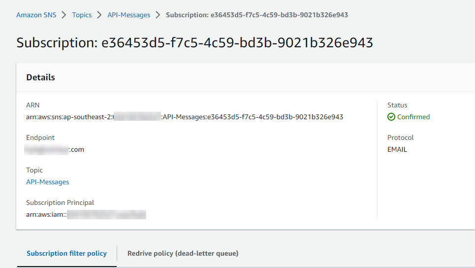

# API Gateway with Lambda, Mock, and AWS Service integrations

# Overview

We’re going to set up an API Gateway REST API, with a few different endpoints, including Mock, Lambda, and AWS service (SNS) integrations.

You can read about the differences between REST and HTTP APIs here: [https://docs.aws.amazon.com/apigateway/latest/developerguide/http-api-vs-rest.html](https://docs.aws.amazon.com/apigateway/latest/developerguide/http-api-vs-rest.html)

For this demo we will use REST, because it allows the use of Mock integrations.

I will be creating this in the ap-southeast-2 region, so all links to the console will be there. Make sure you change region if you’re deploying elsewhere.

# Instructions

## Stage 1 - Setting up SNS

Head to the SNS console: [https://ap-southeast-2.console.aws.amazon.com/sns/v3/home?region=ap-southeast-2#/topics](https://ap-southeast-2.console.aws.amazon.com/sns/v3/home?region=ap-southeast-2#/topics)

Click on <kbd>Create topic</kbd>

Set the *Type* to “Standard”

Set the *Name* to be “API-Messages”

Under *Access policy*, leave the *Method* as “Basic”

Change *Define who can publish messages to the topic* to “Only the specified AWS accounts” and enter your account ID (found in the top right of the console)

Change *Define who can subscribe to this topic* to “Only the specified AWS accounts” and enter your account ID again

*In the real world, this should be locked down further to only the resources you want publishing to the topic, but in this temporary example set up, locking down to just the account is fine and safe enough*

Leave all other options as default

Click on <kbd>Create topic</kbd>

On the next page, click on <kbd>Create subscription</kbd>

Change the *Protocol* to “Email”

In the *Endpoint* field, enter your personal email

Click <kbd>Create subscription</kbd>

You will receive a confirmation email shortly after, with a link you need to click on. This tells SNS that you’re happy to receive emails from the topic, and prevents spam from being sent via SNS.

*Side note: While writing this, my confirmation went to Spam in Gmail, so don’t forget to check there.*

Your subscription should now be in the Confirmed state:



## Stage 2 - Create the Lambda

Head to the Lambda console: [https://ap-southeast-2.console.aws.amazon.com/lambda/home?region=ap-southeast-2#/functions](https://ap-southeast-2.console.aws.amazon.com/lambda/home?region=ap-southeast-2#/functions)

Click <kbd>Create function</kbd>

Leave *Author from scratch* selected

Set the *Function name* to `api-return-ip`

Set the *Runtime* to “Python 3.9”

Leave the *Architecture* as “x86_64”

Click <kbd>Create function</kbd>

In the *Code* tab, enter the following code:

```python
def lambda_handler(event, context):   
    return {
        'statusCode': 200,
        'headers': {},
        'body': event['requestContext']['identity']['sourceIp'],
        'isBase64Encoded': False
        }
```

This is an extremely basic function that *just* returns the source IP of the requester (you).

Don’t forget to click <kbd>Deploy</kbd> to save the function.


## Stage 3 - Create the API

Head to the API Gateway console: https://ap-southeast-2.console.aws.amazon.com/apigateway/main/apis?region=ap-southeast-2

Click <kbd>Create API</kbd>

Select REST API → <kbd>Build</kbd>

Make sure you don’t select “REST API Private”.


Leave the Protocol and “Create new API” options as is, and set your API name to whatever you like


Click <kbd>Create API</kbd>

Once that’s done you will see all of the “Resources” (endpoints / API paths), right now we have none, so click on <kbd>Actions</kbd> and then “Create Resource”


This first resource we create will be for the Mock integration, so we’ll just name it “Mock”. The Resource Path is the URL path you will use to call it, so in this case it would be something like

`https://abcdef1234.execute-api.ap-southeast-2.amazonaws.com/mock`


Next we have to attach a Method. A Method is the HTTP method that the resource (path) will accept, such as “GET”, “POST”, “DELETE”, etc.

For the Mock integration, we will just use “GET”. 

Make sure you are in the /mock resource


Then click <kbd>Actions</kbd> then “Create Method”


Select “GET”


Then click the tick to accept.

Once that’s done, API Gateway will present a list of possible integrations. For this one, select “Mock” then click <kbd>Save</kbd>


Once that’s done, click on “Integration Response”


This is where we tell API Gateway what the Mock integration should respond with. 

Expand the 200 status line, then the Mapping Templates section, and set the *Content-Type* to `application/json`


Click on the tick, then in the template section, enter the following (you can replace the message with whatever you like)

```bash
{
    "statusCode": 200,
    "message": "This response is mocking you"
}
```

Then click <kbd>Save</kbd> (it won’t give any feedback that it’s saved, but it has)


Then click <kbd>Save</kbd> on the method response


That’s all done. Now we’ll set up the Lambda integration.

Go back to the *root* (`/`)resource


Then click <kbd>Actions</kbd> then <kbd>Create Resource</kbd>

For this one, set the resource name to “Lambda”, and leave the Resource Path as “/lambda”

Click <kbd>Create Resource</kbd>

Click on <kbd>Actions</kbd> then <kbd>Create Method</kbd>. This will also be a “GET”


On the next page, set the “Integration type” to “Lambda function”

Enable “Use Lambda Proxy integration”

Once you click the “Lambda Function” text field, it should drop down with a list of Lambda’s in that region, select the one you created earlier

Leave all other options as is, and click <kbd>Save</kbd>


You should see a popup telling you that you’re about to give API Gateway permission to invoke your Lambda, click <kbd>OK</kbd>

Lastly we’ll set up another resource for SNS.

For this one, we will need to set up an IAM role that API Gateway will use to publish messages to SNS. 

Head to the IAM Console: [https://us-east-1.console.aws.amazon.com/iamv2/home?region=ap-southeast-2#/roles](https://us-east-1.console.aws.amazon.com/iamv2/home?region=ap-southeast-2#/roles)

Go to the Roles page, and click <kbd>Create Role</kbd>


Under “Trusted entity”, select “AWS Service”, and in the drop-down, select API Gateway. Make sure you select the radio button for “API Gateway” as well.


Click <kbd>Next</kbd>

On the Permissions page, click <kbd>Next</kbd>

Lastly, set the role name to “api-gw-sns-role” then click <kbd>Create role</kbd>

Now go into the role you just created


Click on <kbd>Add permissions</kbd> then <kbd>Create inline policy</kbd>


Go to the JSON tab and enter the following

```bash
{
    "Version": "2012-10-17",
    "Statement": [
        {
            "Effect": "Allow",
            "Action": "sns:Publish",
            "Resource": "*"
        }
    ]
}
```

Click <kbd>Review policy</kbd>

Under “Review policy” set the name to “SnsPublish” and click <kbd>Create policy</kbd>

On the summary page, copy the ARN of the role you just created, you will need it for the next step


Now head back to the API Gateway console: https://ap-southeast-2.console.aws.amazon.com/apigateway/main/apis?region=ap-southeast-2

Go back into your REST API

Go back to the *root* resource


Then click <kbd>Actions</kbd> then <kbd>Create Resource</kbd>

For this one, set the resource name to “SNS”, and leave the Resource Path as “/sns”

Click <kbd>Create Resource</kbd>

Click on <kbd>Actions</kbd> then <kbd>Create Method</kbd>. 

This one will be a “POST”.

On the next page, set the “Integration type” to “AWS Service”

Set the AWS Region as the same region as your API / SNS (for me this is ap-southeast-2)

Set the AWS Service as “Simple Notification Service (SNS)”

Leave the AWS Subdomain blank

Set the HTTP method to POST

Leave the Action Type as “Use action name”

Set the “Action” to “Publish”

Leave the rest of the form as is, and click <kbd>Save</kbd>


If you’re wondering where we got the “Publish” action, and where to find other Action types, you can view them all in the API Reference for the service: [https://docs.aws.amazon.com/sns/latest/api/API_Operations.html](https://docs.aws.amazon.com/sns/latest/api/API_Operations.html)

There’s a few ways to pass your message through API Gateway to the AWS service, but to make things easy for this example, we’re going to use Query Strings. Query Strings are found in the URL of websites after a question mark, e.g. `https://google.com/search?q=hello`, where “q=hello” is the query string.

Go to the “/sns” resource, and the “POST” method, and click “Method Request” 


Under “URL Query String Parameters” click “Add query string” and enter “TopicArn” and click the tick.

Then click “Add query string” and enter “Message” and click the tick.

Your query string should look like this


Go back to the “/sns” resource, and the “POST” method, and click “Integration Request”


Under “URL Query String Parameters” click “Add query string” 

Set the Name to “Message” and the Mapped from to `method.request.querystring.Message`

Click the tick to save

Click “Add query string” again

Set the Name to “TopicArn” and the Mapped from to `method.request.querystring.TopicArn`

Click the tick to save

Now we need to Deploy the API. 

Click on <kbd>Actions</kbd>, then <kbd>Deploy API</kbd>


In the pop up window, set the “Deployment stage” to “[New Stage]”, and the “Stage name” to “v1”.


The “Stage name” can really be anything, and is used to direct API requests to different “versions” of the API. So you could have a “dev” stage, and “prod” stage, or just use the standard “v1”, “v2”, etc.

Click <kbd>Deploy</kbd>

Once that’s done, you will be sent to the Stage Editor page, where you can set things like Rate Limiting, WAF associations, caching, logs, etc. We don’t need to change any of these for this demo.

At the top of the screen you will see your API URL


Copy that URL for the next step.

## Stage 4 - Testing the API

The Lambda and Mock resources can be tested in the browser. By default, any URL you enter into your browser performs a GET request (and remember, only our Lambda and Mock resources have the GET method set).

### Mock

If we visit our API URL and append “/mock” we should see the response we entered earlier


The reason we want a JSON output rather than a friendly human readable one, is because working with JSON in programming languages makes things much easier. Your code or application could read the “statusCode” key and see a 200 value, and then it could read the “message” key and see it’s value.

### Lambda

Now if we visit our “/lambda” URL we should see our function response (your IP address)


### SNS

For the last endpoint, we can’t use a browser because browsers by default only perform “GET” requests, so we have a couple of options to test this endpoint.

### Command Line

If you’re comfortable using the command line (Linux, Mac, or WSL for Windows), follow these steps. If you would prefer to use a GUI, skip ahead.

In your CLI, run the following command (replace “REGION” and “ACCOUNT-ID” with your region and account ID), and don’t forget to replace the URL with your API gateway URL

```python
curl -X POST -G -d 'TopicArn=arn:aws:sns:REGION:ACCOUNT-ID:API-Messages' -d 'Message=Hello!'  https://abc123def.execute-api.ap-southeast-2.amazonaws.com/v1/sns
```

*Note* if you want to use spaces in your message, because query parameters are URL encoded, spaces need to be replaced with a +, so for example:

```python
curl -X POST -G -d 'TopicArn=arn:aws:sns:REGION:ACCOUNT-ID:API-Messages' -d 'Message=I+like+sending+long+messages'  https://abc123def.execute-api.ap-southeast-2.amazonaws.com/v1/sns
```

### GUI (AWS Console)

The API Gateway console provides a handy way to test your API. 


On the testing page, under “Query Strings”, enter the following. Replace the TopicArn with your SNS Topic ARN, and the message with whatever you like.

```python
TopicArn=arn:aws:sns:REGION:ACCOUNT-ID:API-Messages&Message=APIs+are+fun
```

*Note* if you want to use spaces in your message, because query parameters are URL encoded, spaces need to be replaced with a +

Scroll down and click <kbd>Test</kbd>


### GUI (Postman)

We can also use a popular API testing tool called Postman. It’s available for Windows, Mac, and Linux

It can be downloaded for free from their website: [https://www.postman.com/downloads/](https://www.postman.com/downloads/)

I won’t write instructions on installing the program, it’s fairly self explanatory and isn’t related to this demo.

Once you’ve opened Postman, click on the + up the top of the application to open a new tab. Set the method to POST, and enter your API Gateway URL.

You can then enter the two Query Parameters we set earlier:

`TopicArn` which is the ARN of your SNS topic.

`Message` which is the message you want to send to the topic


Once you’ve entered all that, hit <kbd>Send</kbd>

No matter which method you chose, you should receive an email from SNS containing the message in your Query String


## Stage 5 - Cleaning up

Head to the API Gateway console: [https://ap-southeast-2.console.aws.amazon.com/apigateway/main/apis?region=ap-southeast-2](https://ap-southeast-2.console.aws.amazon.com/apigateway/main/apis?region=ap-southeast-2)

Select the API you created, and click <kbd>Actions</kbd> then <kbd>Delete</kbd>


Head to the SNS console: [https://ap-southeast-2.console.aws.amazon.com/sns/v3/home?region=ap-southeast-2#/topics](https://ap-southeast-2.console.aws.amazon.com/sns/v3/home?region=ap-southeast-2#/topics)

Go to *Topics*, select the Topic you created earlier, and click <kbd>Delete</kbd>


In the confirmation box, enter “delete me” and click <kbd>Delete</kbd>

Go to *Subscriptions*, select the Subscription you created for your email, and click <kbd>Delete</kbd>


Head to the IAM console: [https://us-east-1.console.aws.amazon.com/iamv2/home?region=ap-southeast-2#/roles](https://us-east-1.console.aws.amazon.com/iamv2/home?region=ap-southeast-2#/roles)

Under *Roles*, search for "api-gw-sns-role”

Select the role we created earlier, and click <kbd>Delete</kbd>


Type “api-gw-sns-role” into the confirmation field, and click <kbd>Delete</kbd>

Head to the Lambda console: [https://ap-southeast-2.console.aws.amazon.com/lambda/home?region=ap-southeast-2#/functions](https://ap-southeast-2.console.aws.amazon.com/lambda/home?region=ap-southeast-2#/functions)

Select the function we created earlier, and click <kbd>Actions</kbd> then <kbd>Delete</kbd>


Enter “delete” in the confirmation window, and then click <kbd>Delete</kbd>

Head to the Cloudwatch Logs console: [https://ap-southeast-2.console.aws.amazon.com/cloudwatch/home?region=ap-southeast-2#logsV2:log-groups](https://ap-southeast-2.console.aws.amazon.com/cloudwatch/home?region=ap-southeast-2#logsV2:log-groups)

Search for the "api-return-ip” Log Group, select the log group , click <kbd>Actions</kbd> then <kbd>Delete</kbd>


In the confirmation popup, click <kbd>Delete</kbd>