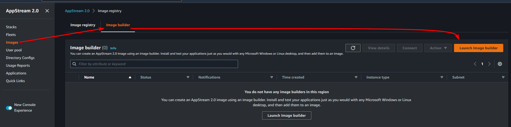

# Creating an AppStream 2.0 Image

# Overview

We’re going to set up an AppStream 2.0 Image of Visual Studio Code (VSCode), and then connect to it and use it using both the web client and native Windows or MacOS applications (optional).

When we set up the VSCode image, we’ll make a couple of configuration changes and see how they persist over to the image users see.

We will be creating this environment in the ap-southeast-1 (Singapore) region, so all links to the console will be there. Make sure you change region if you’re deploying elsewhere. App Stream 2.0 is only available in some regions: 

[https://aws.amazon.com/about-aws/global-infrastructure/regional-product-services/](https://aws.amazon.com/about-aws/global-infrastructure/regional-product-services/)

# Instructions

## Stage 1 - Creating the image

Head to the AppStream console: [https://ap-southeast-1.console.aws.amazon.com/appstream2](https://ap-southeast-1.console.aws.amazon.com/appstream2)

Go to ************Images************, then the ********************************Image builder******************************** tab, then click on <kbd>Launch image builder</kbd>



On the next page you will be offered a number of image builder templates, for example Windows Server 2019 on an instance with a GPU, Amazon Linux 2 on a G4dn instance with an Nvidia T4 GPU optimised for machine learning, or Amazon Linux 2 on a general purpose instance, which is what we will use.

In the search bar, search for `AmazonLinux2` and select the image with the “Instance family” of “General purpose”


Click <kbd>Next</kbd>

On the next page, set the ********Name******** to “VSCodeBuilder” and change the **************************Instance type************************** to “stream.standard.small”


Click <kbd>Next</kbd>

On the next page, leave the VPC as default, select ***any*** subnet, and make sure you check “Enable default internet access”


Click <kbd>Next</kbd>

Click <kbd>Launch Image Builder</kbd>

The Image Builder instance will take a couple of minutes to start and become available


Once it is Running, select the builder and click <kbd>Connect</kbd>


You will be connected to a remote console of an Amazon Linux 2 instance, running the Gnome user interface.

You should receive a pop up in your browser similar to this, make sure you click <kbd>Allow</kbd>, we will be pasting a number of commands and typing them out manually would be quite painful


Click on Applications, then Terminal


We’ll install VS Code using the instructions on Visual Studio’s website: [https://code.visualstudio.com/docs/setup/linux](https://code.visualstudio.com/docs/setup/linux)

Amazon Linux is what’s referred to as a RHEL (Red Hat Enterprise Linux) based Linux distribution, which is different to a Debian based Linux distribution (such as Ubuntu), so we’ll use the commands under **RHEL, Fedora, and CentOS based distributions**. The commands to install VSCode are below, so you don’t need to keep this page open, this is just to show you where to find the instructions.

To paste test into the remote session, you can right click on the terminal and click Paste


Firstly, copy and paste the following commands into the Terminal

```python
sudo rpm --import https://packages.microsoft.com/keys/microsoft.asc
sudo sh -c 'echo -e "[code]\nname=Visual Studio Code\nbaseurl=https://packages.microsoft.com/yumrepos/vscode\nenabled=1\ngpgcheck=1\ngpgkey=https://packages.microsoft.com/keys/microsoft.asc" > /etc/yum.repos.d/vscode.repo'
yum check-update
sudo yum -y install ImageMagick code
convert /usr/share/code/resources/app/resources/linux/code.png -resize 256x256 /tmp/code.png

```

**Note**: We’re also installing the ImageMagick utility, we’re going to use that to resize the VS Code logo because AppStream requires the logo to be 256x256. This is completely optional and you ***can*** create an application without a logo, but this just makes things a bit nicer.

This may take a couple of minutes to run, once it’s complete you will the word “Complete!” along with the console waiting for the next commands


Now let’s run VS Code, by entering the command `code`

You should be presented with the VS Code welcome screen, you can close that tab


Click on ********************Extensions********************


We’re going to install a Theme that will be used by all users by default


Choose any theme you like, I’m going to choose “Noctis” for no reason other than the icon stood out to me


You may (depending on the theme) then be presented with a list of colour themes, again, select any you like


Next, open the ********Settings******** page


Search for “confirm before close” and change the setting to “always”


You can change any setting you like, but this particular setting can be helpful if you accidentally close VS Code while working on a file.

Next, close ***all*** tabs in VS Code


Switch back to the Terminal, and run the following command

```python
lsof -p $(pstree -p $(pidof "/usr/share/code/code --enable-crashpad") | grep -o '([0-9]\+)' | grep -o '[0-9]\+' | tr '\012' ,)|grep REG | sed -n '1!p' | awk '{print $9}'|awk 'NF' > /tmp/code.txt
```

What this command does, is find the process ID (PID) of the VS Code application (`pidof "/usr/share/code/code --enable-crashpad”`), then uses `lsof` to list the open files for that application (binaries, libraries, fonts, sockets, log files, etc). These are all the files that are required for the application to run. If you’re interested, you can run the following command to see all of these files:

```python
lsof -p $(pidof "/usr/share/code/code --enable-crashpad")
```

The command then records the full path to each open file, to a text file called `/tmp/code.txt`, this is what the AppStream command will use to create the image in the next step.

Now, run the following command to tell AppStream we have added an application

```python
AppStreamImageAssistant add-application \
 --name VSCode \
 --absolute-app-path /usr/share/code/code \
 --display-name VSCode \
 --absolute-icon-path /tmp/code.png \
 --absolute-manifest-path /tmp/code.txt
```

Then we’ll copy our configuration directories, which contains the theme and settings we changed in VS Code

```python
sudo mkdir /etc/skel/.config
sudo cp -R ~/.config/Code /etc/skel/.config
sudo cp -R ~/.vscode /etc/skel/.vscode
```

Now we’ll tell AppStream to create the image

```python
AppStreamImageAssistant create-image --name VSCode
```

This will shutdown your image builder instance, and kick you out of the session, this is normal. 

Feel free to close this window.

If you head back to the AppStream console ([https://ap-southeast-1.console.aws.amazon.com/appstream2](https://ap-southeast-1.console.aws.amazon.com/appstream2)), and go to **Images** and search for “VSCode”, you will see our image getting created


Once the ************Status************ has changed to “Available” continue to the next stage


## Stage 2 - Creating a fleet

Head to the AppStream dashboard: [https://ap-southeast-1.console.aws.amazon.com/appstream2](https://ap-southeast-1.console.aws.amazon.com/appstream2)

Go to **Fleets**, then the <kbd>Create fleet</kbd>


Change the ********************Fleet type******************** to “On-demand”


Click <kbd>Next</kbd>

Set the ********Name******** to “Demo-Fleet”

Change the **************************Instance type************************** to”stream.standard.small”


Click <kbd>Next</kbd>

On the next page, search for “VScode” and select the image we created in the previous stage


Click <kbd>Next</kbd>

On the network page, check “Enable default internet access”

Leave the ******VPC****** as default, and set each subnet to one of the subnets in your VPC (any order is fine)

Leave the ****************************Security Group**************************** as is


Click <kbd>Next</kbd>

Click <kbd>Create fleet</kbd>

In the confirmation box check the acknowledgement checkbox and click <kbd>Create</kbd>


## Stage 3 - Creating a stack

Head to the AppStream dashboard: [https://ap-southeast-1.console.aws.amazon.com/appstream2](https://ap-southeast-1.console.aws.amazon.com/appstream2)

Go to **Stacks**, then click <kbd>Create stack</kbd>


Set the ********Name******** to “Demo-Stack”, leave all other settings as is and click <kbd>Next</kbd>

On the next page, you can enable storage on Google Drive or OneDrive, with S3 selected as default. Leave these as is, and click <kbd>Next</kbd>

On the next page, uncheck “Enable application settings persistence”, and click <kbd>Next</kbd>


Click <kbd>Create stack</kbd>

On the next page, click <kbd>Action</kbd> then <kbd>Associate fleet</kbd>


Select “Demo-Fleet” and click <kbd>Associate</kbd>


We now have an AppStream stack, which contains a fleet of instances used to run our application (image).

Next we’ll create a user that can use this stack.

## Stage 4 - Creating a user and using our application

Head to the AppStream dashboard: [https://ap-southeast-1.console.aws.amazon.com/appstream2](https://ap-southeast-1.console.aws.amazon.com/appstream2)

In a production environment, you would likely link an Active Directory type user directory in **********************************Directory Configs**********************************, but for our demo we will create each user individually.

Go to **User Pool**, then click <kbd>Create user</kbd>


Set the **********Email********** to the email you will use to sign in

Set your ********************First name******************** and **************Last name************** to your first and last name


Click <kbd>Create user</kbd>

Refresh the user page until your new user is ready, then click <kbd>Action</kbd> then <kbd>Assign stack</kbd>


There should only be one stack available (”Demo-Stack”), so leave that as is, and click <kbd>Assign stack</kbd>


You should then receive an email with your temporary password and a link to your login page


Click on the login page link

Enter your temporary credentials, and you will be prompted to set a new password


Once you’ve logged in, you will see a list of your available applications, in our case, only VSCode


Click on the VSCode application, and AppStream will start creating your session (launching an instance that will serve your application)


After a couple of minutes, your session should start, and you will see the Welcome tab, with VSCode running your chosen theme


And if we go to Settings


Search for “confirm before close” and you should see our setting still set to what we chose in the Image Builder


Leave this session open for the next stage.

## Stage 6 - Using the home directory

In Stage 3 when we created our stack, one of the configuration options was to enable home folders using an S3 bucket, this is enabled by default. In this stage we’re going to create some files in the application, close the session, confirm the files are still there, then view the files in S3.

In your session window, in VS Code, click on the **Files** icon, then <kbd>Open Folder</kbd>


Go into the “MyFiles” directory


You will see two directory’s, “HomeFolder” which is stored in S3, and “TemporaryFiles” which is (as you can guess) temporary and is deleted when your session finishes.

Open up “HomeFolder”


Click <kbd>Open</kbd>


Click <kbd>Yes, I trust the authors</kbd> in the window that pops up


There’s three ways to create a new file, right click on the Explorer pane on the left, clicking on the new page icon, or clicking “New file…” in the window tab. Choose any of these and open a new file.


Call it “test.sh”


In the code window, enter the following (or whatever you like, we’re not running the code)

```python
#!/bin/bash

echo "Wow it works"
```


Press <kbd>Ctrl</kbd>+<kbd>S</kbd> to save, or go to File then Save


Let’s end the session now, as if we were done working for the day


Click <kbd>LOGOUT</kbd> in the confirmation box that pops up

Now back on the login screen, enter your credentials again


Click the VSCode application and wait for the session to start


Follow the steps above again to open up your HomeFolder


And our file is still there.

Head to the AppStream console: [https://ap-southeast-1.console.aws.amazon.com/appstream2](https://ap-southeast-1.console.aws.amazon.com/appstream2)

Go to ************Stacks************ and click “Demo-Stack”


Under ******************************Storage Details******************************, click on the S3 bucket


In that bucket, if you go into `user/userpool/<id>` you will see the file we created in VS Code


**********Note:********** You should take note of the bucket name as we will need that in the clean up stage. If this is your only `appstream2-` bucket, then you don’t need to worry, but if you have multiple, make sure you note down which one this is.

## Stage 7 - Optional: Using the native client

We just used our application using the web browser, but AWS also offers a native client for Windows, MacOS, and Linux. In this optional stage, we’ll set up and use that client to access our application.

**Note**: Uninstalling this application is ***not*** included in the clean up stage, so you will need to uninstall the application (if you don’t want it) yourself.

You can download the client from this page: [https://clients.amazonappstream.com/](https://clients.amazonappstream.com/)

I’ll be installing the client on my Windows PC, but the steps will be basically the same for MacOS or Linux


Click <kbd>Next</kbd>


Leave “Client logging” checked (unless you want to opt out, this checkbox won’t affect our test)


Click <kbd>Next</kbd>

Leave “AppStream 2.0 Client USB Driver” *********unchecked*********, to avoid any additional drivers being installed on our PC


Click <kbd>Finish</kbd>

Now we need the Login URL that was emailed to us when we created our user, go to your email client and open the welcome email, and ************right click************ on the login link and click “Copy link address” (or whatever the alternative is in your browser)


Paste the link into your client


Click <kbd>Connect</kbd>

Login with your email and password


Just like in the web UI, click on the VSCode application


Once the session has started, you will presented with a window identical to what was shown in your web browser


## Stage 8 - Clean up

Head to the AppStream console: [https://ap-southeast-1.console.aws.amazon.com/appstream2](https://ap-southeast-1.console.aws.amazon.com/appstream2)

Select “Demo-Stack” and click <kbd>Action</kbd> then <kbd>Disassociate fleet</kbd>


In the confirmation box, click <kbd>Disassociate</kbd>

Select “Demo-Stack” and click <kbd>Action</kbd> then <kbd>Delete</kbd>


Click <kbd>Delete</kbd> in the confirmation box

Go to ************Fleets************, select “Demo-Fleet” and click <kbd>Action</kbd> then <kbd>Stop</kbd>


In the confirmation box, click <kbd>Stop</kbd>

Wait for the fleet to be in the “Stopped” status before continuing


Select “Demo-Fleet” and click <kbd>Action</kbd> then <kbd>Delete</kbd>


In the confirmation box, click <kbd>Delete</kbd>

Go to ****Images****, search for “VSCode”, select the image, click <kbd>Action</kbd>, then <kbd>Delete</kbd>


In the confirmation box, click <kbd>Delete</kbd>

Go to ****************User pool****************, select your user, click <kbd>Action</kbd> then <kbd>Disable user</kbd>


Click <kbd>Disable user</kbd> in the confirmation box.

As of writing this, there’s no way to delete a user via the console, so we need to use AWS CLI. 

Head to the CloudShell console: [https://console.aws.amazon.com/cloudshell](https://console.aws.amazon.com/cloudshell)

You may need to select a supported region, any region is fine.

The command you need to run is:

```python
aws --region ap-southeast-1 appstream delete-user --user-name jbezos@amazon.com --authentication-type USERPOOL
```

********Note********: don’t forget to replace the region with the region your AppStream 2.0 is located in, and the user-name with the email address you used.


Head to the S3 console: [https://s3.console.aws.amazon.com/s3/buckets](https://s3.console.aws.amazon.com/s3/buckets?region=ap-southeast-2&region=ap-southeast-2)

Go to **************Buckets************** and click on AppStream bucket


Go to the **********************Permissions********************** tab, and click <kbd>Delete</kbd> under **************************Bucket policy**************************

AppStream adds a policy to prevent anyone deleting this bucket as a safety measure against accidentally deleting home directory buckets


Enter “delete” and click <kbd>Delete</kbd> in the confirmation window

Go back to **************Buckets**************, select your AppStream bucket, and click <kbd>Empty</kbd>


Enter “*permanently delete*” on the confirmation page, and click <kbd>Empty</kbd>

Go back to **************Buckets**************, select your AppStream bucket, and click <kbd>Delete</kbd>


Enter the bucket name on the confirmation page, and click <kbd>Delete bucket</kbd>