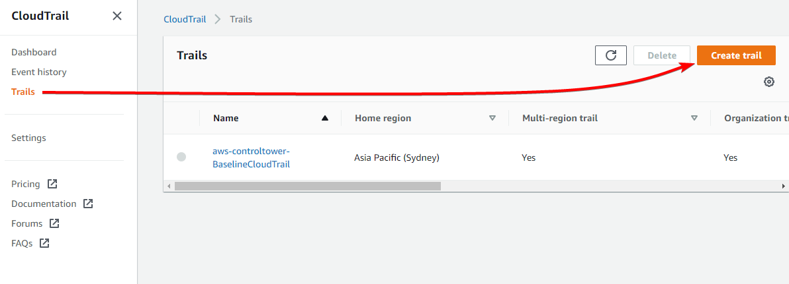

# CloudTrail with Log File Integrity

# Overview

We’re going to be creating a CloudTrail Trail, logging to an S3 bucket, with Log file validation enabled.

We’re then going to see how our AWS API calls appear in the log files, we’re going to check the checksum / hash of the log files, look at the log file hashes in the digest files, and then we will try modifying a log file *and* a digest file, to see how it breaks validity.

We will be creating this environment in the ap-southeast-4 (Melbourne) region, so all links to the console will be there. Make sure you change region if you’re deploying elsewhere.

# Instructions

## Stage 1 - Create an S3 bucket

Head to the S3 console: [https://s3.console.aws.amazon.com/s3/buckets](https://s3.console.aws.amazon.com/s3/buckets?region=ap-southeast-2)

Go to *Buckets* and click on <kbd>Create bucket</kbd>

Under “Bucket Name” enter anything you like, for this demo I will use `demo-cloudtrail-logs`

Set the AWS Region to the region you’re setting up CloudTrail in, in my case, `ap-southeast-4`

Leave everything else as default and click <kbd>Create bucket</kbd>

## Stage 2 - Create a CloudTrail Trail

Head to the CloudTrail console: [https://ap-southeast-4.console.aws.amazon.com/cloudtrail](https://ap-southeast-4.console.aws.amazon.com/cloudtrail)

Go to *Trails* and click <kbd>Create trail</kbd>



Note: You may already have a trail created if you have set up Control Tower in the past, you can ignore that, it’s fine to have multiple trails configured.

On the next page, set the trail name to `demo`

Select “Use existing S3 bucket”, and enter (or browse to) the name of your newly created bucket

Under “Customer managed AWS KMS key”, leave “New” selected, and change the “AWS KMS alias” to `demo-key`

Ensure “Log file validation” is selected

Leave all other settings as default and click <kbd>Next</kbd>


On the next page, leave all the settings as default. For this demo we only care about management events (AWS API calls), *not* data events (S3 reads and writes for example)

Click <kbd>Next</kbd>

Click <kbd>Create trail</kbd>

## Stage 3 - Generating events

Head to the EC2 console: [https://ap-southeast-4.console.aws.amazon.com/ec2/home](https://ap-southeast-4.console.aws.amazon.com/ec2/home)

Go to *AMIs*


Head to the Lambda console: [https://ap-southeast-4.console.aws.amazon.com/lambda/home](https://ap-southeast-4.console.aws.amazon.com/lambda/home)

Go to *Functions*


Head to the RDS console: [https://ap-southeast-4.console.aws.amazon.com/rds/home](https://ap-southeast-4.console.aws.amazon.com/rds/home)’

Go to *Databases*


All these actions don’t look like they’re doing anything, but each one is generating multiple AWS API calls, such as `DescribeImages`, `ListFunctions`, `DescribeDBInstances`, plus dozens of others just by loading the page.

Obviously feel free to perform any other actions you like, such as creating a Lambda function, launching an EC2 instance, etc, however for this demo we won’t be doing any other actions, so you will need to clean these resources up yourself when you’re done.

Once you’re done, wait *one hour* and then proceed to the next step. CloudTrail log digests are created each hour, so we’ll wait for that to complete before proceeding.

Note down roughly what time you performed these actions, so we know which log file to view in the next step.

## Stage 4 - Viewing the logs

Head to the S3 console: [https://s3.console.aws.amazon.com/s3/buckets](https://s3.console.aws.amazon.com/s3/buckets?region=ap-southeast-2)

Click on *Buckets* and go into your CloudTrail bucket you created earlier


Go into the `AWSLogs/` directory, then into your account number, then `CloudTrail/` then the region you are in, then the year, month, day:


You will see CloudTrail creates a log file every ~5 minutes. I’m going to view the log file from 14:11 as that’s when I was performing random actions in the previous stage.

Select the log file, and click <kbd>Download</kbd>

### *Viewing JSON files*

JSON files are relatively difficult to read as a human, so while it is possible, I’d recommend using a tool to format the JSON nicely.

*Command Line*

Using the `jq` tool, you can `cat` the downloaded log file and pipe it into `jq` like this:

```json
cat 1232456789012_CloudTrail_ap-southeast-4_20230315T0315Z_LOi9LL5VQOn9UZ6k.json | jq
```

Which will output:

```json
{
  "Records": [
    {
      "eventVersion": "1.08",
      "userIdentity": {
        "type": "IAMUser",
        "principalId": "AAAAAIIIIIIDDDDDZZZZ",
        "arn": "arn:aws:iam::123456789012:user/username",
        "accountId": "123456789012",
        "accessKeyId": "AAAAAIIIIIIDDDDDZZZZ",
        "userName": "username",
        "sessionContext": {
          "sessionIssuer": {},
          "webIdFederationData": {},
          "attributes": {
            "creationDate": "2023-03-15T00:10:12Z",
            "mfaAuthenticated": "true"
          }
        }
      },
      "eventTime": "2023-03-15T03:06:00Z",
      "eventSource": "rds.amazonaws.com",
      "eventName": "DescribeOrderableDBInstanceOptions",
<truncated>
```

*Web Browser*

The following website can be used to format JSON. 

Remember, always be careful with what sensitive data / output you’re entering into a third party website.

[https://jsonformatter.curiousconcept.com/#](https://jsonformatter.curiousconcept.com/#)

*VSCode*

If you use VSCode, you can install the [Prettier](https://marketplace.visualstudio.com/items?itemName=esbenp.prettier-vscode) extension, which will format and colour the JSON file.


*Browser Extensions*

I haven’t tested these personally, but there’s numerous browser extensions for JSON formatting

[https://chrome.google.com/webstore/detail/json-formatter/bcjindcccaagfpapjjmafapmmgkkhgoa?hl=en](https://chrome.google.com/webstore/detail/json-formatter/bcjindcccaagfpapjjmafapmmgkkhgoa?hl=en)

[https://addons.mozilla.org/en-US/firefox/addon/basic-json-formatter/](https://addons.mozilla.org/en-US/firefox/addon/basic-json-formatter/)

[https://microsoftedge.microsoft.com/addons/detail/json-formatter-for-edge/njpoigijhgbionbfdbaopheedbpdoddi](https://microsoftedge.microsoft.com/addons/detail/json-formatter-for-edge/njpoigijhgbionbfdbaopheedbpdoddi)

Once you’ve found a suitable method for reading JSON files, if you take a look through the CloudTrail log, each event is an API call made by a user, so for example:

```json
{
            "eventVersion": "1.08",
            "userIdentity": {
                "type": "IAMUser",
                "principalId": "AAAAAIIIIIIDDDDDZZZZ",
                "arn": "arn:aws:iam::123456789012:user/jeff.bezos",
                "accountId": "123456789012",
                "accessKeyId": "AAAAAIIIIIIDDDDDZZZZ",
                "userName": "jeff.bezos",
                "sessionContext": {
                    "sessionIssuer": {},
                    "webIdFederationData": {},
                    "attributes": {
                        "creationDate": "2023-03-15T00:10:12Z",
                        "mfaAuthenticated": "true"
                    }
                }
            },
            "eventTime": "2023-03-15T03:08:29Z",
            "eventSource": "lambda.amazonaws.com",
            "eventName": "ListFunctions20150331",
            "awsRegion": "ap-southeast-4",
            "sourceIPAddress": "123.123.123.123",
            "userAgent": "Mozilla/5.0 (Windows NT 10.0; Win64; x64) AppleWebKit/537.36 (KHTML, like Gecko) Chrome/111.0.0.0 Safari/537.36",
            "requestParameters": null,
            "responseElements": null,
            "requestID": "1bde6a85-035b-49a1-9d71-9c5abcdc7c8e",
            "eventID": "277e8de0-6410-4202-af17-c3eecbacbf0d",
            "readOnly": true,
            "eventType": "AwsApiCall",
            "managementEvent": true,
            "recipientAccountId": "123456789012",
            "eventCategory": "Management",
            "tlsDetails": {
                "tlsVersion": "TLSv1.2",
                "cipherSuite": "ECDHE-RSA-AES128-GCM-SHA256",
                "clientProvidedHostHeader": "lambda.ap-southeast-4.amazonaws.com"
            },
            "sessionCredentialFromConsole": "true"
        },
```

So in this event you can see the user `jeff.bezos` called the `ListFunctions20150331` API call, from IP address `123.123.123.123`. 

You can also see this is a “ReadOnly” event, meaning no changes were made to any resources. This field is useful to filter for only CloudTrail actions that made a change to something in the account.

## Stage 4 - Viewing the digest file

Head to the S3 console: [https://s3.console.aws.amazon.com/s3/buckets](https://s3.console.aws.amazon.com/s3/buckets?region=ap-southeast-2)

Click on *Buckets* and go into your CloudTrail bucket you created earlier


Go into the `AWSLogs/` directory, then into your account number, then `CloudTrail-Digest/` then the region you are in, then the year, month, day.

Select the digest file that was created at the end of the hour, so for example the log file I was viewing was last modified at 14:16 so the digest file I’m going to view is the one that was created at 15:09


Just like you did for the CloudTrail log file, download the file and open it in whatever tool you’re using to view JSON files

The CloudTrail *log* file I’m viewing is

`1234567789012_CloudTrail_ap-southeast-4_20230315T0320Z_1iwuEXInvYIpo1Zq.json.gz`

So if I search for that in the digest file I can see the time stamp of the first and last event, and the hash value

```json
{
            "s3Bucket": "demo-cloudtrail-logs",
            "s3Object": "AWSLogs/1234567789012/CloudTrail/ap-southeast-4/2023/03/15/1234567789012_CloudTrail_ap-southeast-4_20230315T0320Z_1iwuEXInvYIpo1Zq.json.gz",
            "hashValue": "3007368a401b56dab0576c7cc9c3acb4ff41d423c7d403242d15d3f4f49f21d2",
            "hashAlgorithm": "SHA-256",
            "newestEventTime": "2023-03-15T03:15:14Z",
            "oldestEventTime": "2023-03-15T03:11:08Z"
        },
```

At the beginning of the digest file we can also see a lot of meta data about the digest file itself:

```json
{
    "awsAccountId": "1234567789012",
    "digestStartTime": "2023-03-15T03:00:48Z",
    "digestEndTime": "2023-03-15T04:00:48Z",
    "digestS3Bucket": "demo-cloudtrail-logs",
    "digestS3Object": "AWSLogs/1234567789012/CloudTrail-Digest/ap-southeast-4/2023/03/15/1234567789012_CloudTrail-Digest_ap-southeast-4_demo_ap-southeast-4_20230315T040048Z.json.gz",
    "digestPublicKeyFingerprint": "ad89cdd3a01ca82b01f9ba802987d3cf",
    "digestSignatureAlgorithm": "SHA256withRSA",
    "newestEventTime": "2023-03-15T03:55:44Z",
    "oldestEventTime": "2023-03-15T03:00:48Z",
    "previousDigestS3Bucket": "demo-cloudtrail-logs",
    "previousDigestS3Object": "AWSLogs/1234567789012/CloudTrail-Digest/ap-southeast-4/2023/03/15/1234567789012_CloudTrail-Digest_ap-southeast-4_demo_ap-southeast-4_20230315T030048Z.json.gz",
    "previousDigestHashValue": "23d7d7a2e7721ca4e69dcbf1317ccda319ee164072b1fd2aba80e172b5f1b8f9",
    "previousDigestHashAlgorithm": "SHA-256",
    "previousDigestSignature": "809df1e29ddf8b1389e2164352fa7a95e76d8af8d85e5e5209811c70ed174f623e059fed01daf20ee6b02b6bac43f8b1c54a370bb1f20d84f53c1c1b4f4b5cd6004587a6bf2827aa762393c2f9be9374c1b6886b3e301eb34d35fc9ba813bb2f0579245db89c8feab7184c1955cb9bb88b50b14ac0f095131b1640c735d3023246e3973dbd2d57cf096d1d189527eecdb46eac7b88b874c29237a63082d9044f7d0c9eb89e4685b63906319ee9f68145ab67a3796652a7042f98d2ab1243b6bab811b28c02a2b2b36d9e12145a963973452fdbd96508c67d7b269e441a48aaf9634e117d76eed3e69eac6677c9555008efebcd41619c95ac1e93b9ee93083c38",
    "logFiles": [
        {
<truncated>
```

First we’ll look at the hash value of the *CloudTrail log* we were viewing earlier, in the digest file it says that log file `AWSLogs/1234567789012/CloudTrail/ap-southeast-4/2023/03/15/1234567789012_CloudTrail_ap-southeast-4_20230315T0320Z_1iwuEXInvYIpo1Zq.json.gz` has the hash `3007368a401b56dab0576c7cc9c3acb4ff41d423c7d403242d15d3f4f49f21d2`

Now to calculate the hash of that file, there’s a few ways to do it depending on your OS.

*Linux*

Most Linux distributions will have `sha256sum` installed, which is a command line tool to calculate the SHA256 checksum of a file

```json
sha256sum 1234567789012_CloudTrail_ap-southeast-4_20230315T0320Z_1iwuEXInvYIpo1Zq.json
3007368a401b56dab0576c7cc9c3acb4ff41d423c7d403242d15d3f4f49f21d2  1234567789012_CloudTrail_ap-southeast-4_20230315T0320Z_1iwuEXInvYIpo1Zq.json
```

*MacOS*

MacOS should have the `shasum` tool, which accepts the argument `-a 256` telling it to calculate the SHA256 checksum

```python
❯ shasum -a 256 1234567789012_CloudTrail_ap-southeast-4_20230315T0320Z_1iwuEXInvYIpo1Zq.json
3007368a401b56dab0576c7cc9c3acb4ff41d423c7d403242d15d3f4f49f21d2  1234567789012_CloudTrail_ap-southeast-4_20230315T0320Z_1iwuEXInvYIpo1Zq.json
```

*Windows*

Windows has a built in tool that can be called from Command Prompt or PowerShell called `certutil`

```json
PS C:\Users\hello\Downloads> certutil.exe -hashfile .\1234567789012_CloudTrail_ap-southeast-4_20230315T0320Z_1iwuEXInvYIpo1Zq.json SHA256
SHA256 hash of .\1234567789012_CloudTrail_ap-southeast-4_20230315T0320Z_1iwuEXInvYIpo1Zq.json:
3007368a401b56dab0576c7cc9c3acb4ff41d423c7d403242d15d3f4f49f21d2
```

So in all three cases the checksum was the same, `3007368a401b56dab0576c7cc9c3acb4ff41d423c7d403242d15d3f4f49f21d2` which matches what is in the digest file, so we can be certain this log file hasn’t been modified.

Let’s see what happens if we modified *anything* in the CloudTrail log, let’s throw Bill Gates under the bus and say *he* called the `ListFunctions20150331` API

```json
{
            "eventVersion": "1.08",
            "userIdentity": {
                "type": "IAMUser",
                "principalId": "AAAAAIIIIIIDDDDDZZZZ",
                "arn": "arn:aws:iam::123456789012:user/bill.gates",
                "accountId": "123456789012",
                "accessKeyId": "AAAAAIIIIIIDDDDDZZZZ",
                "userName": "bill.gates",
                "sessionContext": {
                    "sessionIssuer": {},
                    "webIdFederationData": {},
                    "attributes": {
                        "creationDate": "2023-03-15T00:10:12Z",
                        "mfaAuthenticated": "true"
                    }
                }
            },
            "eventTime": "2023-03-15T03:08:29Z",
            "eventSource": "lambda.amazonaws.com",
            "eventName": "ListFunctions20150331",
<truncated>
```

Now if we check the SHA256 sum:

```json
❯ sha256sum 123456789012_CloudTrail_ap-southeast-4_20230315T0320Z_1iwuEXInvYIpo1Zq.json
33f36af460f6e7cd28b28b50bb15f730b2339d920474b46ccf4e74f8fa6cb5f4  123456789012_CloudTrail_ap-southeast-4_20230315T0320Z_1iwuEXInvYIpo1Zq.json
```

The checksum is completely different.

## Stage 5 - *Verifying the log and digest files*

For this stage you will need the AWS CLI, you can either [download](https://docs.aws.amazon.com/cli/latest/userguide/getting-started-install.html) it locally here, or use the [AWS CloudShell](https://ap-southeast-2.console.aws.amazon.com/cloudshell/home). Don’t forget to specify the region that your CloudTrail trail exists in.

The AWS CLI has the functionality to iterate through your log files between specified times, validate their checksum, *as well as* validate the checksums of the digest files. If we were to do this manually, it would be quite a bit harder: [https://docs.aws.amazon.com/awscloudtrail/latest/userguide/cloudtrail-log-file-custom-validation.html#cloudtrail-log-file-custom-validation-sample-code](https://docs.aws.amazon.com/awscloudtrail/latest/userguide/cloudtrail-log-file-custom-validation.html#cloudtrail-log-file-custom-validation-sample-code)

The AWS CLI command you need to run is the following. Don’t forget to update the region, trail ARN and start / end times in UTC time):

```json
aws --region ap-southeast-4 cloudtrail validate-logs --trail-arn arn:aws:cloudtrail:ap-southeast-4:123456789012:trail/demo --start-time '2023-03-15T05:00Z' --end-time '2023-03-15T06:00Z' --verbose
```

The output for my log files, for the above command is:

```json
❯ aws --region ap-southeast-4 cloudtrail validate-logs --trail-arn arn:aws:cloudtrail:ap-southeast-4:123456789012:trail/demo --start-time '2023-03-15T05:00Z' --end-time '2023-03-15T06:00Z' --verbose
Validating log files for trail arn:aws:cloudtrail:ap-southeast-4:123456789012:trail/demo between 2023-03-15T05:00:00Z and 2023-03-15T06:00:00Z

Digest file     s3://demo-cloudtrail-logs/AWSLogs/123456789012/CloudTrail-Digest/ap-southeast-4/2023/03/15/123456789012_CloudTrail-Digest_ap-southeast-4_demo_ap-southeast-4_20230315T060048Z.json.gz   valid
Log file        s3://demo-cloudtrail-logs/AWSLogs/123456789012/CloudTrail/ap-southeast-4/2023/03/15/123456789012_CloudTrail_ap-southeast-4_20230315T0510Z_V0Ys6ocepSSYl8OL.json.gz      valid
Log file        s3://demo-cloudtrail-logs/AWSLogs/123456789012/CloudTrail/ap-southeast-4/2023/03/15/123456789012_CloudTrail_ap-southeast-4_20230315T0520Z_lsOn2GUFH6ldeVTX.json.gz      valid
Log file        s3://demo-cloudtrail-logs/AWSLogs/123456789012/CloudTrail/ap-southeast-4/2023/03/15/123456789012_CloudTrail_ap-southeast-4_20230315T0555Z_tOJccVTgE22nohRt.json.gz      valid
Log file        s3://demo-cloudtrail-logs/AWSLogs/123456789012/CloudTrail/ap-southeast-4/2023/03/15/123456789012_CloudTrail_ap-southeast-4_20230315T0540Z_ucmpBygJirk3zxwF.json.gz      valid
Log file        s3://demo-cloudtrail-logs/AWSLogs/123456789012/CloudTrail/ap-southeast-4/2023/03/15/123456789012_CloudTrail_ap-southeast-4_20230315T0550Z_5KSaiSOWXTYD4Hhu.json.gz      valid
Log file        s3://demo-cloudtrail-logs/AWSLogs/123456789012/CloudTrail/ap-southeast-4/2023/03/15/123456789012_CloudTrail_ap-southeast-4_20230315T0535Z_pgdRLTJq3DOGhcL4.json.gz      valid
Log file        s3://demo-cloudtrail-logs/AWSLogs/123456789012/CloudTrail/ap-southeast-4/2023/03/15/123456789012_CloudTrail_ap-southeast-4_20230315T0515Z_tKDGrvgNkbNEPuLE.json.gz      valid
Log file        s3://demo-cloudtrail-logs/AWSLogs/123456789012/CloudTrail/ap-southeast-4/2023/03/15/123456789012_CloudTrail_ap-southeast-4_20230315T0600Z_5ZJPMA0cMbI6VN9T.json.gz      valid
Log file        s3://demo-cloudtrail-logs/AWSLogs/123456789012/CloudTrail/ap-southeast-4/2023/03/15/123456789012_CloudTrail_ap-southeast-4_20230315T0525Z_HTPauvC2uXY9mEQQ.json.gz      valid
Log file        s3://demo-cloudtrail-logs/AWSLogs/123456789012/CloudTrail/ap-southeast-4/2023/03/15/123456789012_CloudTrail_ap-southeast-4_20230315T0530Z_VI2VONm9Sk73V6pJ.json.gz      valid
Log file        s3://demo-cloudtrail-logs/AWSLogs/123456789012/CloudTrail/ap-southeast-4/2023/03/15/123456789012_CloudTrail_ap-southeast-4_20230315T0510Z_vBNgDIuTquQXeGxV.json.gz      valid
Digest file     s3://demo-cloudtrail-logs/AWSLogs/123456789012/CloudTrail-Digest/ap-southeast-4/2023/03/15/123456789012_CloudTrail-Digest_ap-southeast-4_demo_ap-southeast-4_20230315T050048Z.json.gz   valid
Log file        s3://demo-cloudtrail-logs/AWSLogs/123456789012/CloudTrail/ap-southeast-4/2023/03/15/123456789012_CloudTrail_ap-southeast-4_20230315T0435Z_QyTPaZWQlrb7ToQA.json.gz      valid
Log file        s3://demo-cloudtrail-logs/AWSLogs/123456789012/CloudTrail/ap-southeast-4/2023/03/15/123456789012_CloudTrail_ap-southeast-4_20230315T0420Z_V9P9WffzoudHMW11.json.gz      valid
Log file        s3://demo-cloudtrail-logs/AWSLogs/123456789012/CloudTrail/ap-southeast-4/2023/03/15/123456789012_CloudTrail_ap-southeast-4_20230315T0430Z_bwQdRtWImSHgYq5q.json.gz      valid
Log file        s3://demo-cloudtrail-logs/AWSLogs/123456789012/CloudTrail/ap-southeast-4/2023/03/15/123456789012_CloudTrail_ap-southeast-4_20230315T0445Z_pMuQDAL39jTMoWh7.json.gz      valid
Log file        s3://demo-cloudtrail-logs/AWSLogs/123456789012/CloudTrail/ap-southeast-4/2023/03/15/123456789012_CloudTrail_ap-southeast-4_20230315T0500Z_yM3zq8sMxeebSgXY.json.gz      valid
Log file        s3://demo-cloudtrail-logs/AWSLogs/123456789012/CloudTrail/ap-southeast-4/2023/03/15/123456789012_CloudTrail_ap-southeast-4_20230315T0450Z_9WAm73sQcXRxqBs7.json.gz      valid
Log file        s3://demo-cloudtrail-logs/AWSLogs/123456789012/CloudTrail/ap-southeast-4/2023/03/15/123456789012_CloudTrail_ap-southeast-4_20230315T0440Z_bWCTGu8Eb0hgpPGk.json.gz      valid
Log file        s3://demo-cloudtrail-logs/AWSLogs/123456789012/CloudTrail/ap-southeast-4/2023/03/15/123456789012_CloudTrail_ap-southeast-4_20230315T0405Z_uWSLxq8RzwJDZc2p.json.gz      valid
Log file        s3://demo-cloudtrail-logs/AWSLogs/123456789012/CloudTrail/ap-southeast-4/2023/03/15/123456789012_CloudTrail_ap-southeast-4_20230315T0455Z_y4rozjRSNIJ5baZw.json.gz      valid
Log file        s3://demo-cloudtrail-logs/AWSLogs/123456789012/CloudTrail/ap-southeast-4/2023/03/15/123456789012_CloudTrail_ap-southeast-4_20230315T0425Z_Sv7lYiFgRZ0dXt1y.json.gz      valid
Log file        s3://demo-cloudtrail-logs/AWSLogs/123456789012/CloudTrail/ap-southeast-4/2023/03/15/123456789012_CloudTrail_ap-southeast-4_20230315T0415Z_UqPzkRCNevxWTMxC.json.gz      valid
Log file        s3://demo-cloudtrail-logs/AWSLogs/123456789012/CloudTrail/ap-southeast-4/2023/03/15/123456789012_CloudTrail_ap-southeast-4_20230315T0410Z_Xyd38WrYN0F0DpJo.json.gz      valid

Results requested for 2023-03-15T05:00:00Z to 2023-03-15T06:00:00Z
Results found for 2023-03-15T05:00:48Z to 2023-03-15T06:00:00Z:

2/2 digest files valid
23/23 log files valid
```

So this is telling us that each log file *and* digest file created between 5AM and 6AM UTC was valid and unmodified. 

Let’s modify a log file and see what happens when we check the validity. 

Head to the S3 console: [https://s3.console.aws.amazon.com/s3/buckets](https://s3.console.aws.amazon.com/s3/buckets?region=ap-southeast-2)

Click on *Buckets* and go into your CloudTrail bucket you created earlier


Go into the `AWSLogs/` directory, then into your account number directory, then `CloudTrail/` then the region you are in, then the year, month, day.

Choose a log file that was created between the range you’re validating, so for me that’s 5AM to 6AM UTC, or 3PM AEDT to 4PM AEDT


I’m going to modify one of the events in the log file and change the username from my user, to `jeff.bezos`, but you can change anything in this log file for this step.

Save the file, and before we upload it, we need to Gzip it. Gzip is installed on Linux and MacOS by default, but for Windows you will need to use a tool like [7Zip](https://7-zip.org/download.html).

On Linux or MacOS, you can run:

```json
gzip <filename>
```

On Windows, using 7-Zip, right click on the file and go to 7-Zip, then “Add to archive…”


Change the “Archive format” to “gzip” and click <kbd>OK</kbd>


Now go back to the S3 console and click <kbd>Upload</kbd>


Upload the CloudTrail log you just modified, and click <kbd>Upload</kbd>

*Make sure you select the file ending in .gz*


Now if we run the `validate-logs` command again, we get an error saying the log file is invalid

```json
❯ aws --region ap-southeast-4 cloudtrail validate-logs --trail-arn arn:aws:cloudtrail:ap-southeast-4:123456789012:trail/demo --start-time '2023-03-15T05:00Z' --end-time '2023-03-15T06:00Z' --verbose
Validating log files for trail arn:aws:cloudtrail:ap-southeast-4:123456789012:trail/demo between 2023-03-15T05:00:00Z and 2023-03-15T06:00:00Z

Digest file     s3://demo-cloudtrail-logs/AWSLogs/123456789012/CloudTrail-Digest/ap-southeast-4/2023/03/15/123456789012_CloudTrail-Digest_ap-southeast-4_demo_ap-southeast-4_20230315T060048Z.json.gz   valid
Log file        s3://demo-cloudtrail-logs/AWSLogs/123456789012/CloudTrail/ap-southeast-4/2023/03/15/123456789012_CloudTrail_ap-southeast-4_20230315T0510Z_V0Ys6ocepSSYl8OL.json.gz      valid
Log file        s3://demo-cloudtrail-logs/AWSLogs/123456789012/CloudTrail/ap-southeast-4/2023/03/15/123456789012_CloudTrail_ap-southeast-4_20230315T0520Z_lsOn2GUFH6ldeVTX.json.gz      valid
Log file        s3://demo-cloudtrail-logs/AWSLogs/123456789012/CloudTrail/ap-southeast-4/2023/03/15/123456789012_CloudTrail_ap-southeast-4_20230315T0555Z_tOJccVTgE22nohRt.json.gz      valid
Log file        s3://demo-cloudtrail-logs/AWSLogs/123456789012/CloudTrail/ap-southeast-4/2023/03/15/123456789012_CloudTrail_ap-southeast-4_20230315T0540Z_ucmpBygJirk3zxwF.json.gz      valid
Log file        s3://demo-cloudtrail-logs/AWSLogs/123456789012/CloudTrail/ap-southeast-4/2023/03/15/123456789012_CloudTrail_ap-southeast-4_20230315T0550Z_5KSaiSOWXTYD4Hhu.json.gz      valid
Log file        s3://demo-cloudtrail-logs/AWSLogs/123456789012/CloudTrail/ap-southeast-4/2023/03/15/123456789012_CloudTrail_ap-southeast-4_20230315T0535Z_pgdRLTJq3DOGhcL4.json.gz      valid
Log file        s3://demo-cloudtrail-logs/AWSLogs/123456789012/CloudTrail/ap-southeast-4/2023/03/15/123456789012_CloudTrail_ap-southeast-4_20230315T0515Z_tKDGrvgNkbNEPuLE.json.gz      valid
Log file        s3://demo-cloudtrail-logs/AWSLogs/123456789012/CloudTrail/ap-southeast-4/2023/03/15/123456789012_CloudTrail_ap-southeast-4_20230315T0600Z_5ZJPMA0cMbI6VN9T.json.gz      valid
Log file        s3://demo-cloudtrail-logs/AWSLogs/123456789012/CloudTrail/ap-southeast-4/2023/03/15/123456789012_CloudTrail_ap-southeast-4_20230315T0525Z_HTPauvC2uXY9mEQQ.json.gz      valid
Log file        s3://demo-cloudtrail-logs/AWSLogs/123456789012/CloudTrail/ap-southeast-4/2023/03/15/123456789012_CloudTrail_ap-southeast-4_20230315T0530Z_VI2VONm9Sk73V6pJ.json.gz      valid
Log file        s3://demo-cloudtrail-logs/AWSLogs/123456789012/CloudTrail/ap-southeast-4/2023/03/15/123456789012_CloudTrail_ap-southeast-4_20230315T0510Z_vBNgDIuTquQXeGxV.json.gz      valid
Digest file     s3://demo-cloudtrail-logs/AWSLogs/123456789012/CloudTrail-Digest/ap-southeast-4/2023/03/15/123456789012_CloudTrail-Digest_ap-southeast-4_demo_ap-southeast-4_20230315T050048Z.json.gz   valid
Log file        s3://demo-cloudtrail-logs/AWSLogs/123456789012/CloudTrail/ap-southeast-4/2023/03/15/123456789012_CloudTrail_ap-southeast-4_20230315T0435Z_QyTPaZWQlrb7ToQA.json.gz      valid
Log file        s3://demo-cloudtrail-logs/AWSLogs/123456789012/CloudTrail/ap-southeast-4/2023/03/15/123456789012_CloudTrail_ap-southeast-4_20230315T0420Z_V9P9WffzoudHMW11.json.gz      valid

Log file        s3://demo-cloudtrail-logs/AWSLogs/123456789012/CloudTrail/ap-southeast-4/2023/03/15/123456789012_CloudTrail_ap-southeast-4_20230315T0430Z_bwQdRtWImSHgYq5q.json.gz      INVALID: hash value doesn't match

Log file        s3://demo-cloudtrail-logs/AWSLogs/123456789012/CloudTrail/ap-southeast-4/2023/03/15/123456789012_CloudTrail_ap-southeast-4_20230315T0445Z_pMuQDAL39jTMoWh7.json.gz      valid
Log file        s3://demo-cloudtrail-logs/AWSLogs/123456789012/CloudTrail/ap-southeast-4/2023/03/15/123456789012_CloudTrail_ap-southeast-4_20230315T0500Z_yM3zq8sMxeebSgXY.json.gz      valid
Log file        s3://demo-cloudtrail-logs/AWSLogs/123456789012/CloudTrail/ap-southeast-4/2023/03/15/123456789012_CloudTrail_ap-southeast-4_20230315T0450Z_9WAm73sQcXRxqBs7.json.gz      valid
Log file        s3://demo-cloudtrail-logs/AWSLogs/123456789012/CloudTrail/ap-southeast-4/2023/03/15/123456789012_CloudTrail_ap-southeast-4_20230315T0440Z_bWCTGu8Eb0hgpPGk.json.gz      valid
Log file        s3://demo-cloudtrail-logs/AWSLogs/123456789012/CloudTrail/ap-southeast-4/2023/03/15/123456789012_CloudTrail_ap-southeast-4_20230315T0405Z_uWSLxq8RzwJDZc2p.json.gz      valid
Log file        s3://demo-cloudtrail-logs/AWSLogs/123456789012/CloudTrail/ap-southeast-4/2023/03/15/123456789012_CloudTrail_ap-southeast-4_20230315T0455Z_y4rozjRSNIJ5baZw.json.gz      valid
Log file        s3://demo-cloudtrail-logs/AWSLogs/123456789012/CloudTrail/ap-southeast-4/2023/03/15/123456789012_CloudTrail_ap-southeast-4_20230315T0425Z_Sv7lYiFgRZ0dXt1y.json.gz      valid
Log file        s3://demo-cloudtrail-logs/AWSLogs/123456789012/CloudTrail/ap-southeast-4/2023/03/15/123456789012_CloudTrail_ap-southeast-4_20230315T0415Z_UqPzkRCNevxWTMxC.json.gz      valid
Log file        s3://demo-cloudtrail-logs/AWSLogs/123456789012/CloudTrail/ap-southeast-4/2023/03/15/123456789012_CloudTrail_ap-southeast-4_20230315T0410Z_Xyd38WrYN0F0DpJo.json.gz      valid

Results requested for 2023-03-15T05:00:00Z to 2023-03-15T06:00:00Z
Results found for 2023-03-15T05:00:48Z to 2023-03-15T06:00:00Z:

2/2 digest files valid
22/23 log files valid, 1/23 log files INVALID
```

The same can be done for the digest files. The log file we modified is contained in the 16:09 digest file (05:00 UTC), so let’s download that digest file, modify it, gzip it, and re-upload it. I won’t go over the steps again, they’re mostly identical to what we just did.

However, in the digest file, I’m going to change the checksum of the log file I modified, to the new sneaky checksum:

```json
❯ sha256sum 123456789012_CloudTrail_ap-southeast-4_20230315T0430Z_bwQdRtWImSHgYq5q.json.gz
b3d30b38373363ae0f16601db7f0f598a09e96100f13ead994d887233452b611  123456789012_CloudTrail_ap-southeast-4_20230315T0430Z_bwQdRtWImSHgYq5q.json.gz
```

This is where I’m updating the hash


Now I’ve gzip’d it, re-uploaded it, and re-ran the `validate-logs` command:

```json
❯ aws --region ap-southeast-4 cloudtrail validate-logs --trail-arn arn:aws:cloudtrail:ap-southeast-4:123456789012:trail/demo --start-time '2023-03-15T05:00Z' --end-time '2023-03-15T06:00Z' --verbose
Validating log files for trail arn:aws:cloudtrail:ap-southeast-4:123456789012:trail/demo between 2023-03-15T05:00:00Z and 2023-03-15T06:00:00Z

Digest file     s3://demo-cloudtrail-logs/AWSLogs/123456789012/CloudTrail-Digest/ap-southeast-4/2023/03/15/123456789012_CloudTrail-Digest_ap-southeast-4_demo_ap-southeast-4_20230315T060048Z.json.gz   valid
Log file        s3://demo-cloudtrail-logs/AWSLogs/123456789012/CloudTrail/ap-southeast-4/2023/03/15/123456789012_CloudTrail_ap-southeast-4_20230315T0510Z_V0Ys6ocepSSYl8OL.json.gz      valid
Log file        s3://demo-cloudtrail-logs/AWSLogs/123456789012/CloudTrail/ap-southeast-4/2023/03/15/123456789012_CloudTrail_ap-southeast-4_20230315T0520Z_lsOn2GUFH6ldeVTX.json.gz      valid
Log file        s3://demo-cloudtrail-logs/AWSLogs/123456789012/CloudTrail/ap-southeast-4/2023/03/15/123456789012_CloudTrail_ap-southeast-4_20230315T0555Z_tOJccVTgE22nohRt.json.gz      valid
Log file        s3://demo-cloudtrail-logs/AWSLogs/123456789012/CloudTrail/ap-southeast-4/2023/03/15/123456789012_CloudTrail_ap-southeast-4_20230315T0540Z_ucmpBygJirk3zxwF.json.gz      valid
Log file        s3://demo-cloudtrail-logs/AWSLogs/123456789012/CloudTrail/ap-southeast-4/2023/03/15/123456789012_CloudTrail_ap-southeast-4_20230315T0550Z_5KSaiSOWXTYD4Hhu.json.gz      valid
Log file        s3://demo-cloudtrail-logs/AWSLogs/123456789012/CloudTrail/ap-southeast-4/2023/03/15/123456789012_CloudTrail_ap-southeast-4_20230315T0535Z_pgdRLTJq3DOGhcL4.json.gz      valid
Log file        s3://demo-cloudtrail-logs/AWSLogs/123456789012/CloudTrail/ap-southeast-4/2023/03/15/123456789012_CloudTrail_ap-southeast-4_20230315T0515Z_tKDGrvgNkbNEPuLE.json.gz      valid
Log file        s3://demo-cloudtrail-logs/AWSLogs/123456789012/CloudTrail/ap-southeast-4/2023/03/15/123456789012_CloudTrail_ap-southeast-4_20230315T0600Z_5ZJPMA0cMbI6VN9T.json.gz      valid
Log file        s3://demo-cloudtrail-logs/AWSLogs/123456789012/CloudTrail/ap-southeast-4/2023/03/15/123456789012_CloudTrail_ap-southeast-4_20230315T0525Z_HTPauvC2uXY9mEQQ.json.gz      valid
Log file        s3://demo-cloudtrail-logs/AWSLogs/123456789012/CloudTrail/ap-southeast-4/2023/03/15/123456789012_CloudTrail_ap-southeast-4_20230315T0530Z_VI2VONm9Sk73V6pJ.json.gz      valid
Log file        s3://demo-cloudtrail-logs/AWSLogs/123456789012/CloudTrail/ap-southeast-4/2023/03/15/123456789012_CloudTrail_ap-southeast-4_20230315T0510Z_vBNgDIuTquQXeGxV.json.gz      valid

Digest file     s3://demo-cloudtrail-logs/AWSLogs/123456789012/CloudTrail-Digest/ap-southeast-4/2023/03/15/123456789012_CloudTrail-Digest_ap-southeast-4_demo_ap-southeast-4_20230315T050048Z.json.gz   INVALID: signature verification failed

Results requested for 2023-03-15T05:00:00Z to 2023-03-15T06:00:00Z
Results found for 2023-03-15T05:00:48Z to 2023-03-15T06:00:00Z:

1/2 digest files valid, 1/2 digest files INVALID
11/11 log files valid
```

Now I’ve broken the digest validity, and the chain of trust that each digest file uses.

## Stage 6 - Clean up

Head to the CloudTrail console: [https://ap-southeast-4.console.aws.amazon.com/cloudtrail](https://ap-southeast-4.console.aws.amazon.com/cloudtrail)

Go to *Trails* and select the `demo` trail you created, and click <kbd>Delete</kbd>


In the confirmation box, click <kbd>Delete</kbd>

Head to the S3 console: [https://s3.console.aws.amazon.com/s3/buckets](https://s3.console.aws.amazon.com/s3/buckets?region=ap-southeast-2&region=ap-southeast-2)

*Note:* CloudTrail may add a few files to your bucket for a few minutes after your Trail has been deleted, so if you empty your bucket, and then go to delete it and it says there’s still objects in there, this will be why. Just wait a few minutes and try again.

Select your CloudTrail trail bucket, and click <kbd>Empty</kbd>


Enter “*permanently delete”* in the confirmation window, and click <kbd>Empty</kbd>

Then, select your CloudTrail trail bucket, and click <kbd>Delete</kbd>


Enter the bucket name in the confirmation window, and click <kbd>Delete</kbd>