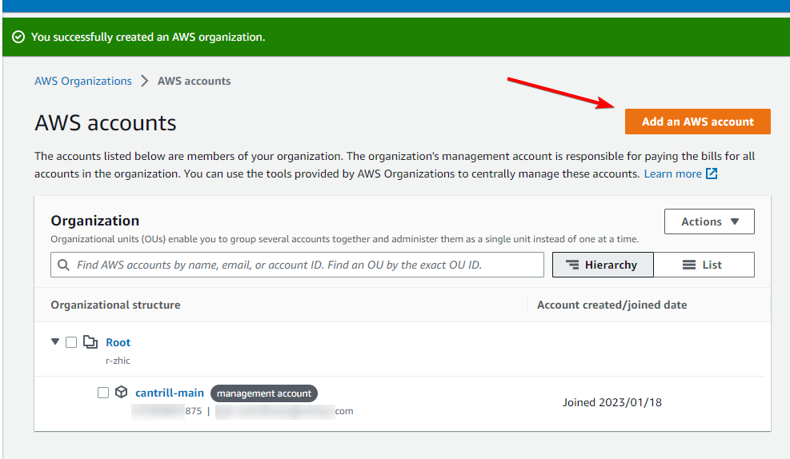

# Control Tower

# Overview

We’re going to be setting up Control Tower in our AWS Organisation.

You will be setting this up from your “management” account. In a production environment, your management account would contain nothing but your Organization, Control Tower, Users (ideally SSO), and Billing. All resources, buckets, logs, etc should be in sub-accounts.

For this demo you will need four to five different email accounts. If you use Gmail or Google Workspace, you can use “plus addresses”, which means if your email address is `jeffbezos@gmail.com`, you can use `jeffbezos+aws@gmail.com`, or `jeffbezos+sandbox@gmail.com`, or any other variation, and they will all route to your primary email. 

Alternatively you can use a service like 10 Minute Mail ([https://10minutemail.com/](https://10minutemail.com/)) to get a free temporary email address. 

As you create each account, you should login to the root user for that account, reset the password, and note it down. You will need the root user password for the last step when you close the accounts.

Another important point to note, at the end of this demo we are going to be closing AWS accounts. AWS documentation says that when an account is closed, the root user email address **cannot** be reused, so make sure you don’t use an email address that you will want to use with AWS in the future.

[https://docs.aws.amazon.com/organizations/latest/userguide/orgs_manage_accounts_close.html#:~:text=The root user's email address can't be reused if you close an account](https://docs.aws.amazon.com/organizations/latest/userguide/orgs_manage_accounts_close.html#:~:text=The%20root%20user%27s%20email%20address%20can%27t%20be%20reused%20if%20you%20close%20an%20account)

We will be creating this environment in the ap-southeast-2 region, so all links to the console will be there. Make sure you change region if you’re deploying elsewhere.

# Instructions

## Stage 1 - Create an Organization and sub-account

In your primary (management) account, head to the Organizations console: [https://us-east-1.console.aws.amazon.com/organizations/v2/home?region=us-east-1#](https://us-east-1.console.aws.amazon.com/organizations/v2/home?region=us-east-1#)

Click on <kbd>Create an organization</kbd>

Now we’ll add a sub-account to our organization, click on <kbd>Add an AWS account</kbd>

Leave “Create an AWS account” selected.

Enter your **account name**, we’ll use “Sandbox”.

Enter your root user **email address** you would like to use for this new account. Note, this email must not be used with an AWS account already.

Remember: If you use Gmail or Google Workspace, you can use “plus addresses”. 

Leave **IAM role name** as default.

You should now have two accounts in your Organization

If you want to login to your new Sandbox account, you can head to the AWS Console login page and *reset your password* for your new root user. This is optional, the rest of these steps can be done without logging into your new account as root.

You now have an AWS Organization with a management account and a sub-account. In the real world you might have dozens of accounts for different projects, environments (dev, testing, prod, etc), or for different teams. You can then organize these accounts into OUs (Organizational Units) based on team, project, or whatever you like.

You can also set up SCPs (Service Control Policies) to enforce things such as mandatory backups, restricted regions, disabled services, etc. We will be doing this via Control Tower later in the guide.

## Stage 2 - Set up Control Tower

Head to the Control Tower console: [https://ap-southeast-2.console.aws.amazon.com/controltower/home/landing?region=ap-southeast-2](https://ap-southeast-2.console.aws.amazon.com/controltower/home/landing?region=ap-southeast-2)

Click <kbd>Set up landing zone</kbd>

Set your **Home Region** to your preferred region. This is where things like Cloudformation Stack Sets, logs, buckets, etc will be provisioned **by Control Tower** by default. This doesn’t affect where **you** can provision resources. I’m going to use “Asia Pacific (Sydney)”.

Leave **Region deny setting** set to “Not enabled”, we don’t want to restrict any regions right now.

Click <kbd>Next</kbd>

Control Tower sets up a new OU in your organization; “Security” used for log archives and security audits. You can change this OU name if you like, but we’ll leave it as default.

There is also a config box to set up a new OU called “Sandbox”, which you would put your sandbox, dev, testing, etc accounts.

Leave both of these as default and click <kbd>Next</kbd>

On the next page, you will be prompted to create two new accounts, one for Log archiving, and one for Auditing (CloudTrail trail buckets, etc).

You need to create these two accounts, so you will need two more email addresses. 

Note: You **can** use your Sandbox account you created earlier for **one** of these, but not both (they need to be separate accounts). You also can’t use the management account for either of these. So at the bare minimum, you need one new account. AWS obviously recommends creating two new accounts and not sharing logs or audit with any resources.

I’m going to create two new accounts with plus addresses, so we will have four accounts total.

On the next page, Control Tower will ask you if you wish to enable **organization level** CloudTrail, which enables CloudTrail for all of your accounts and aggregates the storage to your Audit account created on the previous page. Leave this set to **Enabled**.

Leave the rest of the page as default and click <kbd>Next</kbd>

Check the confirmation box, and then click <kbd>Set up landing zone</kbd>

Setting up Control Tower will take a while (in my experience, 20-30 minutes).

## Stage 3 - Creating and switching to an IAM user

For the next steps you cannot use the root account, so if you’re logged in as root, we’re going to create a new user in the IAM Identity Center (previously “SSO”), assign the necessary permissions, and add this user to our sub-account(s).

Head to the IAM Identity Center console: [https://ap-southeast-2.console.aws.amazon.com/singlesignon/home?region=ap-southeast-2#!/instances/users](https://ap-southeast-2.console.aws.amazon.com/singlesignon/home?region=ap-southeast-2#!/instances/users)

On the Users page, click on <kbd>Add user</kbd>

Set whatever you like for the **Username**, I’ll use `jeffbezos`

Under **Password**, select “Generate a one-time password that you can share with this user”

Set the two **Email addresses** to (you guessed it) a new, unused email address.

Fill out the First name and Last name with any values you like.

Click <kbd>Next</kbd>

Add this user to all the groups listed. In production this should obviously be locked down to only the required groups, but for this demo, these permissions are fine.

Click <kbd>Next</kbd>

Click <kbd>Add user</kbd>

Note down the AWS access portal URL, your username, and your generated password.

You will need this Access Portal URL multiple times throughout this guide.

Now we need to give your user access to your sub-account, so using Identity Center you can login to that account (which is required for the next step).

Head to **AWS Accounts**, select your sub-account (**not** your management account), and click <kbd>Assign users or groups</kbd>

Switch to the **Users** tab, select your newly created user, and click <kbd>Next</kbd>

Select **all** Permission Sets, and click <kbd>Next</kbd>

Click <kbd>Submit</kbd>

Now, head to that access portal URL, and login with your newly created account. You will be prompted to change your password.

Once logged in, you will see a list of all your accounts that your new user has been added to. Click on your sub-account, then Management Console next to the role `AWSAdministratorAccess`

Once you’ve logged into your sub-account, head to the IAM console: [https://us-east-1.console.aws.amazon.com/iamv2/home?region=ap-southeast-2#/roles](https://us-east-1.console.aws.amazon.com/iamv2/home?region=ap-southeast-2#/roles)

Go to **Roles** and click <kbd>Create Role</kbd>

Under **Trusted entity type** change this “AWS account”. Click on “Another AWS account”, and paste the **account ID of the management account**. You can get this from the Identity Center page you were on previously.

Click <kbd>Next</kbd>

Search for and attach the policy “AdministratorAccess”

Click <kbd>Next</kbd>

Set the **Role name** to `AWSControlTowerExecution`. 

Click <kbd>Create role</kbd>

This is the role that Control Tower will use when making changes in sub-accounts. When you create an account **via** Control Tower, it will automatically create this role using Account Factory, but adding an existing account requires this step to be done manually.

So far this sub-account is in the AWS Organization, but is **not** managed by Control Tower. We’ll do that next.

## Stage 4 - Enrolling accounts to Control Tower

Log back into the **management** account using the Identity Center portal from earlier.

Head to the Control Tower console, and go to **Organization**: [https://ap-southeast-2.console.aws.amazon.com/controltower/home/organization?region=ap-southeast-2](https://ap-southeast-2.console.aws.amazon.com/controltower/home/organization?region=ap-southeast-2)

You will see only your management, log, and audit accounts are enrolled in the Control Tower organization.

Click on your Sandbox account (or whichever account you created earlier), and click <kbd>Actions</kbd> → <kbd>Enroll</kbd>

Select any OU (there should only be 1), and click <kbd>Enroll account</kbd>

Click <kbd>Enroll account</kbd> in the confirmation box that pops up.

The account status should now be “Enrolling”, this will take a few minutes.

Once that’s done, you now have Control Tower set up, with a management account, an auditing account, a logging account, and a sub-account (where you would add your resources).

## Stage 5 - Enabling a configuration control for your organization

Head to the Control Tower console: [https://ap-southeast-2.console.aws.amazon.com/controltower/home/controls?region=ap-southeast-2](https://ap-southeast-2.console.aws.amazon.com/controltower/home/controls?region=ap-southeast-2)

Click on **All controls**

Click on the **Find controls** search bar and select “Guidance”

Then select “Equals”

Then select “Elective”

Mandatory controls are already enabled, and we just want to browse what we **can** enable.

There’s three different types of control implementations; Config rule (used to detect), CloudFormation guard rules (used to prevent during CloudFormation creation), and Service Control Policy’s (used to prevent at the API level).

For this demo, we’re going to set up an SCP, for S3, to prevent changes to the Encryption on buckets.

Find the control called `[AWS-GR_AUDIT_BUCKET_ENCRYPTION_ENABLED] Disallow Changes to Encryption Configuration for Amazon S3 Buckets`, select it, and click <kbd>Enable control</kbd>

On the next page, select the OU you want this control to apply to. We’ll apply this to the “Sandbox” OU, as that’s where our sub-account is.

Remember, in a production environment you might have dozens of nested OUs for different teams, departments, environments, etc, so this level of granularity can be useful.

Click <kbd>Enable control on OU</kbd>

Now let’s test it out. Head back to the IAM Identity Center portal, and log into your sub-account (”Sandbox”)

Head to the S3 console: [https://s3.console.aws.amazon.com/s3/home?region=ap-southeast-2](https://s3.console.aws.amazon.com/s3/home?region=ap-southeast-2)

Go to **Buckets** and click <kbd>Create bucket</kbd>

Choose any **Bucket name** you like, and leave the rest of the options as default.

Click <kbd>Create bucket</kbd>

**Note:** You might get an error at the top of the S3 console saying you don’t have permissions to `PutEncryption`, that is expected because of the control we have enabled.

Once that’s done, go into your newly created bucket, go to the **Properties** tab, and click <kbd>Edit</kbd> next to **Default encryption**

We’ll try and change the encryption from the default S3 managed encryption key, to a KMS managed key.

Click <kbd>Save changes</kbd>

And as expected, we got a permissions error.

This next part is optional, but we’re now going to **disable** the S3 encryption control we enabled, and see if we can make that encryption change.

Log back into the **management** account, using the Identity Center portal.

Find the control that we enabled, it should be this one: [https://ap-southeast-2.console.aws.amazon.com/controltower/home/controls/AWS-GR_AUDIT_BUCKET_ENCRYPTION_ENABLED?region=ap-southeast-2](https://ap-southeast-2.console.aws.amazon.com/controltower/home/controls/AWS-GR_AUDIT_BUCKET_ENCRYPTION_ENABLED?region=ap-southeast-2)

Under the **OUs enabled** tab, select the Sandbox OU that we chose earlier, and click <kbd>Disable control</kbd>

Click <kbd>Disable</kbd> in the pop up confirmation window.

Now if we log back into the sub-account, go back to S3, back into the bucket, and try changing the encryption again, it should work.

**Note**: SCPs can take a couple of minutes to enable/disable, so if this doesn’t work straight away, try again after a few minutes.

## Stage 6 - Creating a service catalog product

We’re going to add a product to the Service Catalog in our management account. This will then be deployed in Stage 7, to a new account, using account factory. 

This is just a simple, AWS provided, Cloudformation based, product that creates an S3 bucket. In the real world you would most likely create your own CloudFormation stacks, or get products from AWS Marketplace to deploy more complex applications.

First we need to create the required IAM role that Control Tower will use. Head to the IAM console: [https://us-east-1.console.aws.amazon.com/iamv2/home?region=ap-southeast-2#/roles](https://us-east-1.console.aws.amazon.com/iamv2/home?region=ap-southeast-2#/roles)

Go to **Roles** and click <kbd>Create Role</kbd>

Under **Trusted entity type** change this “AWS account”. Leave “This account (\<account ID\>)” selected.

Click <kbd>Next</kbd>

Search for and attach the policy “AWSServiceCatalogAdminFullAccess”

Click <kbd>Next</kbd>

Set the **Role name** to `AWSControlTowerBlueprintAccess`. 

Click <kbd>Create role</kbd>

Head to the Service Catalog console: [https://ap-southeast-2.console.aws.amazon.com/servicecatalog/home?region=ap-southeast-2#home](https://ap-southeast-2.console.aws.amazon.com/servicecatalog/home?region=ap-southeast-2#home)

Go to the **Getting started library**

Search for `Amazon S3 Public Bucket with Read Only Access`, select it, and click <kbd>Add to portfolio</kbd>

On the next page, under **Select portfolio**, select the “AWS Control Tower Account Factory Portfolio”

<kbd>Add to portfolio</kbd>

## Stage 7 - Creating an account with account factory

Head to the Control Tower console: [https://ap-southeast-2.console.aws.amazon.com/controltower/home/dashboard?region=ap-southeast-2](https://ap-southeast-2.console.aws.amazon.com/controltower/home/dashboard?region=ap-southeast-2)

Go to **Account factory** and click <kbd>Create account</kbd>

On the next page, set the **Account email** to (you guessed it) a new email address. 

Set the **Display name** to anything you like.

Under **Access configuration,** you can use the same email as the **Account email** above.

Once that’s filled out, expand the **Account factory customization** pane.

Set the **Account that contains your AWS Service Catalog products** to the **management** account ID, and click <kbd>Validate</kbd>

It’s possible to have a separate AWS account to store all of these product blueprints, but for this demo we’re not going to do that, we’re just going to use the management account.

Under **Select a product**, choose the S3 product we created earlier.

Select **Product version** “v1.0”

Under **Deployment Regions** select “Home Region”

Click <kbd>Create account</kbd>

If you go to **Organization** you will see your account being set up, and enrolling in your Organization and Control Tower

After a few minutes, this should change from “Enrolling” to “Enrolled” and move to the “Sandbox” OU.

Head back to the IAM Identity Center console: [https://us-east-1.console.aws.amazon.com/iamv2/home?region=ap-southeast-2#/organization/accounts](https://us-east-1.console.aws.amazon.com/iamv2/home?region=ap-southeast-2#/organization/accounts)

Go to the AWS Accounts page, select your newly created account, and click <kbd>Assign users or groups</kbd>

Go to the **Users** tab, select your IAM user, and click <kbd>Next</kbd>

Select all Permission sets, and click <kbd>Next</kbd>

Click <kbd>Submit</kbd>

Now, head back to the Identity Center portal, select your new account, and login

Head to the CloudFormation console: [https://ap-southeast-2.console.aws.amazon.com/cloudformation/home?region=ap-southeast-2#/stacks](https://ap-southeast-2.console.aws.amazon.com/cloudformation/home?region=ap-southeast-2#/stacks)

You will see a number of Stacks that have been set up by Control Tower, including our Service Catalog product

Now head to the S3 console: [https://s3.console.aws.amazon.com/s3/buckets?region=ap-southeast-2](https://s3.console.aws.amazon.com/s3/buckets?region=ap-southeast-2)

You will see our bucket that was created from the Service Catalog product

Again, this is a **very** basic example of what is possible with Service Catalog, and usually it would be used for much more complex applications.

## Stage 8 - Clean up

This clean up is going to be a bit different, because we are going to be unmanaging (un-enrolling) accounts in Control Tower, deleting the Organization, and deleting AWS accounts. 

Obviously you should be very careful here to only delete the accounts you created for this demo.

Log back in to your **management** account as the **root user**. We’re going to be deleting our IAM users from Identity Centre, so we need to be using the root account.

Head to the Service Catalog console: [https://ap-southeast-2.console.aws.amazon.com/servicecatalog/home?region=ap-southeast-2#admin-products](https://ap-southeast-2.console.aws.amazon.com/servicecatalog/home?region=ap-southeast-2#admin-products)

Go to the **Product list** page, and click on “Amazon S3 Public Bucket with Read Only Access”

Under the **Portfolios** tab, select each portfolio, and click <kbd>Disassociate product from portfolio</kbd>

Go to the **Product list** page, select the “Amazon S3 Public Bucket with Read Only Access” product, click <kbd>Actions</kbd> → <kbd>Remove from organization</kbd>

Enter “delete” in the confirmation box

Head to the IAM Identity Center console: [https://ap-southeast-2.console.aws.amazon.com/singlesignon/home?region=ap-southeast-2#!/instances/users](https://ap-southeast-2.console.aws.amazon.com/singlesignon/home?region=ap-southeast-2#!/instances/users)

On the **Users** page, select the IAM user you created earlier, and click <kbd>Delete users</kbd>

Click <kbd>Delete user</kbd> in the confirmation box

Head to the Control Tower console: [https://ap-southeast-2.console.aws.amazon.com/controltower/home/organization?region=ap-southeast-2](https://ap-southeast-2.console.aws.amazon.com/controltower/home/organization?region=ap-southeast-2)

Under **Organization,** select the accounts you wish to remove from Control Tower, and click <kbd>Actions</kbd> → <kbd>Unmanage</kbd>

Enter “UNMANAGE” in the confirmation box, and click <kbd>Unmanage account</kbd>

Head to the Organizations console: [https://us-east-1.console.aws.amazon.com/organizations/v2/home/accounts](https://us-east-1.console.aws.amazon.com/organizations/v2/home/accounts)

Select the accounts you wish to remove from the Organization, and click <kbd>Actions</kbd> → <kbd>Remove from organization</kbd>

Click <kbd>Remove account</kbd> in the confirmation box

Once all accounts have been removed from the Organization, you can delete the Organization by going to **Settings** and then clicking <kbd>Delete organization</kbd>

Enter your oranization ID, and click <kbd>Delete organization</kbd>.

Head to the IAM console: [https://us-east-1.console.aws.amazon.com/iam/home?region=ap-southeast-2](https://us-east-1.console.aws.amazon.com/iam/home?region=ap-southeast-2)

Go to the **Roles** page, search for and select `AWSControlTowerExecution` and click <kbd>Delete</kbd>

Enter the role name in the confirmation box, and click <kbd>Delete</kbd>

Go to the **Roles** page, search for and select `AWSControlTowerBlueprintAccess` and click <kbd>Delete</kbd>

Enter the role name in the confirmation box, and click <kbd>Delete</kbd>

Now, login to the root user account for each account you created in this guide. Click on the menu in the top right, then **Account**, then scroll down to the very bottom of the page

Click on <kbd>Close Account</kbd>

Then in the confirmation box, click on <kbd>Close Account</kbd> again