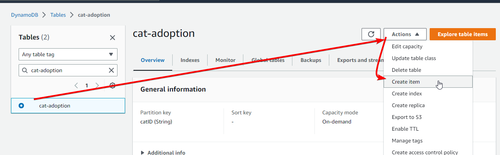

# DynamoDB Lambda Triggers

# Overview

We will be setting up a DynamoDB table full of cats that are waiting to be adopted. When the `adopted` field is updated to `true`, a Lambda will be triggered that will send an email to the adoption center telling them that “[cat abc] has been adopted!”

# Instructions

## Stage 1 - Creating the DynamoDB table

Head to the DynamoDB dashboard: [https://ap-southeast-2.console.aws.amazon.com/dynamodbv2/home?#tables](https://ap-southeast-2.console.aws.amazon.com/dynamodbv2/home?#tables)

Click on Create table

For **Table Name**, we will use `cat-adoption`

The **Partition Key** will be `catID` (string)

Leave the **Sort Key** blank

Change the **Table Settings** as to “Customize settings”

Leave the **Table Class** as “DynamoDB Standard”

Set the ********************Read/write capacity settings******************** to “On-demand”

Under ************************************Secondary Indexes w************************************e’ll create a **Global Index**, with the **Partition Key** as `adopted` (string), and no **Sort Key** (leave it blank). The **Index Name** will be “adopted-index”, and the **Attribute Projections** will be “All”

Leave **Encryption at rest** as “Owned by Amazon DynamoDB”

Click Create table

## Stage 2 - Populating the table

Now you get to add as many cats as you like to the `cat-adoption` table. In the real world this would be populated by an external service, or a frontend website the cat adoption agency uses, but in this case we will enter the data manually.

Click on your newly created `cat-adoption` table, click Actions → Create item



Set the `catID` **Value** to “cat0001”

Click Add new attribute → String, set the **Attribute name** to “catName”, set the **Value** to your chosen cats name

Click Add new attribute → String, set the **Attribute name** to “adopted”, set the **Value** to “false”

Click Create item

Repeat this process as many times as you like, don’t forget to update the `catID` each time with an incrementing number.

## Stage 2a - Querying our data

Head to Explore table items


To show why we created a global secondary index on the table, click on **Scan or query items**, select **********Query**********, change the ************Index************ to “adopted-index” and search for “true” in the partition key. 


Searching for “true” will return no objects (assuming you set all of your cat records to adopted: false):


Searching for “false” will return all cats that haven’t been adopted:


**Querying** uses indexes, which is far more efficient and cost effective, without having this secondary index we would need to **Scan** the table to look for cats which are/aren’t adopted, which means DynamoDB iterates over every record and checks that key. With tables that have thousands or millions of records, this can be very expensive (and slow).

## Stage 3 - Setting up SNS

Head to the SNS console: [https://ap-southeast-2.console.aws.amazon.com/sns/v3/home?region=ap-southeast-2#/topics](https://ap-southeast-2.console.aws.amazon.com/sns/v3/home?region=ap-southeast-2#/topics)

Click on Create topic

Set the ********Type******** to “Standard”

Set the ********Name******** to be “Adoption-Alerts”

Under **************************Access policy**************************, leave the ************Method************ as “Basic”

Change **Define who can publish messages to the topic** to “Only the specified AWS accounts” and enter your account ID (found in the top right of the screen)

Change **Define who can subscribe to this topic** to “Only the specified AWS accounts” and enter your account ID again

***********In the real world, this should be locked down further to only the resources you want publishing to the topic, but in this temporary example set up, locking down to just the account is fine and safe enough***********

Leave all other options as default

Click on Create topic

On the next page, click on Create subscription

Change the ****************Protocol**************** to “Email”

In the ****************Endpoint**************** field, enter your personal email

Click Create subscription

You will receive a confirmation email shortly after, with a link you need to click on. This tells SNS that you’re happy to receive emails from the topic, and prevents spam from being sent via SNS.

******************Side note: While writing this, my confirmation went to Spam in Gmail, so don’t forget to check there.******************

Your subscription should now be in the Confirmed state:


## Stage 4 - Create the Lambda

Head to the Lambda console: [https://ap-southeast-2.console.aws.amazon.com/lambda/home?region=ap-southeast-2#/functions](https://ap-southeast-2.console.aws.amazon.com/lambda/home?region=ap-southeast-2#/functions)

Click Create function

Leave **Author from scratch** selected

Set the **************************Function name************************** to `cat-adoption-function`

Set the **************Runtime************** to “Python 3.9”

Leave the ************************Architecture************************ as “x86_64”

Open the ****************************************************Change default execution role**************************************************** and set the ****************************Execution role**************************** to “Create a new role from AWS policy templates”

Set the ******************Role name****************** to `cat-adoption-function-role`

Add the `Amazon SNS publish policy` template to the ********************************Policy templates********************************

Click Create function

In the **Code** tab, enter the following code:

```python
import boto3

def lambda_handler(event, context):
    sns = boto3.client('sns')
    accountid = context.invoked_function_arn.split(":")[4]
    region = context.invoked_function_arn.split(":")[3]
    for record in event['Records']:
        message = record['dynamodb']['NewImage']
        catName = message['catName']['S']

        response = sns.publish(
            TopicArn=f'arn:aws:sns:{region}:{accountid}:Adoption-Alerts',
            Message=f"{catName} has been adopted!",
            Subject='Cat adopted!',
        )
```

This code basically iterates through all the records that DynamoDB passes to the Lambda function, and then publishes a message to SNS.

Don’t forget to click Deploy to save the function.


## Stage 4a - Add DynamoDB permissions to the Lambda role

Head to the Lambda console: [https://ap-southeast-2.console.aws.amazon.com/lambda/home?region=ap-southeast-2#/functions](https://ap-southeast-2.console.aws.amazon.com/lambda/home?region=ap-southeast-2#/functions)

Click on your newly created function, then the **Configuration** tab, then **Permissions.**

Click on the role 


Click on Add Permissions and then Attach Policies

Search for “AmazonDynamoDBFullAccess” and select it

Click Attach Policies

Your role policies should look something like this (the blurred policy ID will be different for you, so I’ve blurred it out to make it simpler):


This is required so the Lambda function can read from the DynamoDB Stream. In the real world this should be locked down a lot further, but in this case, we’re okay with the Lambda having full DynamoDB permissions to ***all*** tables.

## Stage 5 - Enabling the DynamoDB Stream

Head back to the DynamoDB console: [https://ap-southeast-2.console.aws.amazon.com/dynamodbv2/home?region=ap-southeast-2#table?initialTagKey=&name=cat-adoption&tab=streams](https://ap-southeast-2.console.aws.amazon.com/dynamodbv2/home?region=ap-southeast-2#table?initialTagKey=&name=cat-adoption&tab=streams)

Click on the ************************************Export and streams************************************ tab, then under **DynamoDB stream details** click Enable

On the next page, under **View type**, select ****************“New image”. We only care about the new data, we don’t need the previous record data from before it was changed.

Click Enable stream

On the next page, under **DynamoDB stream details,** click Create trigger

On the next page, under **Lambda function** select your newly created “cat-adoption-function”, leave the other options as is.

Click Create trigger


## Stage 6 - Testing it out

Head back to the DynamoDB console: [https://ap-southeast-2.console.aws.amazon.com/dynamodbv2/home?region=ap-southeast-2](https://ap-southeast-2.console.aws.amazon.com/dynamodbv2/home?region=ap-southeast-2#table?initialTagKey=&name=cat-adoption&tab=streams)

Click on Explore table items

You should see the cat items you created earlier, if not, click on Scan → Run


Change one of the “adopted” fields to “true”


After a few seconds you should receive an email telling you that cat has been adopted!


## Stage 7 - Clean up

Head to the DynamoDB console: [https://ap-southeast-2.console.aws.amazon.com/dynamodbv2/home?region=ap-southeast-2#tables](https://ap-southeast-2.console.aws.amazon.com/dynamodbv2/home?region=ap-southeast-2#tables)

Select the table you created and click Delete

Select “Delete all CloudWatch alarms for this table” and leave “Create a backup of this table before deleting it” **********unselected**********.

Type “delete” into the confirmation field and click Delete table


Head to the Lambda console: [https://ap-southeast-2.console.aws.amazon.com/lambda/home?region=ap-southeast-2#/functions](https://ap-southeast-2.console.aws.amazon.com/lambda/home?region=ap-southeast-2#/functions)

Select the function you created, then click Actions → Delete


Type “delete” into the confirmation field, and click Delete

Head to the SNS console: [https://ap-southeast-2.console.aws.amazon.com/sns/v3/home?region=ap-southeast-2#/topics](https://ap-southeast-2.console.aws.amazon.com/sns/v3/home?region=ap-southeast-2#/topics)

Select your Topic and click Delete

Type “delete me” into the confirmation field, and click Delete


Now go to the Subscriptions page, select your subscription, click Delete, and then Delete


Head to the IAM console: [https://us-east-1.console.aws.amazon.com/iamv2/home?region=ap-southeast-2#/roles](https://us-east-1.console.aws.amazon.com/iamv2/home?region=ap-southeast-2#/roles)

Under **Roles**, search for "cat-adoption”

Select the role, and click Delete


Type “cat-adoption-function-role” into the confirmation field, and click Delete

Head to the Cloudwatch Logs console: [https://ap-southeast-2.console.aws.amazon.com/cloudwatch/home?region=ap-southeast-2#logsV2:log-groups](https://ap-southeast-2.console.aws.amazon.com/cloudwatch/home?region=ap-southeast-2#logsV2:log-groups)

Search for the "/aws/lambda/cat-adoption-function” Log Group

Select the log group, click Actions → Delete


In the confirmation popup, click Delete

You’re all done!