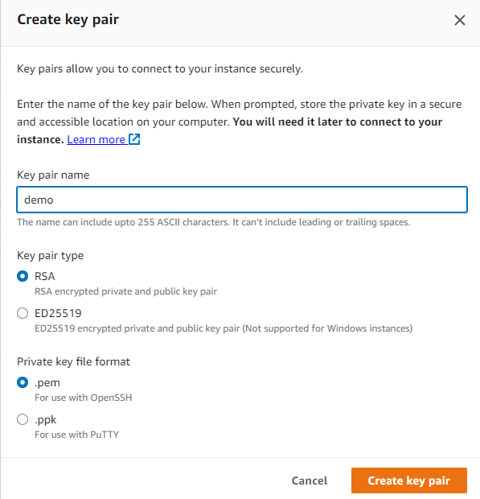

# Elastic Disaster Recovery (AWS DRS)

# Overview

We’re going to set up a basic Nginx EC2 instance, and then install the Elastic Disaster Recovery agent, to replicate the instance / application to another region.

I’m going to be setting up my primary Nginx instance in Singapore (ap-southeast-1), and the disaster recovery (or secondary) instance in Tokyo (ap-northeast-1). You can of course choose any two regions, just make sure the destination region supports the “Elastic Disaster Recovery” service: https://aws.amazon.com/about-aws/global-infrastructure/regional-product-services

This demo will require some using SSH to connect to a server and run some commands.


# Instructions

## Stage 1 - Create the instance

Head to the EC2 console: [https://ap-southeast-1.console.aws.amazon.com/ec2/home](https://ap-southeast-1.console.aws.amazon.com/ec2/home)

Click on <kbd>Launch instance</kbd>

We’ll set “nginx-primary” as the **Name**

Under **AMI**, leave the default “Amazon Linux” selected

Leave the **Instance type** as “t2.micro”

Under **Key pair (login)**, either select a key you already have, or create a new key pair.

If creating new pair:



The **Key Pair Name** can be anything, and you can leave the **Key Pair Type** as is, however the **Private Key File Format** depends on the OS you will be using. 

If you’re using a Mac or Linux PC, leave “.pem” selected. If you’re using Windows and will be using the PuTTY program, change this to “.ppk”. This demo will not cover ****how**** to SSH into a server, only the commands to run once you’re in.

Under ********************************Network Settings********************************, click on <kbd>Edit</kbd>


You can either change the **VPC**, or leave it set to the default VPC like I will. The **Subnet** can be left as “No preference”, but you need to make sure ******************************************Auto-assign public IP****************************************** is set to “Enable”


Under ****************************************************Firewall (security groups)****************************************************, select “Create security group”, and name it “nginx”. The description can stay as is.


Leave the default rule of SSH allowed from anywhere, and click <kbd>Add security group rule</kbd>


Change the ********Type******** to “HTTP” and the **********************Source type********************** to “Anywhere”


Now both SSH and HTTP are allowed from any IP. In a production environment you would be using HTTPS, and locking down SSH to specific IP addresses, but that’s beyond the scope of this demo.

Leave everything else as default, and click <kbd>Launch instance</kbd>

On the next page, click on <kbd>View all instances</kbd>

Your instance will most likely still be booting up, this may take a couple of minutes

Note down the **********************Public IPv4 address**********************, we will need that for the next step


## Stage 2 - Set up Elastic Disaster Recovery

Switch to your destination **********region. As mentioned earlier, I’m using Tokyo (ap-northeast-1)

Head to the DRS console: https://ap-northeast-1.console.aws.amazon.com/drs/home

You should be prompted with the initial set up wizard


Under ****************************************************************Replication server configuration****************************************************************, you *can* change the default ***********destination*********** subnet for replicated servers, and the default instance type. I will be leaving these as default.

Click <kbd>Next</kbd>

On the next page, leave all options as default and click <kbd>Next</kbd>

On the next page, leave all options as default and click <kbd>Next</kbd>

On the last page, click <kbd>Create default</kbd>

You should now be sent to the “Source servers” page. DRS is now waiting for agents (source servers) to connect so it can start replicating data.

## Stage 3 - Create temporary IAM access keys

Elastic Disaster Recovery requires *********temporary *********************IAM credentials to set up the initial replication connection. These will be cleaned up at the end of the demo.

Head to the IAM console: https://us-east-1.console.aws.amazon.com/iamv2/home#/users

Go to the **********Users********** page, and click on your username


On the ************************Permissions************************ tab, if you have “AdministratorAccess”, you can skip this part of this step, and go on to create your access keys.

If not, click on <kbd>Add permissions</kbd> then <kbd>Add permissions</kbd>

Select “Attach policies directly” and then search for and select `AWSElasticDisasterRecoveryAgentInstallationPolicy`


Click <kbd>Next</kbd> then click <kbd>Add permissions</kbd>

Now to create the Access Keys we need for the next step. Go to the ****************************************Security credentials**************************************** tab, and scroll down to **Access keys,** click on <kbd>Create access key</kbd>

On the next page, select “Command Line Interface (CLI)”, and check the confirmation box


Click <kbd>Next</kbd>

Set the ******************************************Description tag value****************************************** to “Temporary DRS install key” and click <kbd>Create access key</kbd>

Now make sure you copy and keep the ********************Access key******************** and **********************************Secret access key**********************************, you will need these for the next step


Click <kbd>Done</kbd>

## Stage 4 - Install Elastic Disaster Recovery agent

Using the public IP address you copied earlier, SSH into your instance 

The default user for Amazon Linux 2 is `ec2-user`

To begin with, we’ll install and start Nginx by running these commands:

```bash
sudo amazon-linux-extras install -y nginx1
sudo systemctl start nginx.service
sudo systemctl enable nginx.service
```

To confirm it’s working, visit the IP address of your instance in your browser


Note: Make sure your browser doesn’t direct you to HTTPS, as that won’t work in our demo. Make sure you type in `http://54.151.248.177` (replacing that IP, with your instance IP).

Now that our “application” is up and running, we’ll install the DRS agent. Back in your SSH console, run the following commands:

```bash
sudo yum install -y kernel-devel-`uname -r`
wget -O ./aws-replication-installer-init.py https://aws-elastic-disaster-recovery-us-east-1.s3.us-east-1.amazonaws.com/latest/linux/aws-replication-installer-init.py
sudo python3 aws-replication-installer-init.py
```

You will then be prompted for some more information

************************************AWS Region Name************************************ - This is the ***********destination*********** region. In my case, ap-northeast-1

****AWS Access Key ID**** - The key we generated in the previous step

********AWS Secret Access Key******** - The secret key we generated in the previous step

When you get prompted with `To replicate some of the disks, type the path of the disks, separated with a comma (for example, /dev/sda, /dev/sdb). To replicate all disks, press Enter:` , press <kbd>Enter</kbd>

For sanity sake, this is my output:


The script will start installing the AWS Replication Agent, this might take a couple of minutes.

## Stage 5 - Configuring DRS recovery launch settings

Switch to your destination **********region. As mentioned earlier, I’m using Tokyo (ap-northeast-1)

Head to the DRS console: https://ap-northeast-1.console.aws.amazon.com/drs/home

You should see under ****************************Source Servers**************************** your instance from your source region, either currently syncing, or completed syncing


This took around 20 minutes to fully complete for me, although that will vary between regions and instance sizes.

If you head to the EC2 console: https://ap-northeast-1.console.aws.amazon.com/ec2/home

You should see a new instance, created by Elastic Disaster Recovery. This instance handles the replication between your source server and DRS. This is ***not*** the server that will be used in a disaster / failover.


Head back to the DRS console: https://ap-northeast-1.console.aws.amazon.com/drs/home

Once your source server is in the Ready state, click on the hostname


On the next page, go to the ******************************Launch settings****************************** page. 

First, next to **********************************************General launch settings********************************************** click <kbd>Edit</kbd>


Change **Instance type right sizing** to “None”. 

This option (when enabled) will provision a recovery instance of a type AWS recommends based on CPU and memory usage. This might be useful in production, but not for our demo purposes.

Click <kbd>Save settings</kbd>

Next, under **************************************EC2 launch template************************************** there’s a couple of settings we need to change. You will see the instance type is much too large for our testing, there’s no Security Groups being applied (meaning we can’t access it), and there’s no Public IP, so let’s click on <kbd>Edit</kbd>


On the next page, under **************************Instance Type************************** change the instance type to a “t2.micro”, so we stay within the free tier.


Then, scroll down to **********************************Network Settings**********************************, and select “Create security group”. Change the **************************************Security Group Name************************************** to “nginx”, the **********************Description********************** to “Testing”, and leave the ********VPC******** as default.

Click on <kbd>Add security group rule</kbd>

Change ********Type******** to “HTTP”, and ****************Source Type**************** to “Anywhere”


Then, still under ********************************Network Settings********************************, expand **Advanced network configuration**, then change ********************************Auto-assign Public IP******************************** to “Enable”


Once that’s done, click <kbd>Create template version</kbd>

On the next page, click <kbd>View launch templates</kbd>

Select the launch template created by DRS, then click <kbd>Actions</kbd> then <kbd>Set default version</kbd>


In the config box that pops up, change the ********************************Template version******************************** to the highest value, in my case this is 5, but in your case it will probably be 2


Click <kbd>Set as default version</kbd>

Now if we head back to the DRS console: https://ap-northeast-1.console.aws.amazon.com/drs/home?region=ap-northeast-1#/sourceServers

Then go back into our Source server, and back to the ******************************Launch settings****************************** tab, we will see all three options have changed


## Stage 6 - Performing a test recovery

Head to the DRS console: https://ap-northeast-1.console.aws.amazon.com/drs/home

Go to the ****************************Source servers**************************** page, select your source server, and click on <kbd>Initiate recovery job</kbd> and then <kbd>Initiate Recovery Drill</kbd>


On the next page, leave all options as default and click <kbd>Initiate drill</kbd>

This will take a few minutes. If you go to the ****************************************Recovery Job History**************************************** page, you can view the status of the job


What this ****************************Recovery Drill**************************** process is designed to do is allow you to perform test restores to an instance in the destination region, so that you can test connectivity, and ensure that the server and application start up successfully.

Once the recovery job is complete, we can view the newly created instance in EC2 by clicking on the instance name


Then clicking “View in EC2”


Then in the EC2 console, copy the IP address, and visit it in your browser


You should see the Nginx welcome page, like we saw on the original (source) instance


That confirms the source server is successfully replicated to the destination region, and can be restored / failed over to at any point, and we can be confident our very basic application starts up and fails-over successfully.

## Stage 7 - Clean up

In the destination region (ap-northeast-1 for me)

Head to the DRS console: https://ap-northeast-1.console.aws.amazon.com/drs/home

Go to ************************************Recovery instances************************************, select your instance, click <kbd>Actions</kbd>, then click <kbd>Terminate recovery instances</kbd>


Next go to ****************************Source servers****************************, select your instance, click <kbd>Actions</kbd>, then click <kbd>Disconnect from AWS</kbd>


In the confirmation box, click <kbd>Disconnect</kbd>. This deletes all replicated data, and disconnects the source instance from Elastic Disaster Recovery.

Now select your instance again, click <kbd>Actions</kbd>, then click <kbd>Delete server</kbd>


In the confirmation box, click <kbd>Permanently delete</kbd>

Head to the EC2 console: https://ap-northeast-1.console.aws.amazon.com/ec2/v2/home

Go to ********************Instances********************, and if there are any Running instances, select them, then click <kbd>Instance state</kbd> and then <kbd>Terminate Instance</kbd>

Be careful to only delete instances created in this demo


Click <kbd>Terminate</kbd> in the confirmation box

Go to **************Volumes**************, select any Volumes related to the AWS Elastic Disaster Recovery service, click <kbd>Actions</kbd> and then <kbd>Delete Volume</kbd>


Type “delete” in the confirmation box, then click <kbd>Delete</kbd>

Go to ******************Snapshots******************, select all snapshots related to AWS Elastic Disaster Recovery service, click <kbd>Actions</kbd> and then <kbd>Delete Snapshot</kbd>


Type “delete” in the confirmation box, then click <kbd>Delete</kbd>

Go to ******************************Security Groups,****************************** select all security groups related to AWS Elastic Disaster Recovery service, click <kbd>Actions</kbd> and then <kbd>Delete security groups</kbd>


Type “delete” in the confirmation box, then click <kbd>Delete</kbd>

In the source region (ap-southeast-1 for me)

Head to the EC2 console: https://ap-southeast-1.console.aws.amazon.com/ec2/v2/home

Go to ********************Instances********************, select the initial demo nginx instance we created, then click <kbd>Instance state</kbd> and then <kbd>Terminate Instance</kbd>


Click <kbd>Terminate</kbd> in the confirmation box

Go to ******************************Security Groups,****************************** select the Security Group we created earlier, click <kbd>Actions</kbd> and then <kbd>Delete security groups</kbd>


In the confirmation box, click <kbd>Delete</kbd>

Go to ************************Key Pairs************************, select the key pair we created earlier, click <kbd>Actions</kbd> and then <kbd>Delete</kbd>


Type “Delete” in the confirmation box, then click <kbd>Delete</kbd>

Head to the IAM console: https://us-east-1.console.aws.amazon.com/iamv2/home#/users

Go to the **********Users********** page, and click on your username


On the ************************Permissions************************ tab, if you added the `AWSElasticDisasterRecoveryAgentInstallationPolicy` policy, select it and click <kbd>Remove</kbd>


Click <kbd>Remove policy</kbd> in the confirmation window

Go to the ********************Security Credentials******************** tab, scroll down to ****************Access Keys****************, and click <kbd>Actions</kbd> then <kbd>Deactivate</kbd> next to the key you created earlier


Click <kbd>Deactivate</kbd> in the confirmation box

Now click <kbd>Actions</kbd> then <kbd>Delete</kbd> next to the key you created earlier


Enter the Access Key in the confirmation box and click <kbd>Delete</kbd>


