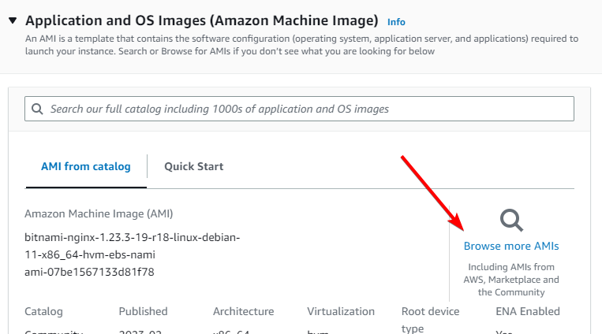

# Fault Injection Simulator

# Overview

We’re going to be setting up two Nginx instances, them put them behind an Application Load Balancer. We’ll then set up AWS Fault Injection Simulator to take down one or more of these instances, and see how our “application” (the Nginx welcome page) handles it.

I refer to Fault Injection Simulator as “FIS” a few times in this document, just so you know what I’m referring to.

I will be creating this in the ap-southeast-1 region, so all links to the console will be there. Make sure you change region if you’re deploying elsewhere.

# Instructions

## Stage 1 - Create the instances

Head to the EC2 console: https://ap-southeast-1.console.aws.amazon.com/ec2/home

Click on <kbd>Launch instance</kbd>

We’ll set “nginx” as the **Name**

Under **AMI**, click on “Browse more AMIs”

Next, get the AMI of the Bitnami Nginx image ***************************in the region you are using*************************** from this page: https://bitnami.com/stack/nginx/cloud/aws/amis 

In my case, Singapore. Copy the AMI ID, paste it in the search bar, go to the Community AMIs tab, and select the image.

Leave the **Instance type** as “t2.micro”

Under **Key pair (login)**, change this to “Proceed without a key pair (Not Recommended)”. We won’t be accessing these instances, so we have no need for this.

Under ********************************Network Settings********************************, click on <kbd>Edit</kbd>

You can either change the **VPC**, or leave it set to the default VPC like I will. The **Subnet** can be left as “No preference”, but you need to make sure ******************************************Auto-assign public IP****************************************** is set to “Enable”

Under ****************************************************Firewall (security groups)****************************************************, select “Create security group”, and name it “nginx”. The description can stay as is.

Delete the default SSH rule by clicking <kbd>Remove</kbd>

Click <kbd>Add security group rule</kbd>

Change the ********Type******** to “HTTP” and the **********************Source type********************** to “Anywhere”

Next, change the “Number of instances” to 2

Leave everything else as default, and click <kbd>Launch instance</kbd>

On the next page, click on <kbd>View all instances</kbd>

You should see two instances in the process of starting

After a few minutes, you should be able to visit both public IPs in your browser (make sure to only use `http://` not `https://`) and you will see the Nginx welcome page

## Stage 2 - Create the Target Group

Head to the EC2 console: https://ap-southeast-1.console.aws.amazon.com/ec2/home

Go to **Target Groups** and click <kbd>Create target group</kbd>

Leave “Instances” selected

Change the ****************Target group name**************** to “nginx”

Leave everything else as default, and click <kbd>Next</kbd>

On the next page, select both instances we created earlier, and click <kbd>Include as pending below</kbd>

This adds both instances to the Target Group *******pending******* a successful health check, which was set on the previous page, and is just an HTTP call to the `/` URI, looking for a `200` response. 

Click <kbd>Create target group</kbd>

## Stage 3 - Create the Application Load Balancer

Head to the EC2 console: https://ap-southeast-1.console.aws.amazon.com/ec2/home

Go to ****************************Load Balancers**************************** and click <kbd>Create load balancer</kbd>

Under **Load balancer types**, select “Application Load Balancer”

Set the ****************Load balancer name**************** to “nginx”

Under ******************************Network mapping******************************, select all available Mappings, and leave the subnet as default (unless you have selected a different VPC and know what you’re doing)

Under ******************************Security groups******************************, select the “nginx” Security Group we created earlier in the EC2 instances console

Under ******************************************Listeners and routing,****************************************** change the ****************************Default action**************************** to the Target Group we created in the previous step

Leave everything else as default, and click <kbd>Create load balancer</kbd>

On the next page, click <kbd>View load balancer</kbd>

Click on your load balancer name

Then, note down the ****************DNS name****************, we will use this for testing

While we wait for that to provision, if you click on the Target Group under **************Listeners**************, we can confirm our instances are healthy and will receive traffic

You should see both instances (”Registered targets”) in either the `initial` or `healthy` status

If we visit our Load Balancer DNS in our browser, we should see the Nginx welcome page again

At this point we don’t know, or care, which instance serves the traffic, we just know the load balancer is distributing traffic between them

## Stage 4 - Create an FIS IAM role

Head to the IAM console: https://us-east-1.console.aws.amazon.com/iamv2/home?region=us-east-1#/roles

Go to **********Roles********** and click <kbd>Create role</kbd>

Select “AWS Service” as the ******************Trusted Entity Type******************

Select “FIS” under ****************************************************************Use cases for other AWS services****************************************************************, then choose the “AWSFaultInjectionSimulatorEC2Access” option

Click <kbd>Next</kbd>

On the permissions page, click <kbd>Next</kbd>

Set the ******************Role name****************** to “FIS-Role”

Click <kbd>Create role</kbd>

Back on the **********Roles********** page, search for and click on the role you just created

Click on <kbd>Add permissions</kbd> then <kbd>Attach policies</kbd>

Search for and select `AWSFaultInjectionSimulatorNetworkAccess` 

Click <kbd>Add permissions</kbd>

## Stage 5 - Set up Fault Injection Simulator

Head to the FIS console: https://ap-southeast-1.console.aws.amazon.com/fis/home?region=ap-southeast-1#Home

You should be presented with the FIS welcome screen, click on <kbd>Create experiment template</kbd>

In the **********************Description********************** field I’m going to put “kill nginx”, you can enter whatever you like

We’re going to add two actions, one to reboot our instances, and one to disrupt the network connectivity in our subnets

Under **************Actions**************, click <kbd>Add action</kbd>

Set the ********Name******** to “reboot-nginx”

Set the **********************Action type********************** to “aws:ec2:reboot-instances”

Click <kbd>Save</kbd>

Under **************Actions**************, click <kbd>Add action</kbd>

Set the ********Name******** to “disrupt-network”

Set the **********************Action type********************** to “aws:network:disrupt-connectivity”

Set the **Duration** to 5 minutes

Click <kbd>Save</kbd>

Under **************Targets**************, click on <kbd>Edit</kbd> next to “Instances-Target-1”, under ************************Resource IDs************************ select both of the instances you created earlier

Change the ****************************Selection mode**************************** to “Count” and set the **************************************Number of resources************************************** to 1. We only want 1 instance rebooted at a time, we know if both are rebooted there will obviously be downtime.

Click <kbd>Save</kbd>

Next to “Subnets-Target-2” click <kbd>Edit</kbd>

Under ************************Resource IDs************************, select all available subnets

Leave **************Selection mode************** as “All”

Click <kbd>Save</kbd>

Under ****************************Service Access**************************** change the IAM role to the “FIS-Role” role we created in the previous step.

Under ******************************Stop conditions******************************, we will leave this blank, in a production environment you might want to call off any fault simulations if things start to break, and you can do this by specifying a CloudWatch alarm.

Leave everything else as default, and click <kbd>Create experiment template</kbd>

Because we haven’t specified a way to stop the simulation, AWS will warn us and ask for confirmation, enter “create” in the confirmation box and click <kbd>Create experiment template</kbd>

## Stage 6 - Start the FIS Experiment

Before we start the experiment, you should open up two windows or tabs, one with your EC2 instances so you can see their state, and one with our Nginx website

Head to the FIS console: https://ap-southeast-1.console.aws.amazon.com/fis/home?region=ap-southeast-1#Home

Go to ************Experiment templates************, select the template we just created, and click <kbd>Start experiment</kbd>

On the next page, click <kbd>Start experiment</kbd>

In the confirmation box, enter “start” and click <kbd>Start experiment</kbd>

When FIS reboots our ********instance********, we shouldn’t notice any disruption (and in my testing this worked as expected).

However, when FIS disrupted the network, it impacted ***all*** subnets, and caused our Application Load Balancer to be unable to reach both instances, as well as preventing us from accessing our load balancer

While this is happening (during the 5 minute window), if you’re interested, you can head to the VPC console: https://ap-southeast-1.console.aws.amazon.com/vpc/home

Go to **************Subnets**************, select any of your subnets, and go to the **********************Network ACL********************** tab. You will see both inbound and outbound have Deny rules from all IPs (0.0.0.0/0) on them, preventing any traffic going into or out of the subnet

After the test is complete, you will see the Network ACL will have the default “allow” rule re-added

## Stage 7 - Clean up

Head to the EC2 console: https://ap-northeast-1.console.aws.amazon.com/ec2/v2/home

Go to ********************Instances********************, and select both “nginx” instances, then click <kbd>Instance state</kbd> and then <kbd>Terminate Instance</kbd>

Be careful to only delete instances created in this demo

Go to ****************************Load Balancers****************************, select your “nginx” load balancer, then click <kbd>Actions</kbd> then <kbd>Delete load balancer</kbd>

Enter “confirm” in the confirmation box, then click <kbd>Delete</kbd>

Go to **************************Target Groups**************************, select your “nginx” Target Group, then click <kbd>Actions</kbd> then <kbd>Delete</kbd>

Click <kbd>Yes, delete</kbd> in the confirmation box

Go to ******************************Security Groups******************************, select your “nginx” Security Group, then click <kbd>Actions</kbd> then <kbd>Delete security groups</kbd>

Click <kbd>Delete</kbd> in the confirmation box

Head to the FIS console: https://ap-southeast-1.console.aws.amazon.com/fis/home?region=ap-southeast-1#ExperimentTemplates

Go to **Experiment Templates**, select the template we created earlier, then click <kbd>Actions</kbd> then <kbd>Delete experiment template</kbd>

Type “delete” in the confirmation box, and click <kbd>Delete experiment template</kbd>

Head to the IAM console: https://us-east-1.console.aws.amazon.com/iamv2/home?region=ap-southeast-1#/roles

Go to **********Roles**********, search for “FIS-Role”, select the role you created, and click <kbd>Delete</kbd>

Enter the role name (”FIS-Role”) in the confirmation box, and click <kbd>Delete</kbd>