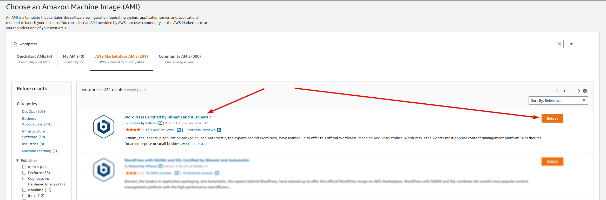

# Global Accelerator

# Overview

We’re going to set up three EC2 instances running Wordpress. All three will have public elastic IPs, one will have Global Accelerator, and another will have Cloudfront (without caching).

We’re going to see the differences between the three in terms of network / website performance.

# Instructions

## Stage 0 - Pick a region

You should choose a region where your instances will be deployed that is relatively far away from you, to see any differences easier. For example if you’re in Sydney, Australia, try choosing a US region, and vice versa. 

The reason you don’t want to choose the region closest to you, is because there will be far fewer hops (routers) and shorter routes to the instances, which will skew the results and make any benefits less obvious.

I’m going to be using **ca-central-1**, so all links will be directing to that region.

## Stage 1 - Create the instances

Head to the EC2 dashboard: [https://ca-central-1.console.aws.amazon.com/ec2/home?region=ca-central-1#Instances:v](https://ca-central-1.console.aws.amazon.com/ec2/home?region=ca-central-1#Instances:v)

Click on Launch instances

For **Name**, just put “wordpress” (we will be changing this shortly)

Set the **Number of instances** to 3

Under **Application and OS Images (Amazon Machine Image)** enter “Wordpress” and hit <kbd>Enter</kbd>

A window should pop up with all the “Wordpress” images on the AWS Marketplace, for this demo, try and use the same one I have here:



In the window that pops up, click on the **Pricing** tab, and make sure it says $0/Hour next to the product name, and then click <kbd>Continue</kbd>

(The $0.021/Hour for the EC2 instance itself is fine, but the AMI should not cost anything).


**Note:** Because this is a “marketplace AMI”, you may receive emails saying you have “subscribed” to a Marketplace Product, or “Offers: New offer accepted” like I did. As long as the price above is $0/Hour, don’t worry. Plus, we will cancel the subscription at the end of this document.

Back in the EC2 configuration window, under **Instance type,** select `t2.micro` which should be Free tier eligible. For accounts <12 months old you get 750 hours per month of free EC2 compute for specific instance types (including t2.micro), so this shouldn’t cost you anything if you only have the instances up for a few hours or days.

[https://aws.amazon.com/free/?all-free-tier.sort-by=item.additionalFields.SortRank&all-free-tier.sort-order=asc&awsf.Free Tier Types=tier%2312monthsfree&awsf.Free Tier Categories=categories%23compute](https://aws.amazon.com/free/?all-free-tier.sort-by=item.additionalFields.SortRank&all-free-tier.sort-order=asc&awsf.Free%20Tier%20Types=tier%2312monthsfree&awsf.Free%20Tier%20Categories=categories%23compute)


Under **Key paid (login)** select “Proceed without a key pair” from the dropdown. We won’t need to access these instances.


Under **Network settings**, we’re going to use the default VPC, and then choose a subnet. It can be any subnet, as long as you pick one. We don’t want to leave it on “No preference” because EC2 might provision the 3 instances to different subnets, and therefore different availability zones, which could (very slightly) impact our testing.


Leave **Auto-assign public IP** on Enable

Under **Firewall (security groups)**, leave “Create security group” selected, with the default **Security group name**. However, we **only** want TCP port 80 and ICMP allowed, as that’s all we need for our testing, so remove any other rules (SSH, HTTPS, etc)


Leave **Configure storage** and **Advanced details** as they are, and click <kbd>Launch instance</kbd>

Now back in the EC2 console, you should have 3 instances, all named “wordpress”, all with Elastic IPs (public IP addresses), and all in the same Availability Zone.


Rename each of the instances as follows (no order / preference, you just want one of each of the following):

wordpress - standard

wordpress - global accelerator

wordpress - cloudfront


If you visit any of the 3 public IP addresses from these instances, you should be greeted with a basic Wordpress page


## Stage 2 - Add Global Accelerator

Head to the Global Accelerator console: [https://us-west-2.console.aws.amazon.com/globalaccelerator/home?region=ca-central-1#GlobalAcceleratorHome:](https://us-west-2.console.aws.amazon.com/globalaccelerator/home?region=ca-central-1#GlobalAcceleratorHome:)

Click on <kbd>Create accelerator</kbd>

Set the **Accelerator name** to “wordpress”

Leave everything else as default, and click <kbd>Next</kbd>

Under **Listeners** add port 80, with protocol TCP, and Client affinity “none” (if we had multiple destinations, we would set this to “Source IP”, but in this demo there’s no where else for clients to be routed).

Click <kbd>Next</kbd>

On the next page, set the **Region** to the region your EC2 instances are in. In my case this is ca-central-1.

Click <kbd>Next</kbd>

On the next page (Step 4), click on <kbd>Add endpoint</kbd>

Set the **Endpoint type** to “EC2 Instance”, and the **Endpoint** to be the “wordpress - global accelerator” instance we created earlier. Leave the **weight** as is.


Click on <kbd>Create accelerator</kbd>

It will take a few (5-10 in my experience) minutes to create the Global Accelerator.

Once completed, you will have two IPv4 addresses and a DNS name. 


## Stage 2 - Add Cloudfront

Head to the Cloudfront console: [https://us-east-1.console.aws.amazon.com/cloudfront/v3/home?region=ca-central-1#/distributions](https://us-east-1.console.aws.amazon.com/cloudfront/v3/home?region=ca-central-1#/distributions)

Click <kbd>Create distribution</kbd>

Set the **Origin** to the Public IPv4 DNS that was provided for your “wordpress - cloudfront” EC2 instance


Leave the **Protocol** on “HTTP only”

Under **Default cache behavior**, change **Compress objects automatically** to “No”, and the **Cache policy** to “CachingDisabled”


Change **Origin request policy** to “AllViewer”


Leave all other settings default, and click <kbd>Create distribution</kbd>

## Stage 3 - Testing

You should now be able to visit all three DNS names and see a Wordpress home page.

**Wordpress - Standard**


**Wordpress - Global Accelerator**


**Wordpress - Cloudfront**


### Network tests

Let’s traceroute to each DNS record.

I’ve obfuscated the 3rd hop intentionally in each output, your traceroute will look different.

**Note** this traceroute was run on a Linux PC, which uses UDP by default for traceroutes, as does Mac. So for Linux and Mac computers, the command shown will work. Window’s uses ICMP by default, so the command `tracert 13.248.152.10` will work just the same.

**Wordpress - Standard**

```bash
❯ traceroute -I -q1 ec2-99-79-123-146.ca-central-1.compute.amazonaws.com
traceroute to ec2-99-79-123-146.ca-central-1.compute.amazonaws.com (99.79.123.146), 30 hops max, 60 byte packets
 1  MY-PC (172.27.96.1)  0.265 ms
 2  gateway (192.168.1.254)  0.503 ms
 3  loopX.bng.mel.aussiebb.net (119.17.X.1)  4.568 ms
 4  10.241.5.82 (10.241.5.82)  162.222 ms
 5  10.241.4.72 (10.241.4.72)  165.326 ms
 6  be23.core1.equinix-sy1.syd.aussiebb.net (119.18.32.221)  162.401 ms
 7  be6.bdr1.coresite-sv1.sjc.aussiebb.net (180.150.2.108)  162.417 ms
 8  ce-0-17-0-0.r01.snjsca04.us.bb.gin.ntt.net (128.242.179.33)  162.691 ms
 9  ae-10.r25.snjsca04.us.bb.gin.ntt.net (129.250.3.174)  162.722 ms
10  ae-8.r21.dllstx14.us.bb.gin.ntt.net (129.250.4.155)  223.588 ms
11  ae-1.a01.dllstx14.us.bb.gin.ntt.net (129.250.4.30)  208.637 ms
12  ae-1.amazon.dllstx14.us.bb.gin.ntt.net (128.241.14.222)  201.369 ms
13  15.230.130.155 (15.230.130.155)  202.572 ms
14  **
15  52.93.34.139 (52.93.34.139)  202.724 ms
16  176.32.125.207 (176.32.125.207)  201.337 ms
17  **
18  52.94.83.2 (52.94.83.2)  236.100 ms
19  52.94.83.195 (52.94.83.195)  241.643 ms
20  52.94.83.194 (52.94.83.194)  236.090 ms
21  52.94.82.249 (52.94.82.249)  235.719 ms
22  52.94.81.14 (52.94.81.14)  237.265 ms
23  **
24  **
25  **
26  **
27  **
28  **
29  ec2-99-79-123-146.ca-central-1.compute.amazonaws.com (99.79.123.146)  237.243 ms
```

29 hops (routers) and 237ms to reach the EC2 instance. This is to be expected when routing to an IP address from Melbourne, Australia, to Montreal, Canada.

**Wordpress - Global Accelerator**

```bash
❯ traceroute -I -q1 a19f75343838b8bf3.awsglobalaccelerator.com
traceroute to a19f75343838b8bf3.awsglobalaccelerator.com (76.223.23.50), 30 hops max, 60 byte packets
 1  MY-PC (172.27.96.1)  0.244 ms
 2  gateway (192.168.1.254)  0.390 ms
 3  loopX.bng.mel.aussiebb.net (119.17.X.1)  3.229 ms
 4  10.241.5.82 (10.241.5.82)  3.672 ms
 5  10.241.4.142 (10.241.4.142)  5.154 ms
 6  10.241.4.229 (10.241.4.229)  3.272 ms
 7  a19f75343838b8bf3.awsglobalaccelerator.com (76.223.23.50)  2.892 ms
```

7 hops, and 2.8ms. This is staying in the same city (Melbourne), and is served by one of AWS’s Edge  locations, the same ones that serve Cloudfront, and Route53. You can see a map of AWS’s Edge locations here: [https://aws.amazon.com/cloudfront/features/?whats-new-cloudfront.sort-by=item.additionalFields.postDateTime&whats-new-cloudfront.sort-order=desc](https://aws.amazon.com/cloudfront/features/?whats-new-cloudfront.sort-by=item.additionalFields.postDateTime&whats-new-cloudfront.sort-order=desc)

**Note:** If you have taken the “AWS Certified Security - Specialty” or “AWS Certified Advanced Networking - Specialty” course at [https://learn.cantrill.io/](https://learn.cantrill.io/) you will know that this IP is **not** hitting the EC2 instance. Global Accelerator sets up anycast IPs in all of it’s Edge locations, and terminates the TCP connections there, while on the backend opening a separate TCP connection to the EC2 instance, via the AWS internal backbone.

**Wordpress - Cloudfront**

```bash
❯ traceroute -I -q1 dl0qk8du0izvb.cloudfront.net
traceroute to dl0qk8du0izvb.cloudfront.net (65.8.14.82), 30 hops max, 60 byte packets
 1  MY-PC (172.27.96.1)  0.196 ms
 2  gateway (192.168.1.254)  0.350 ms
 3  loopX.bng.mel.aussiebb.net (119.17.X.1)  3.686 ms
 4  10.241.5.82 (10.241.5.82)  3.517 ms
 5  10.241.4.142 (10.241.4.142)  6.781 ms
 6  10.241.4.229 (10.241.4.229)  3.652 ms
 7  150.222.72.89 (150.222.72.89)  3.339 ms
 8  **
 9  **
10  **
11  **
12  **
13  server-65-8-14-82.mel50.r.cloudfront.net (65.8.14.82)  3.033 ms
```

As expected, the latency is almost identical to the Global Accelerator traceroute, however it does have a few more hops. More hops isn’t really a problem if the latency to the last hop (the host) is okay, which in this case it is.

### HTTP Tests

Now we can test the main use case of Global Accelerator, improving application performance. 

In our case we’re going to be serving a Wordpress website, however the same principal applies to any application or service. 

We’re going to take a look at the website speed using Google Chrome. The same tools are also on Firefox and Safari, however I won’t be covering those in this document.

Open up an Incognito window, we don’t want any caching impacting our test. 

Hit <kbd>F12</kbd> to open the Console, and then dock it to the bottom of the screen


Now go to the Network tab, and ensure Disable Cache is checked.


Enter the URL in the address bar and hit <kbd>Enter</kbd> and you will see all of the requests made to the web server, how long they took, the response status, and (what we’re interested in), the waterfall. Hover your mouse over the waterfall to see more details.

**Remember:** We want to specifically use `http` for these tests, not `https`, our EC2 instance isn’t set up to serve (or allow) `https` connections, and we don’t want SSL set up to impact our testing.

**Wordpress - Standard**


The standard EC2 instance took 239ms to establish the initial connection, and 324ms for the server to respond.

**Wordpress - Global Accelerator**


The main difference here is the initial connection took 2.63ms, because, as mentioned earlier, Global Accelerator establishes the TCP (HTTP) connection at an edge location close to you / your customer, and then creates another connection to the EC2 instance in the background.

So while the total page load time was ~80ms **faster** than the standard instance, the main benefit here is the fast connection times, which can be very useful for applications that make a lot of smaller connections, and benefit from faster establishment times.

**Wordpress - Cloudfront**


Cloudfront operates in a similar way to Global Accelerator, in that it uses AWS’s internal network to reach the Origin (in this case, the instance in Canada). Because of this, the initial connection time is about the same the traceroute / ping latency (2.43ms).

Obviously we’re not utilising the main benefit of Cloudfront, caching, which would speed up the page load time dramatically, and in a lot of cases prevent any connections being made to the Origin instance.

## Stage 4 - Clean up

Head to the Cloudfront console: [https://us-east-1.console.aws.amazon.com/cloudfront/v3/home?region=ca-central-1#/distributions](https://us-east-1.console.aws.amazon.com/cloudfront/v3/home?region=ca-central-1#/distributions)

Select the distribution you created, and click <kbd>Disable</kbd>

Distributions must be disabled before they can be deleted. Disabling them can take a minute or two.


Once that’s done (the <kbd>Delete</kbd> button will be clickable), select your distribution again and click <kbd>Delete</kbd>


Head to the Global Accelerator console: [https://us-west-2.console.aws.amazon.com/globalaccelerator/home?region=ca-central-1#GlobalAcceleratorDashboard:](https://us-west-2.console.aws.amazon.com/globalaccelerator/home?region=ca-central-1#GlobalAcceleratorDashboard:)

Select the Accelerator you created, and click <kbd>Delete</kbd>


In the confirmation box, you need to disable the accelerator first, before deleting it.


Once that’s done, enter “delete” in the confirmation box and click <kbd>Delete</kbd>

Head to the EC2 instances console: [https://ca-central-1.console.aws.amazon.com/ec2/home?region=ca-central-1#Instances:instanceState=running](https://ca-central-1.console.aws.amazon.com/ec2/home?region=ca-central-1#Instances:instanceState=running)

Select the three EC2 instances you created and click Actions → Terminate instance


Click <kbd>Terminate</kbd> on the confirmation popup.

Head to the AWS Marketplace Subscriptions console: [https://us-east-1.console.aws.amazon.com/marketplace/home?region=ca-central-1#/subscriptions](https://us-east-1.console.aws.amazon.com/marketplace/home?region=ca-central-1#/subscriptions)

Remember this is a free subscription, but for the sake of cleanliness, we’ll remove this as well.

You should see your Wordpress subscription, click on <kbd>Manage</kbd>


Click on Actions → Cancel subscription


Check the “I understand…” checkbox, and click <kbd>Yes, cancel subscription</kbd>

