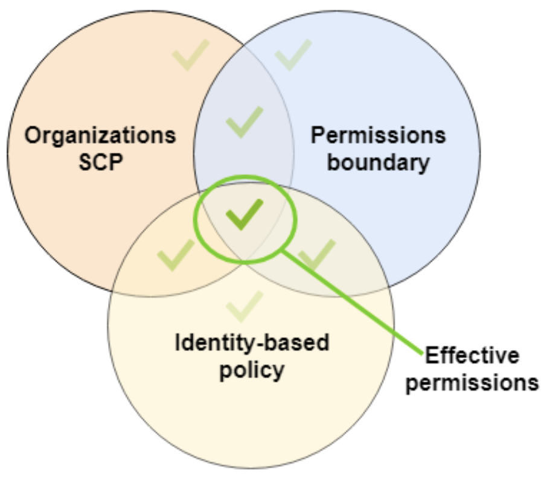

# SCP, Permissions Boundary, and IAM policy

# Overview

We’re going to be creating and configuring an IAM user, and then limiting their access via IAM Policies, Permissions Boundary’s, and Service Control Policies (SCPs).

We’re going to create a user in an organisation sub-account, then test out creating S3 buckets and IAM users, using that newly created user.

We will then use an SCP to prevent ********deleting******** buckets at the account level, and Permission Boundary’s to limit the user to performing **********everything********** in S3, all while having full AdministratorAccess at the Identity-based policy level.

The following diagram from the Cantrill Solutions Architect Professional course explains how these three permission tools work together.



**********Note:********** You will need to have an AWS Organisation set up to use Service Control Policies. They’re relatively easy to set up as long as you have 2+ AWS accounts, see the following tutorial for instructions: [https://docs.aws.amazon.com/organizations/latest/userguide/orgs_tutorials_basic.html](https://docs.aws.amazon.com/organizations/latest/userguide/orgs_tutorials_basic.html)

# Instructions

## Stage 1 - Create the IAM user

**Account:** Sub-account

********User:******** Your default user

Head to the IAM dashboard: [https://us-east-1.console.aws.amazon.com/iamv2/home](https://us-east-1.console.aws.amazon.com/iamv2/home)

Go the Users page click <btn>Add Users</btn>

Enter the User Name, ensure “Enable console access” is selected, leave “Autogenerated password” selected, and leave “Users must create a new password at next sign-in (recommended)” selected. Then click <kbd>Next</kbd>.

On the next page, select “Attach policies directly” and check “AdministratorAccess”


Click <kbd>Next</kbd>

On the next page, click <kbd>Create user</kbd>.

Make sure you copy down the autogenerated password as you’ll need that for the next step.

This user now has unrestricted access to perform ****any**** tasks / API calls in this AWS account, because they have the “AdministratorAccess” identity-based policy assigned.

## Stage 2 - Login as your new user and test access

**Account:** Sub-account

********User:******** Newly created user

Let’s test out some actions, first we’ll create an S3 bucket. 

Head to the S3 console: https://s3.console.aws.amazon.com/s3/buckets

Click on <kbd>Create bucket</kbd>

Choose any name and any region, and leave all other settings as default.

Click <kbd>Create bucket</kbd>

It should have created without any issues.


Let’s try and delete that bucket. Select it, and click <kbd>Delete</kbd>


Enter the bucket name in the confirmation window, and click <kbd>Delete bucket</kbd>

As expected, it worked.

Now, head to the IAM console: https://us-east-1.console.aws.amazon.com/iamv2/home

Go to **********Users********** and click <kbd>Add users</kbd>


Set the ******************User name****************** to anything you like.

Click <kbd>Next</kbd>

Under **********************Permissions**********************, select “Attach policies directly”, and select the “AdministratorAccess” policy


Click <kbd>Next</kbd>

Click <kbd>Create user</kbd>

As expected, it worked, and now the organisation has a user that was created with administrator privileges, that isn’t tracked / necessarily known by the owners or administrators of the organisation, which isn’t definitely isn’t ideal

Select the user you just created, and click <kbd>Delete</kbd>


In the confirmation box, enter the username and click <kbd>Delete</kbd>

## Stage 3 - Creating an SCP to prevent bucket deletion

**Account:** Management account

********User:******** Your default user

Head to the AWS Organizations console: https://us-east-1.console.aws.amazon.com/organizations/v2/home/

Go to ****************Policies**************** then ****************Service control policies****************


Click on <kbd>Create policy</kbd>

Set the **********************Policy Name********************** to “NoDeleteBucket”

Then in the statement box, enter

```bash
{
    "Version": "2012-10-17",
    "Statement": [
        {
            "Action": [
                "s3:DeleteBucket"
            ],
            "Resource": "*",
            "Effect": "Deny"
        }
    ]
}
```


Click <kbd>Create policy</kbd>

Now go to the ************************AWS accounts************************ page, and click on the sub-account you’re using for this demo (and where you have created your IAM user)


Go to the ****************Policies**************** tab and click <kbd>Attach</kbd>


Select the `NoDeleteBucket` policy and click <kbd>Attach policy</kbd>


## Stage 4 - Create a permissions boundary

**Account:** Sub-account

********User:******** Your default user

Head to the IAM console: https://us-east-1.console.aws.amazon.com/iamv2/home

Go to **********Users********** and click on the user you created earlier


Expand “Permissions boundary” and click <kbd>Set permissions boundary</kbd>


Search for “AmazonS3FullAccess” and select that policy


Click <kbd>Set boundary</kbd>

## Stage 5 - Login as your new user and test access

**Account:** Sub-account

********User:******** Newly created user

Login to your sub-account, as your newly created user.

First, like we did before, we’ll create a new S3 bucket.

Head to the S3 console: https://s3.console.aws.amazon.com/s3/buckets

Click on <kbd>Create bucket</kbd>

Choose any name and any region, and leave all other settings as default.

Click <kbd>Create bucket</kbd>

As expected, it worked.

Now we’ll try and delete our newly created bucket. Select the bucket and click <kbd>Delete</kbd>


Enter the name of the bucket and click <kbd>Delete bucket</kbd>

You should receive an error:


Remember, our SCP, applied at the account level, is preventing ******anyone****** from deleting S3 buckets.

Now let’s try creating a new user like we did earlier.

Head to the IAM console: https://us-east-1.console.aws.amazon.com/iamv2/home

Immediately you will start seeing permission errors.


Even if you do go to the ************Users************ page, nothing will load, including the <kbd>Create user</kdb> button.

In production, this would be a lot more fine tuned, you would need to give your user access to change their password, MFA, etc, rather than just denying `iam:*`

Effectively, our user has three permission sets acting upon them:

**IAM policy** - Administrator access to everything

**SCP** - They can’t delete S3 buckets

**Permissions boundary** - The user can do anything in S3

This results in our user *****only***** being allowed to perform S3 actions, ******except****** for `DeleteBucket`

## Stage 6 - Clean up

**Account:** Management account

Login to your management account

Head to the AWS Organizations console: https://us-east-1.console.aws.amazon.com/organizations/v2/home/

Go to the ************************AWS accounts************************ page, and click on the sub-account you’re using for this demo


Go to the ****************Policies**************** tab, select our “NoDeleteBucket” policy, and click <kbd>Detach</kbd>


In the confirmation box, click <kbd>Detach policy</kbd>

Go to ****************Policies**************** then ****************Service control policies****************


Select the “NoDeleteBucket” policy, and click <kbd>Actions</kbd> then <kbd>Delete policy</kbd>


Enter the policy name in the confirmation box and click <kbd>Delete</kbd>

**Account:** Sub-account

Login to your sub-account, as the original user you used, to create the sub-account user.

Head to the IAM console: https://us-east-1.console.aws.amazon.com/

Go to **********Users**********, select the sub-account user you have been testing with, and click <kbd>Delete</kbd>


Enter their username in the confirmation box, and click <kbd>Delete</kbd>

Head to the S3 console: https://s3.console.aws.amazon.com/s3/buckets

Select the bucket you created earlier, and click <kbd>Delete</kbd>


Enter the bucket name in the confirmation window and click <kbd>Delete bucket</kbd>