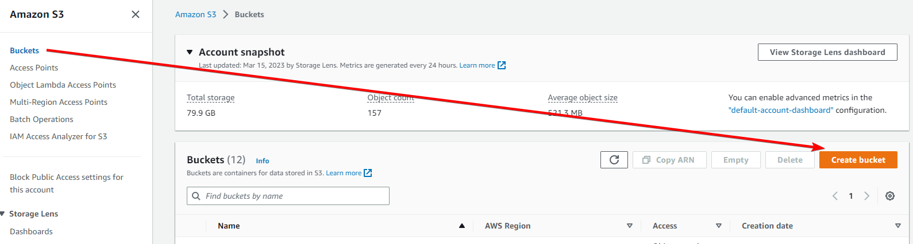

# Lambda X-Ray

# Overview

We’re going to be creating a Lambda function that can be called via a Function URL, that will query a Dog photo API (I tried finding a Cat API, but a ****free**** one didn’t exist, maybe dogs are better?), it will then save the image to an S3 bucket, and then show us the image in the browser.

The Dog API we’re using is: [https://dog.ceo/dog-api/](https://dog.ceo/dog-api/)

We will set up Lambda X-Ray to view where in the code there might be bottlenecks or errors.

We will be creating this environment in the ap-southeast-2 region, so all links to the console will be there. Make sure you change region if you’re deploying elsewhere.

# Instructions

## Stage 1 - Create dog photo bucket

Head to the S3 console: [https://s3.console.aws.amazon.com/s3/buckets](https://s3.console.aws.amazon.com/s3/buckets?region=ap-southeast-2)

Click on **************Buckets**************, then <kbd>Create bucket</kbd>



We’ll call the bucket `cute-doggos` (remember bucket names are regionally unique, so this may be taken when you create your bucket, feel free to use any name you like).

Click <kbd>Create bucket</kbd>

## Stage 2 - Create Lambda IAM role

Head to the IAM console: [https://s3.console.aws.amazon.com/s3/buckets](https://s3.console.aws.amazon.com/s3/buckets?region=ap-southeast-2)

Click on **********Roles**********, then click <kbd>Create role</kbd>


Set the trusted identity to “AWS Service” and select “Lambda”


Click <kbd>Next</kbd>

On the “Add permissions” page, search for and select `AmazonS3FullAccess`


Then search for and select `CloudWatchFullAccess`


As usual, in the real world this should be locked down a lot further, e.g. to a specific bucket with specific actions.

Click <kbd>Next</kbd>

Set the ******************Role name****************** to `dog-photo-function-role`

Click <kbd>Create role</kbd>

## Stage 3 - Create Lambda function

Head to the Lambda console: [https://ap-southeast-2.console.aws.amazon.com/lambda/](https://ap-southeast-2.console.aws.amazon.com/lambda/)

Click on **Functions**, then click <kbd>Create function</kbd>


Set the **************************Function name************************** to `dog-image-scraper`

Change the **************Runtime************** to “Python 3.9” (or whatever the latest version of Python available is)


Under **********************Permissions**********************, expand the “Change default execution role” pane, and select “Use an existing role”. 

Search for and select the role we created in the previous step


Click <kbd>Create function</kbd>

On the function page, in the ********Code******** tab, click <kbd>Upload from</kbd> and select <kbd>.zip file</kbd>


Click <kbd>Upload</kbd>, select the zip file you downloaded earlier, and click <kbd>Save</kbd>


The source code for this function is:

```python
import aws_xray_sdk.core
import boto3
import requests
import os
import base64
import io
import mimetypes

# Initialize the AWS X-Ray SDK
aws_xray_sdk.core.patch_all()

def lambda_handler(event, context):
    # Start a new X-Ray segment
    with aws_xray_sdk.core.xray_recorder.capture('get_dog_images'):
        # Create an S3 client
        session = boto3.Session()
        s3 = session.resource('s3')
        bucket_name = os.getenv('BUCKET_NAME')

        # Call the Dog API
        with aws_xray_sdk.core.xray_recorder.capture('call_dog_api'):
            # Define the endpoint for the Dog API
            endpoint = 'https://dog.ceo/api/breeds/image/random'
            
            # Make a GET request to the Dog API
            response = requests.get(endpoint)
            
            # Get the image URL from the response
            image_url = response.json()['message']

            # Get the name of the image
            image_name = str(response.json()['message']).split('/')[-1]
            
            # Download the image from the URL
            image = requests.get(image_url, stream=True).content
            
        # Save the weather data to S3
        with aws_xray_sdk.core.xray_recorder.capture('save_dog_to_s3'):
            contenttype = mimetypes.types_map['.' + image_name.split('.')[-1]]
            bucket = s3.Bucket(bucket_name)
            bucket.upload_fileobj(io.BytesIO(image), image_name, ExtraArgs={'ContentType': contenttype})
        
    # Generate a response with the image in the body
    response = {
        'statusCode': 200,
        'headers': {
            'Content-Type': 'image/jpeg'
        },
        'body': base64.b64encode(image),
        'isBase64Encoded': True
    }
    return response
```

********Note********: I am wrapping the Dog API request in an X-Ray segment called `call_dog_api` and the S3 upload in a segment called `save_dog_to_s3`, this will be useful to understand later.

The reason we’re using a zip file, is because Lambda only has a limited number of Python modules available by default, if you need any more (including `aws_xray_sdk`) you need to package them into a zip file: [https://docs.aws.amazon.com/lambda/latest/dg/python-package.html](https://docs.aws.amazon.com/lambda/latest/dg/python-package.html)

Once that’s uploaded, you won’t be able to see the code in the browser because it’s “too large”, so any modifications need to be done by unzipping that file, making the changes, zipping it back up, and uploading it again to Lambda. For this demo, we won’t need to modify the function code.

Go to the **************************Configuration************************** tab, then ************************Function URL************************, then click <kbd>Create function URL</kbd>


On the next page, change the ******************Auth type****************** to “NONE”


Then click <kbd>Save</kbd>

This leaves our Lambda open to the public, to be called unlimited times, so don’t forget to delete this function at the end of the demo.

Once that’s done, you will see a Function URL you can use to call the Lambda function, we’ll use that in a moment


Go to the **************************Configuration************************** tab**************************,************************** then ******************************************Environment variables******************************************, and click <kbd>Edit</kbd>


Our Lambda function gets the name of our S3 bucket from an environment variable, so we’ll set that here.

The variable name is `BUCKET_NAME`, and the value needs to be the name of the bucket you created in stage 1


Click <kbd>Save</kbd>

Go to the **************************Configuration************************** tab**************************,************************** then **Monitoring and operations tools**, and click <kbd>Edit</kbd>


Enable “Active tracing” under ******************AWS X-Ray****************** and click <kbd>Save</kbd>


Go to the **************************Configuration************************** tab**************************,************************** then **General configuration**, and click <kbd>Edit</kbd>


Change the **************Timeout************** to 0 min 15 sec. If the Dog API takes longer than the default 3 seconds to reply, we don’t want our Lambda timing out.


Click <kbd>Save</kbd>

## Stage 4 - Testing our function

Head to the Lambda console: [https://ap-southeast-2.console.aws.amazon.com/lambda/](https://ap-southeast-2.console.aws.amazon.com/lambda/)

Click on **Functions**, then click on the Lambda function we just created


Now, click on the ************************Function URL************************ to visit the function in your browser


You should see an adorable photo of a dog


Now let’s see if the photo was also saved to our S3 bucket.

Head to the S3 console: [https://s3.console.aws.amazon.com/s3/buckets](https://s3.console.aws.amazon.com/s3/buckets?region=ap-southeast-2)

Click on **************Buckets**************, then click on the bucket you created in stage 1


There should be an image in the bucket, if you select that, and click <kbd>Open</kbd>


Your browser should show the same image


## Stage 5 - Viewing X-Ray metrics

Head to the CloudWatch console: [https://ap-southeast-2.console.aws.amazon.com/cloudwatch](https://ap-southeast-2.console.aws.amazon.com/cloudwatch)

Go to ******X-Ray traces****** and then **********************Service map**********************


This shows us a map of all of the services / resources that our function calls. You can imagine with dozens of functions, all calling dozens or hundreds of services, this map would get quite intense, but for our basic function this is an easy to understand diagram of how our function works.

If you click on any of the resources, you can see metrics about it, such as latency, number of requests, faults, etc.


Now if you head to the ************Traces************ page, you can see that same information but in more detail. 

Click on one of the traces at the bottom of the page. Each trace is a function execution.


Now we can see each request and how long it took in a neat waterfall style diagram


We can see that the `call_dog_api` segment, which if you look at the function code above is wrapped around the bit of the code that calls the Dog API, took 2.39 seconds to run, which is the slowest part of the function, which took 4.78 seconds to run in total.

Now we’ll break the function, and see what changes in X-Ray.

Head to the Lambda console: [https://ap-southeast-2.console.aws.amazon.com/lambda/](https://ap-southeast-2.console.aws.amazon.com/lambda/)

Click on **Functions**, then click on the `dog-image-scraper` function

Go to **************************Configuration************************** then ******************************************Environment variables****************************************** and click <kbd>Edit</kbd>


Change the `BUCKET_NAME` variable to a bucket you ******don’t****** have access to. For example, we’ll use `jeff-bezos-private-bucket`

Click <kbd>Save</kbd>

Now visit your **Function URL** in the browser again


You should get an `Internal Server Error`


Head to the CloudWatch console: [https://ap-southeast-2.console.aws.amazon.com/cloudwatch](https://ap-southeast-2.console.aws.amazon.com/cloudwatch)

Go to ******X-Ray traces****** and then ************Traces************

Click <kbd>Run query</kbd> to get the latest traces


Under ************Traces************ you can see that there was a trace from ~1 minute ago, that returned a response code of 502 (500-599 response codes mean there was an error on the ******server****** side, we want to see response code’s of 200-299 which mean success)


Click on the trace ID, and you can see quite a few errors and faults


If you click on either the S3 resource, or the bucket in the Service Map, a side window will open with more information


Go to the ********************Exceptions******************** tab, and you can see the error that occurred. In this case the bucket doesn’t exist, but this could be anything such as a permissions error, networking issue, invalid request, etc.


## Stage 6 - Clean up

Head to the S3 console: [https://s3.console.aws.amazon.com/s3/buckets](https://s3.console.aws.amazon.com/s3/buckets)

Go to Buckets and select the bucket you created in stage 1, and click <kbd>Empty</kbd>


Enter “*permanently delete”* in the confirmation window, and click <kbd>Empty</kbd>

Then, select the bucket you created in stage 1, and click <kbd>Delete</kbd>


Enter the bucket name in the confirmation window, and click <kbd>Delete</kbd>

Head to the Lambda console: [https://ap-southeast-2.console.aws.amazon.com/lambda/](https://ap-southeast-2.console.aws.amazon.com/lambda/)

Click on **Functions**, select the `dog-image-scraper` function and click <kbd>Actions</kbd> then <kbd>Delete</kbd>


Type “delete” in the confirmation window, and click <kbd>Delete</kbd>, then <kbd>Close</kbd>

Head to the IAM console: [https://s3.console.aws.amazon.com/s3/buckets](https://s3.console.aws.amazon.com/s3/buckets?region=ap-southeast-2)

Click on **********Roles**********, then search for `dog-photo-function-role`, select it, and click <kbd>Delete</kbd>


Enter the role name in the confirmation window, and click <kbd>Delete</kbd>

Head to the CloudWatch console: [https://ap-southeast-2.console.aws.amazon.com/cloudwatch](https://ap-southeast-2.console.aws.amazon.com/cloudwatch)

Go to ********Logs******** then ********************Log Groups********************, search for `dog-image-scraper` and select the Log Group for the Lambda we created

Click <kbd>Actions</kbd> then <kbd>Delete log group(s)</kbd>


Click <kbd>Delete</kbd> in the confirmation window

CloudWatch X-Ray traces are deleted automatically after 30 days, and cannot be deleted before then, so nothing needs to be done to clean those up.