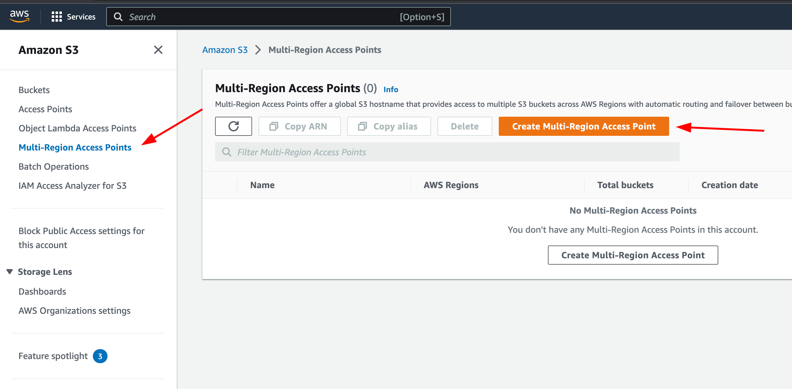

# S3 Multi-Region Access Points

# Overview

We’re going to create an S3 Multi-Region Access Point (MRAP), which allows a single S3 endpoint to distribute traffic to the closest bucket to the user / application.

Multiple buckets are added to the Multi-Region Access Point in different regions, S3 requests (GETs, PUTs, etc) are routed to the closest bucket to the user, and then changes can be replicated between all buckets.

I’m going to be using two buckets, one in ap-southeast-2 (Sydney) and one in ca-central-1 (Canada Central).

# Instructions

## Stage 1 - Create the first bucket

Head to the S3 dashboard: [https://s3.console.aws.amazon.com/s3/buckets](https://s3.console.aws.amazon.com/s3/buckets?region=ap-southeast-2)

Click on <kbd>Create bucket</kbd>

For **Bucket Name**, I will use “multi-region-demo-sydney”.

Set the region to `ap-southeast-2` or whichever region you’re using.

Under “Bucket Versioning”, select “Enable”.

Leave everything else as default and click <kbd>Create bucket</kbd>

## Stage 2 - Create the second bucket

Head to the S3 dashboard: [https://s3.console.aws.amazon.com/s3/buckets](https://s3.console.aws.amazon.com/s3/buckets?region=ap-southeast-2)

Click on <kbd>Create bucket</kbd>

For **Bucket Name**, I will use “multi-region-demo-canada”. 

Set the region to `ca-central-1` or whichever region you’re using.

Under “Bucket Versioning”, select “Enable”.

Leave everything else as default and click <kbd>Create bucket</kbd>

## Stage 3 - Create ****Multi-Region Access Point****

Head to the S3 dashboard: [https://s3.console.aws.amazon.com/s3/buckets](https://s3.console.aws.amazon.com/s3/buckets?region=ap-southeast-2)

Go to the “Multi-Region Access Points” page, and click <kbd>Create Multi-Region Access Point</kbd>



Set the “Multi-Region Access Point name” to anything you like, these are not globally unique.

Click <kbd>Add buckets</kbd>, select your two buckets, and click <kbd>Add buckets</kbd>.


Leave everything else as default, and click <kbd>Create Multi-Region Access Point</kbd>

This process can take “up to” 24 hours, but in my testing it took <15 minutes.

## Stage 4 - Setting up bucket replication

Head to the S3 dashboard: [https://s3.console.aws.amazon.com/s3/buckets](https://s3.console.aws.amazon.com/s3/buckets?region=ap-southeast-2)

Go to the “Multi-Region Access Points” page, click on the access point that you created earlier, and go to the “Replication and failover” page.

Under “Replication rules”, click on <kbd>Create replication rules</kbd>


Leave “Replicate objects among all specified buckets” selected, and check all of the buckets in this access point.


Under “Scope” select “Apply to all objects in the bucket”

Leave everything else as is, and click <kbd>Create replication rules</kbd>

We now have both buckets replicating to each other.

## Stage 4 - Testing using the MRAP

Head to the S3 dashboard: https://s3.console.aws.amazon.com/s3/mraps

Go to the Multi-Region Access Points page, select your access point, and click <kbd>Copy ARN</kbd>. We will need this for the next step.


We’re going to use the AWS CloudShell in the console to test this out, as it allows us to connect to S3 from different regions. If you connected from your local PC, you would ******always****** be routed to the closest bucket to your ISP. 

Next I’m going to copy a file from the Tokyo (ap-northeast-1) region. This should be routed to the closest bucket, Sydney (ap-southeast-2). You can use any region you like, try to pick some that are closer to one bucket or the other, to see the difference.

**********Note:********** CloudShell is not available in every region, see here for a list of available regions you can use: [https://docs.aws.amazon.com/general/latest/gr/cloudshell.html](https://docs.aws.amazon.com/general/latest/gr/cloudshell.html)

Make sure you’re in the region you want to connect from, and open up CloudShell


In the CloudShell console, we’ll create a 10MB file named “test1.file”, and upload it to the S3 MRAP ARN you copied earlier.

```bash
dd if=/dev/urandom of=test1.file bs=1M count=10

aws s3 cp test1.file s3://arn:aws:s3::123456789012:accesspoint/mu7cpm7zpa117.mrap/
```

Now because I’ve done this from Tokyo, Sydney should be the closest bucket, and should have the file


And if we checked the Canada bucket, it’s already replicated


S3 replication isn’t guaranteed to complete in a set time. In fact their documentation says it can take hours or longer: [https://docs.aws.amazon.com/AmazonS3/latest/userguide/replication-troubleshoot.html#:~:text=The majority of objects replicate within 15 minutes%2C but they can sometimes take a couple of hours](https://docs.aws.amazon.com/AmazonS3/latest/userguide/replication-troubleshoot.html#:~:text=The%20majority%20of%20objects%20replicate%20within%2015%20minutes%2C%20but%20they%20can%20sometimes%20take%20a%20couple%20of%20hours)

To get around this, you can enable Replication Time Control (RTC) which speeds up replication and advertises 99.99% of objects replicated within 15 minutes, and “most” objects replicated in seconds. This costs extra, and isn’t required for our demo.

Let’s switch to another region in CloudShell, in my case I’m going to us Ohio (us-east-2). 

Again, run these two commands, changing the file name to test2.file:

```bash
dd if=/dev/urandom of=test2.file bs=1M count=10

aws s3 cp test2.file s3://arn:aws:s3::123456789012:accesspoint/mu7cpm7zpa117.mrap/
```

This time, the file was created in Canada first, as expected, but replication has taken a little longer (remember S3 doesn’t guarantee files are replicated within seconds)


It took about 2 minutes for test2.file to appear in my Sydney bucket.

As a another test, I’m going to pick a region as close to the center of both buckets as I can, and see which bucket receives the file first. In my case this is Mumbai (ap-south-1). 

Note: While Mumbai may ***************geographically*************** be close to the center, there are a lot of network factors behind the scenes which control which region is closest.


```bash
dd if=/dev/urandom of=test3.file bs=1M count=10

aws s3 cp test3.file s3://arn:aws:s3::123456789012:accesspoint/mu7cpm7zpa117.mrap/
```

Sydney wins 🙌


As a final test, we’ll see what happens if we try to get an object, via our Multi-Region Access Point, that has been created in one bucket, but our ‘get’ request is routed to another bucket that has not had the file replicated yet.

To do this, you will need to have two CloudShell’s open, one nearest to each bucket. 

You should type in these commands, replace the account number and MRAP ID, before hitting enter.

In one window, create a new file and upload it:

```bash
dd if=/dev/urandom of=test4.file bs=1M count=10

aws s3 cp test4.file s3://arn:aws:s3::123456789012:accesspoint/mu7cpm7zpa117.mrap/
```

and in another window, try to copy that file to your instance:

```bash
aws s3 cp s3://arn:aws:s3::123456789012:accesspoint/mu7cpm7zpa117.mrap/test4.file .
```

If you’re not quick enough, or replication is unusually fast, you might miss out, and should start again (with a new file name).

This is what happened when I tried to download the “non-existent” file:

```bash
[cloudshell-user@ip-10-4-58-88 ~]$ aws s3 cp s3://arn:aws:s3::123456789012:accesspoint/mu7cpm7zpa117.mrap/test4.file .
fatal error: An error occurred (404) when calling the HeadObject operation: Key "test4.file" does not exist
[cloudshell-user@ip-10-4-58-88 ~]$ aws s3 cp s3://arn:aws:s3::123456789012:accesspoint/mu7cpm7zpa117.mrap/test4.file .
fatal error: An error occurred (404) when calling the HeadObject operation: Key "test4.file" does not exist
[cloudshell-user@ip-10-4-58-88 ~]$ aws s3 cp s3://arn:aws:s3::123456789012:accesspoint/mu7cpm7zpa117.mrap/test4.file .
download: s3://arn:aws:s3::123456789012:accesspoint/mu7cpm7zpa117.mrap/test4.file to ./test4.file
[cloudshell-user@ip-10-4-58-88 ~]$
```

So that’s something important to keep in mind, if your application requires all objects be available immediately, Multi-Region Access Points may not be the best solution, or you should at least ensure your application can handle 404 errors.

## Stage 5 - Clean up

Head to the S3 dashboard: https://s3.console.aws.amazon.com/s3/mraps

Go to the Multi-Region Access Points page, select your access point, and click <kbd>Delete</kbd>.


This process can take a couple of minutes, and you may not be able to delete your buckets while this is happening.

Next, go to the Buckets page, and for each bucket you created, select the bucket and click <kbd>Empty</kbd>


Enter “*permanently delete”* in the confirmation window, and click <kbd>Empty</kbd>

Then once both buckets are empty, select each bucket again, and click <kbd>Delete</kbd>


Enter the bucket name in the confirmation window, and click <kbd>Delete</kbd>