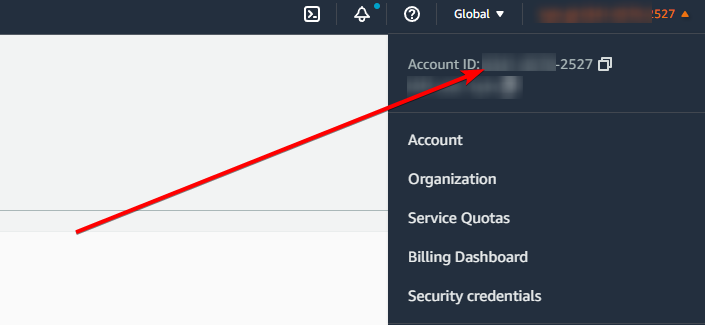

# SFTP Transfer Family with S3 backing

# Overview

We’re going to set up an SFTP server using AWS Transfer Family, with storage on S3. We’re going to use a custom identity provider with a basic Lambda that has hard coded username and password combinations.

Transfer Family isn’t cheap, at $0.30 **per protocol** per hour just for running, and $0.04 per GB transferred. Make sure you remember to delete these resources once you’re done.

[https://aws.amazon.com/aws-transfer-family/pricing/](https://aws.amazon.com/aws-transfer-family/pricing/)

We will be creating this environment in the ap-southeast-2 region, so all links to the console will be there. Make sure you change region if you’re deploying elsewhere.

# Instructions

## Stage 1 - Create the bucket

Head to the S3 dashboard: [https://s3.console.aws.amazon.com/s3/buckets?region=ap-southeast-2](https://s3.console.aws.amazon.com/s3/buckets?region=ap-southeast-2)

Click on <kbd>Create bucket</kbd>

For **Bucket Name**, we will use “sftp-bucket-\<account id\>”. You can get your account ID from the top right dropdown.



Set the region to `ap-southeast-2` or whichever region you’re deploying to.

Leave everything else as default and click <kbd>Create bucket</kbd>

## Stage 2 - Create the IAM roles

Head to the IAM console: [https://us-east-1.console.aws.amazon.com/iamv2/home?region=us-east-1#/roles](https://us-east-1.console.aws.amazon.com/iamv2/home?region=us-east-1#/roles)

On the Roles page, click on <kbd>Create role</kbd>

Set the **Trusted entity type** to “AWS Service”, set the **Use Case** to “Transfer”, **check the Transfer box** and click <kbd>Next</kbd>


Under **Add Permissions**, search for and select "AmazonS3FullAccess”

Click <kbd>Next</kbd>

Set the **Role name** to “transfer-family-s3-role”

Click <kbd>Create role</kbd>

On the Roles page, click on <kbd>Create role</kbd>

Set the **Trusted entity type** to “AWS Service”, set the Use Case to “Transfer” and click <kbd>Next</kbd>

Under **Add Permissions**, search for and select "AWSTransferLoggingAccess”

Set the **Role name** to “transfer-family-logging-role”

Click <kbd>Create role</kbd>

## Stage 3 - Create the authentication Lambda

Head to the Lambda console: [https://ap-southeast-2.console.aws.amazon.com/lambda/home?region=ap-southeast-2#/functions](https://ap-southeast-2.console.aws.amazon.com/lambda/home?region=ap-southeast-2#/functions)

Click <kbd>Create function</kbd>

Leave **Author from scratch** selected

Set the **Function name** to “sftp-auth-function”

Set the **Runtime** to “Python 3.9”

Leave the **Architecture** as “x86_64”

Click <kbd>Create function</kbd>

In the **Code** tab, enter the following code:

```python
def lambda_handler(event, context):
    username_db = ['garfield:password123', 'felix:hunter2', 'sylvester:qwerty']
    accountid = context.invoked_function_arn.split(":")[4]
    ftp_role = f"arn:aws:iam::{accountid}:role/transfer-family-s3-role"
    bucketname = f"sftp-bucket-{accountid}"
    
    username = event['username']
    password = event['password']
    
    for user in username_db:
        if user.split(':')[0] == username and user.split(':')[1] == password:
            return {
               "Role": ftp_role,
               "HomeDirectoryType": "LOGICAL",
               "HomeDirectoryDetails": str([{"Entry": "/", "Target": f"/{bucketname}/{username}"}])
            }
    return {}
```

In the real world, this function would ideally check with an external identity source, to confirm the username / password are valid. Because we’re using SFTP, you can also authenticate using SSH key, but for the purposes of this demo, we’re going to use a static username / password list.

In this function, we’re using logical directory mappings: [https://docs.aws.amazon.com/transfer/latest/userguide/logical-dir-mappings.html](https://docs.aws.amazon.com/transfer/latest/userguide/logical-dir-mappings.html)

This means that each user will use the “root” (`/`) directory as far as they’re concerned, but in the backend, they’re actually using `/<bucket>/<username>`. This makes it a lot neater, and easier, for your users, as they don’t need to specifically change directory into their home directory.

Don’t forget to click <kbd>Deploy</kbd> to save the function.


We now need to allow our Transfer Family server permission to invoke the function. Go to the **Configuration** tab, then **Permissions**. Scroll down to **Resource-based policy statements** and click <kbd>Add permissions</kbd>.

Select **AWS Service** and choose “Other” from the dropdown.


**Statement ID** can be any text you like, we’ll just enter “statement1”.

**Principal** will be `transfer.amazonaws.com`

**Source ARN** will be `arn:aws:transfer:<region>:\<account id\>:server/*`, again, you can get your account number and current region from the top right of the Console. 

**Action** will be `lambda:InvokeFunction`


Click <kbd>Save</kbd>

## Stage 3 - Create the Transfer Family server

Head to the AWS Transfer Family console: [https://ap-southeast-2.console.aws.amazon.com/transfer/home?region=ap-southeast-2#/](https://ap-southeast-2.console.aws.amazon.com/transfer/home?region=ap-southeast-2#/)

Click on <kbd>Create Server</kbd>

Under **Select the protocols you want to enable** select “SFTP”.

The reason we don’t want FTPS is because you need to have an ACM certificate to associate with it (and therefore a custom domain). We also can’t use FTP because Transfer Family won’t allow a public endpoint using unencrypted FTP. So for this demo, SFTP will work fine.

Click <kbd>Next</kbd>

Under **Identity Provider Type**, select “Custom Identity Provider”.

From the **AWS Lambda function** dropdown, select the Lambda we created earlier (”sftp-auth-function”).


Click <kbd>Next</kbd>

Leave the **Endpoint type** on “Publicly accessible”

Click <kbd>Next</kbd>

Leave **Domain** as “Amazon S3”

Click <kbd>Next</kbd>

Under **Logging role** leave “Choose an existing role” selected, and choose “transfer-family-logging-role” under **Logging Role.**


Change **Security policy** to “TransferSecurityPolicy-2022-03”


Click <kbd>Next</kbd>

Click <kbd>Create server</kbd>

It will take a few minutes to create the Transfer Family server.

## Stage 4 - Test it out

I’m going to be using FileZilla, which is available on Windows, Mac, and Linux, but you’re obviously welcome to use whichever SFTP program you prefer, including the command line if you’re comfortable with that.

[https://filezilla-project.org/](https://filezilla-project.org/)

Head to the Transfer Family console: [https://ap-southeast-2.console.aws.amazon.com/transfer/home?region=ap-southeast-2#/servers](https://ap-southeast-2.console.aws.amazon.com/transfer/home?region=ap-southeast-2#/servers)

Click on your server, and grab the **Endpoint**


Now in FileZilla, enter `sftp://<endpoint>` in the Host field, any of the Username’s from the Lambda function, and the respective Password. Leave the port empty. In my case I’m using `felix` and `hunter2`.


You will see a pop up window asking if you would like to trust the public key of the AWS Transfer Family server, click on “Always trust this host” and then OK.


Now you should see in the logs you’re connected to the Transfer Family endpoint, and successfully listed the `/` directory (remember, because we’re using logical directory mappings, this is actually `/<bucket>/<username>/`.

Now, let’s upload a file. You can pick any file you like. Just click and drag your chosen file to the right (the server side).


You should see in the logs that the upload / file transfer was successful:


Now let’s take a look in the S3 bucket. Head to the S3 console, and go into your “sftp-bucket-\<account id\>” bucket: [https://s3.console.aws.amazon.com/s3/buckets?region=ap-southeast-2&region=ap-southeast-2](https://s3.console.aws.amazon.com/s3/buckets?region=ap-southeast-2&region=ap-southeast-2)

You should see a directory with the same name as the username you used, go into that directory and you should see the file you uploaded:


All done! You can now try using different users, uploading a file to S3 directly, then downloading it using the SFTP server, or any other experiments you like.

## Stage 5 - Optional: Checking the SFTP logs

**This step is optional, but is fun to see how many malicious login attempts are made against our SFTP server.**

SSH (and therefore SFTP) are notorious for being port scanned / attacked with login attempts. If you’ve ever set up a publicly accessibly Linux server, with SSH listening on port 22, you will know how frequently attackers try and login.

Let’s take a look at the SFTP logs for our server. Head to the Cloudwatch Logs console: [https://ap-southeast-2.console.aws.amazon.com/cloudwatch/home?region=ap-southeast-2#logsV2:log-groups](https://ap-southeast-2.console.aws.amazon.com/cloudwatch/home?region=ap-southeast-2#logsV2:log-groups)

You will have an “/aws/transfer/<server ID>” log group, click on that, and then click on the “ERRORS” log stream.


I have had this server up for around 30 minutes, and there’s been over a dozen login attempts from various IP addresses:


Notice the log messages are saying `no matching key exchange method found`, this is because we selected “TransferSecurityPolicy-2022-03” as the **Security policy** when setting up the Transfer Family server, and because of that, Transfer Family only allows newer (and more secure) encryption algorithms. A lot of login attempts use older and less secure algorithms, to support a wider range of SSH / SFTP servers.

Let’s lower our **Security policy** on our SFTP Server and see what happens. 

Head to the Transfer Family console: [https://ap-southeast-2.console.aws.amazon.com/transfer/home?region=ap-southeast-2#/servers](https://ap-southeast-2.console.aws.amazon.com/transfer/home?region=ap-southeast-2#/servers)

Click on your server, and click <kbd>Edit</kbd> under **Additional Details**


Change the **Security Policy** to “TransferSecurityPolicy-2018-11”


Click <kbd>Save</kbd>

After a few minutes, when we look at the “ERRORS” log, we can see the attempts are getting a bit further along the process, have established a connection, and are now attempting to login with common usernames (and passwords):


This reinforces the importance of locking down your SFTP server, ideally to within your VPC (and then using a Client or Site-to-site VPN) to access your SFTP server. Or at least using SSH **keys** rather than username / passwords.

## Stage 5 - Clean up

Head to the S3 console: [https://s3.console.aws.amazon.com/s3/buckets?region=ap-southeast-2&region=ap-southeast-2](https://s3.console.aws.amazon.com/s3/buckets?region=ap-southeast-2&region=ap-southeast-2)

Select your SFTP bucket, and click <kbd>Empty</kbd>


Enter “*permanently delete”* in the confirmation window, and click <kbd>Empty</kbd>

Then, select your SFTP bucket, and click <kbd>Delete</kbd>


Enter the bucket name in the confirmation window, and click <kbd>Delete</kbd>

Head to the Lambda console: [https://ap-southeast-2.console.aws.amazon.com/lambda/home?region=ap-southeast-2#/functions](https://ap-southeast-2.console.aws.amazon.com/lambda/home?region=ap-southeast-2#/functions)

Select the “sftp-auth-function” and click Actions → Delete


Enter “delete” in the confirmation window, and click <kbd>Delete</kbd>

Head to the IAM console: [https://us-east-1.console.aws.amazon.com/iamv2/home?region=ap-southeast-2#/roles](https://us-east-1.console.aws.amazon.com/iamv2/home?region=ap-southeast-2#/roles)

Under **Roles**, search for "transfer-family”

Select the roles we created earlier, and click <kbd>Delete</kbd>


Type “delete” into the confirmation field, and click <kbd>Delete</kbd>

Head to the Cloudwatch Logs console: [https://ap-southeast-2.console.aws.amazon.com/cloudwatch/home?region=ap-southeast-2#logsV2:log-groups](https://ap-southeast-2.console.aws.amazon.com/cloudwatch/home?region=ap-southeast-2#logsV2:log-groups)

Search for the "transfer” Log Group

Select the log group that matches your server ID (it should be the only one), click <kbd>Actions</kbd>→ <kbd>Delete</kbd>


In the confirmation popup, click <kbd>Delete</kbd>

Head to the Transfer Family console: [https://ap-southeast-2.console.aws.amazon.com/transfer/home?region=ap-southeast-2#/servers](https://ap-southeast-2.console.aws.amazon.com/transfer/home?region=ap-southeast-2#/servers)

 Select your server, click <kbd>Actions</kbd>→ <kbd>Delete</kbd>


Enter “delete” in the confirmation box that pops up.