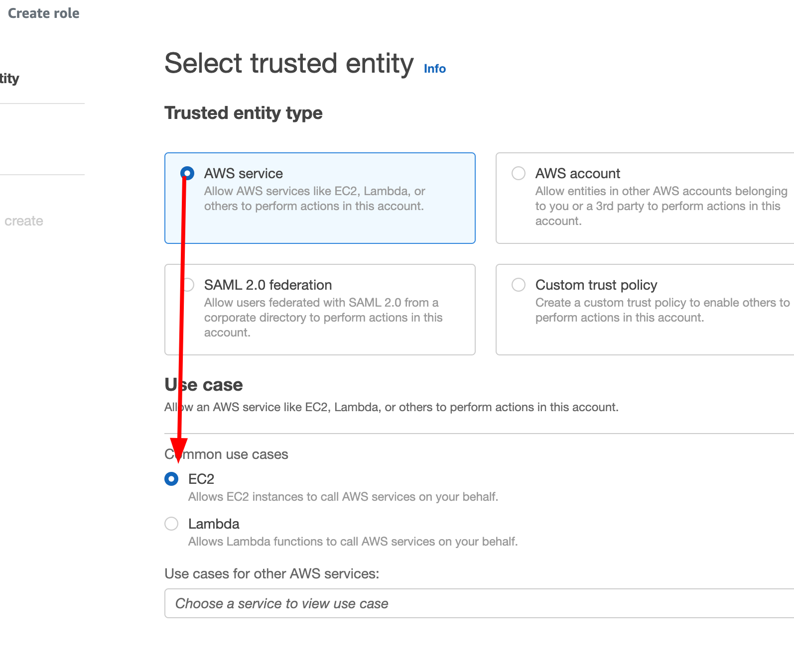

# Systems Manager

# Overview

We’re going to launch two instances, one with Amazon Linux 2, and one with Ubuntu 20.04. We’re going access these instances using Session Manager, use Patch Manager to apply any available OS updates, and the Run Command feature to run some shell commands across our instances.

We will be creating this environment in the ap-southeast-4 (Melbourne) region, so all links to the console will be there. Make sure you change region if you’re deploying elsewhere.

********Note:******** At the time of writing this demo, Amazon Linux 2023 and Ubuntu 22.04 returned errors when patching with Patch Manager, so we’re using slightly older AMIs in this demo. You’re welcome to try using newer AMIs, however if you get an error when running patch manager, try switching to the OS versions I use in this demo.

[https://repost.aws/questions/QU6nU4pjL9Tq2G8UVh6ytmiw/unable-to-perform-patch-scan-on-ubuntu-instances](https://repost.aws/questions/QU6nU4pjL9Tq2G8UVh6ytmiw/unable-to-perform-patch-scan-on-ubuntu-instances)

# Instructions

## Stage 1 - Creating IAM roles

Head to the IAM console: [https://us-east-1.console.aws.amazon.com/iamv2/home](https://us-east-1.console.aws.amazon.com/iamv2/home)

Go to Roles and click on <kbd>Create role</kbd>

Leave “AWS service” selected and choose “EC2”



Click <kbd>Next</kbd>

On the Add Permissions page, search for and select `AmazonSSMManagedInstanceCore`


Click <kbd>Next</kbd>

Set the “Role Name” to `Demo-SSM-Role`

Click <kbd>Create role</kbd>

## Stage 2 - Launch the Ubuntu instance

Head to the EC2 console: [https://ap-southeast-4.console.aws.amazon.com/ec2/home](https://ap-southeast-4.console.aws.amazon.com/ec2/home)

**********Note:********** You can create these instances in any VPC or Subnet, however you need to ensure the instance has internet access to reach the SSM endpoints. The default VPC has an Internet Gateway, so we will be using that.

Go to ******************Instances****************** and click <kbd>Launch instances</kbd>


Set the ********Name******** to “ubuntu”


Under ********************************************************Application and OS Images******************************************************** select “Ubuntu”


Click the dropdown menu and select `Ubuntu Server 20.04 LTS (HVM)`


Leave the **************************Instance Type************************** as “t2.micro” or “t3.micro” (whichever is default) and under ******************************Key pair (login)****************************** select “Proceed without a key pair”


Under ********************************Network settings******************************** click <kbd>Edit</kbd>


Change ********Auto-assign public IP******** to “Enable”


Take note of the security group name that is being created, we will be deleting that in the clean up stage.


Expand the ********************************Advanced details******************************** and under ****************************************IAM instance profile**************************************** select the role you created in stage 1.


Click on <kbd>Launch instance<kbd>


## Stage 3 - Launch the Amazon Linux 2 instance

Head to the EC2 console: [https://ap-southeast-4.console.aws.amazon.com/ec2/home](https://ap-southeast-4.console.aws.amazon.com/ec2/home)

Go to ******************Instances****************** and click <kbd>Launch instances</kbd>


Set the ********Name******** to “al2”


Under ********************************************************Application and OS Images******************************************************** select “Amazon Linux”


Click the dropdown menu and select `Amazon Linux 2 AMI (HVM)`


Leave the **************************Instance Type************************** as “t2.micro” or “t3.micro” (whichever is default) and under ******************************Key pair (login)****************************** select “Proceed without a key pair”


Under ********************************Network settings******************************** click <kbd>Edit</kbd>


Change ********Auto-assign public IP******** to “Enable”


Under ****************************************************Firewall (security groups)**************************************************** select “Select existing security group” and select the security group that was created in stage 2.


Expand the ********************************Advanced details******************************** and under ****************************************IAM instance profile**************************************** select the role you created in stage 1.


Click on <kbd>Launch instance<kbd>


## Stage 4 - Viewing instances in Systems Manager

Head to the Systems Manager console: [https://ap-southeast-4.console.aws.amazon.com/systems-manager](https://ap-southeast-4.console.aws.amazon.com/systems-manager)

Go to **************************Fleet Manager**************************


You should see the two instances we created, already detected and adopted by Systems Manager


If you ******don’t****** see your instances here, either the subnet the instances were launched in doesn’t have internet access, the security group doesn’t have outbound port 443 access, the instance role wasn’t attached (allowing the instance to access Systems Manager), or the instance is still starting up.

On the Fleet Manager page, click on either of the instances


We can see on the next page that Systems Manager knows what Operating System is installed, what SSM agent version is running, and (if we had set one) the SSH key used


If you head to **********************File system**********************, you can browse the file system on the instance, you can cut / copy / delete files, as well as read or tail files.


We’re not going to do this for the demo, but it’s just an example of what you can do using Fleet Manager.

## Stage 5 - Updating packages on the instances using Patch Manager

Head to the EC2 console: [https://ap-southeast-4.console.aws.amazon.com/ec2/home](https://ap-southeast-4.console.aws.amazon.com/ec2/home)

Go to ******************Instances******************, select your `ubuntu` instance, and click <kbd>Connect</kbd>


Under the ******************************Session Manager****************************** tab, click <kbd>Connect</kbd>


This will open up a shell window where you can run commands, just like you would if you were to connect via SSH.

In the shell window, run:

```python
sudo apt update && sudo apt upgrade
```


What this command does is updates the package repository cache on the server (`apt update`) and then tells the package manager (”apt”, short for “Advanced Packaging Tool”) to upgrade any packages that are installed on the server to the latest version available in the package repository (`apt upgrade`)

The square box shows all of the packages that *****would***** be upgraded, if we chose to continue. Note your output will likely look different, as packages that can be upgraded will change over time.


Enter `n` and press <kbd>Enter</kbd>. We don’t want to upgrade any packages using this method, this is mainly to show that there ***are*** updates pending.

Keep this shell window open, and in a new tab or window, head to the Systems Manager console: https://ap-southeast-4.console.aws.amazon.com/systems-manager

Go to **************************Patch Manager************************** and click <kbd>Patch Now</kbd>


On the next page, change ************************************Patching operation************************************ to “Scan and install”, and change ****************************************Patching log storage**************************************** to “Do not store logs” (for this demo, we don’t need any additional logging)


Click <kbd>Patch now</kbd>

This process may take a few minutes, the page will automatically refresh until the process is complete.

Once complete, head back to your tab with the shell open, and run the same command again:

```python
sudo apt update && sudo apt upgrade
```

You should see the list of packages to be upgraded either much smaller, or there being no packages with upgrades available. This is what the Patch Manager did, and we’ll see how it did this next.

Head back to the Patch Manager tab, and click on the “Association ID”


Go to the ****************Versions**************** tab, and take note of the Document Name


This is the Systems Manager document that is used (by default) to patch instances, let’s go and see what’s in the document. 

Click on ********Documents******** and search for “AWS-RunPatchBaseline”


Click on the document name


Go to the **************Content************** tab


Documents are JSON or YAML files that contain instructions on what to run on an instance. Amazon provides dozens of managed documents to do things such as patching an instance (running updates), running custom shell scripts, setting tags on an instance, start port forwarding, etc.

In the “AWS-RunPatchBaseline”, you can see that the script checks for the operating system type and then runs the applicable commands to update the operating system, for example:

Windows:


Linux


MacOS


Head back to the Patch Manager summary window, click on the Execution ID


Then on the next page, click on “Output” next to either of the instances we updated


On the Output page, you can see the output **********and errors********** of the document(s) that ran. For example, when the “AWS-RunPatchBaseline” document runs, there are three steps, `PatchWindows`, `PatchLinux`, and `PatchMacOS`


All of these steps have a status of “Success”, despite the instances running Linux instances. This is because if any step in the document fails, Systems Manager will stop the entire execution. The `PatchWindows` and `PatchMacOS` steps show that they were skipped (which counts as a success) in the Output window


If we go to the `PatchLinux` step, and expand the Output pane, you can see the shell output that was returned as the document was executed


If you expand the Error pane, you can see any errors that occurred during the execution. In this case there were a few warnings, but no errors that were enough to cancel the execution.


## Stage 6 - Running commands using Run Command

Head to the Systems Manager console: https://ap-southeast-4.console.aws.amazon.com/systems-manager

Go to **Run Command** and click <kbd>Run command</kbd>


On the next page, you will see a list of command documents, as mentioned in the last stage, these documents contain instructions on what actions to perform on an instance.

In the search bar, search for “AWS-RunShellScript”


This document is provided by and managed by Amazon, and allows you to run custom shell commands on multiple instances at once. You can imagine at a large organisation with hundreds of instances, this could save quite a bit of time.

Under ****************Commands****************, enter the following command

```python
sudo touch /hello_from_systems_manager
sudo useradd -c "Jeff Bezos" jbezos
```

This will create a file in the `/` directory called `hello_from_systems_manager`, and create a user with the username `jbezos`

Under ********************************Target selection********************************, select “Choose instances manually”, and select all (both) instances. In a production environment we could run this document on only specific instances based on their tag(s), or instances in a resource group (dev instances vs production instances for example)


Under ****************************Output options****************************, deselect “Enable an S3 bucket”. We don’t need to store our output for this command.


Leave all other options as is, and click <kbd>Run</kbd>

The command shouldn’t take very long to run, on the next page you will see the status


Head to the EC2 console: [https://ap-southeast-4.console.aws.amazon.com/ec2/home](https://ap-southeast-4.console.aws.amazon.com/ec2/home)

Go to ******************Instances******************, select either instance, and click <kbd>Connect</kbd>


Under the ******************************Session Manager****************************** tab, click <kbd>Connect</kbd>


This will open up a shell window where you can run commands, just like you would if you were to connect via SSH.

Let’s confirm our command worked, first we’ll check the file was created, run:

```python
ls -l /
```

There’s the file we created


And now we’ll make sure our user was created, run:

```python
sudo tail /etc/passwd
```


## Stage 7 - Viewing aggregate instance data using Inventory

Head to the Systems Manager console: https://ap-southeast-4.console.aws.amazon.com/systems-manager

Go to Inventory and click “Click here to enable inventory on all instances”


This will give you a summary view of the OS versions and applications, among other things, on all of the managed instances in Systems Manager.

If you scroll down and click on one of the instances we created


And go to the **Inventory** tab

You can view the applications installed on that instance


Networking information


Hardware information


And multiple other bits of information

## Stage 8 - Clean up

Head to the EC2 console: [https://ap-southeast-4.console.aws.amazon.com/ec2/home](https://ap-southeast-4.console.aws.amazon.com/ec2/home)

Go to ********************Instances********************, and select both the “al2” and “ubuntu” instances, then click <kbd>Instance state</kbd> and then <kbd>Terminate Instance</kbd>

Be careful to only delete instances created in this demo


Go to ********************Security Groups******************** and select “launch-wizard-1” (or whatever the name of the security group that was created in stage 2 was), then click <kbd>Actions</kbd> then <kbd>Delete security groups</kbd>


Click <kbd>Delete</kbd> in the confirmation window

Head to the IAM console: [https://us-east-1.console.aws.amazon.com/iamv2/home](https://us-east-1.console.aws.amazon.com/iamv2/home)

Go to **********Roles**********, and search for “Demo-SSM-Role”. Select the role we created in stage 1, and click <kbd>Delete</kbd>


Enter “Demo-SSM-Role” in the confirmation box, and click <kbd>Delete</kbd>

Managed instances are automatically removed from AWS Systems Manager, so no clean up is required there.