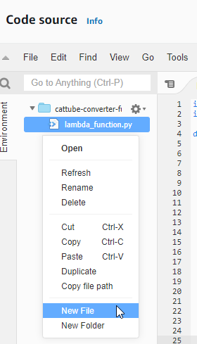

# Video on Demand using MediaConvert, S3, and Cloudfront

# Overview

We’re going to create a Video on Demand ("CatTube") backend that will take any uploaded video format to a source bucket, convert it to the format we require, and place the output video into another bucket ready to be served by Cloudfront.

We will be creating this environment in the ap-southeast-2 region, so all links to the console will be there. Make sure you change region if you’re deploying elsewhere.

# Instructions

## Stage 1 - Creating the source video bucket

Head to the S3 dashboard: [https://s3.console.aws.amazon.com/s3/buckets?region=ap-southeast-2](https://s3.console.aws.amazon.com/s3/buckets?region=ap-southeast-2)

This bucket will be used as the trigger for the media conversion pipeline. Don’t forget, bucket names are unique per region, so if the examples I give below are taken, just pick something else.

Click on <kbd>Create bucket</kbd>

For Bucket **Name**, we will use `cattube-source`

Set the region to `ap-southeast-2` or whichever region you’re deploying to.

Leave everything else as default and click <kbd>Create bucket</kbd>

## Stage 2 - Creating the destination video bucket

Head to the S3 dashboard: [https://s3.console.aws.amazon.com/s3/buckets?region=ap-southeast-2](https://s3.console.aws.amazon.com/s3/buckets?region=ap-southeast-2)

This bucket will be used as the destination for converted videos, as well as the origin for Cloudfront. Don’t forget, bucket names are unique per region, so if the examples I give below are taken, just pick something else.

Click on <kbd>Create bucket</kbd>

For Bucket **Name**, we will use `cattube-destination`

Set the region to `ap-southeast-2` or whichever region you’re deploying to.

Leave everything else as default and click <kbd>Create bucket</kbd>

## Stage 3 - Creating the MediaConvert queue

Head to the MediaConvert console, and go to the Queues page: [https://ap-southeast-2.console.aws.amazon.com/mediaconvert/home?region=ap-southeast-2#/queues/list](https://ap-southeast-2.console.aws.amazon.com/mediaconvert/home?region=ap-southeast-2#/queues/list)

Click on <kbd>Create queue</kbd>

Set the name to `catqueue`

Click on <kbd>Create queue</kbd>

## Stage 4 - Create the Lambda function

Head to the Lambda console: [https://ap-southeast-2.console.aws.amazon.com/lambda/home?region=ap-southeast-2#/functions](https://ap-southeast-2.console.aws.amazon.com/lambda/home?region=ap-southeast-2#/functions)

Click <kbd>Create function</kbd>

Leave **Author from scratch** selected

Set the **Function name** to `cattube-converter-function`

Set the **Runtime** to “Python 3.9”

Leave the **Architecture** as “x86_64”

Click <kbd>Create function</kbd>

On the next page, under the **Code** tab, enter the following code:

**Note:** Replace the `destination_bucket` variable with the **destination** bucket name you chose in stage 2.

```python
import json
import boto3

def lambda_handler(event, context):
    mediaconvert = boto3.client('mediaconvert')
    mediaconvert_endpoint = mediaconvert.describe_endpoints(MaxResults=1)
    mediaconvert = boto3.client('mediaconvert', endpoint_url=f"{mediaconvert_endpoint['Endpoints'][0]['Url']}")
    for message in event['Records']:
				# REPLACE ME #
        destination_bucket = 'cattube-destination'
				##############
        source_bucket = message['s3']['bucket']['name']
        object = message['s3']['object']['key']
        accountid = context.invoked_function_arn.split(":")[4]
        region = context.invoked_function_arn.split(":")[3]

        with open("job.json", "r") as jsonfile:
            job_config = json.load(jsonfile)

        job_config['Queue'] = f"arn:aws:mediaconvert:{region}:{accountid}:queues/catqueue"
        job_config['Role'] = f"arn:aws:iam::{accountid}:role/MediaConvert_Default_Role"
        job_config['Settings']['Inputs'][0]['FileInput'] = f"s3://{source_bucket}/{object}"
        job_config['Settings']['OutputGroups'][0]['OutputGroupSettings']['FileGroupSettings']['Destination'] = f"s3://{destination_bucket}/"

        response = mediaconvert.create_job(**job_config)
```

This code iterates through all the records that S3 passes to the Lambda function, and then publishes the job to MediaConvert.

Then, create a new file that will contain all of the MediaConvert job settings. 

Right click on the directory pane → New File



Set the file name to “job.json”


Add the following config to the newly created file:

```
{
  "Queue": "arn:aws:mediaconvert:region:account_id:queues/Default",
  "UserMetadata": {},
  "Role": "arn:aws:iam::account_id:role/MediaConvert_Default_Role",
  "Settings": {
    "TimecodeConfig": {
      "Source": "ZEROBASED"
    },
    "OutputGroups": [
      {
        "Name": "File Group",
        "Outputs": [
          {
            "ContainerSettings": {
              "Container": "MP4",
              "Mp4Settings": {}
            },
            "VideoDescription": {
              "CodecSettings": {
                "Codec": "H_265",
                "H265Settings": {
                  "MaxBitrate": 5000000,
                  "RateControlMode": "QVBR",
                  "SceneChangeDetect": "TRANSITION_DETECTION"
                }
              }
            },
            "AudioDescriptions": [
              {
                "AudioSourceName": "Audio Selector 1",
                "CodecSettings": {
                  "Codec": "AAC",
                  "AacSettings": {
                    "Bitrate": 96000,
                    "CodingMode": "CODING_MODE_2_0",
                    "SampleRate": 48000
                  }
                }
              }
            ],
            "NameModifier": "-hd"
          },
          {
            "ContainerSettings": {
              "Container": "MP4",
              "Mp4Settings": {}
            },
            "VideoDescription": {
              "Width": 256,
              "Height": 144,
              "CodecSettings": {
                "Codec": "AV1",
                "Av1Settings": {
                  "RateControlMode": "QVBR",
                  "QvbrSettings": {},
                  "MaxBitrate": 100000
                }
              }
            },
            "AudioDescriptions": [
              {
                "CodecSettings": {
                  "Codec": "AAC",
                  "AacSettings": {
                    "Bitrate": 96000,
                    "CodingMode": "CODING_MODE_2_0",
                    "SampleRate": 48000
                  }
                }
              }
            ],
            "NameModifier": "-sd"
          }
        ],
        "OutputGroupSettings": {
          "Type": "FILE_GROUP_SETTINGS",
          "FileGroupSettings": {
            "Destination": "s3://destination_bucket/"
          }
        }
      }
    ],
    "Inputs": [
      {
        "AudioSelectors": {
          "Audio Selector 1": {
            "DefaultSelection": "DEFAULT"
          }
        },
        "VideoSelector": {},
        "TimecodeSource": "ZEROBASED",
        "FileInput": "s3://source_bucket/object.mp4"
      }
    ]
  },
  "AccelerationSettings": {
    "Mode": "DISABLED"
  },
  "StatusUpdateInterval": "SECONDS_60",
  "Priority": 0
}
```
This configuration will take a video input, and output two videos; an SD version (144p) and an HD version (as large as the original video), with the file names of each prepended with "-sd" and "-hd".

Don’t forget to click <kbd>Deploy</kbd> to save the function.

## Stage 4a - Configuring the MediaConvert job

This step is **optional** but if you would like to learn more about MediaConvert and all of the (many) options available, follow this step.

There’s two ways you can customise the `job.json` configuration file we used with our Lambda.

1 - The hard way. Take a look at the documentation for the `create_job` Boto3 function: [https://boto3.amazonaws.com/v1/documentation/api/latest/reference/services/mediaconvert.html#MediaConvert.Client.create_job](https://boto3.amazonaws.com/v1/documentation/api/latest/reference/services/mediaconvert.html#MediaConvert.Client.create_job)

It specifies all of the options the `create_job` function takes, then you can customise the `job.json` file using those options.

2 - The easy, and safe, way. Head to the MediaConvert console, then the jobs page: [https://ap-southeast-2.console.aws.amazon.com/mediaconvert/home?region=ap-southeast-2#/jobs/list](https://ap-southeast-2.console.aws.amazon.com/mediaconvert/home?region=ap-southeast-2#/jobs/list)

Click on <kbd>Create job</kbd>, then on the next page under **Input 1**, set the **Input file URL** to “S3://test/test”. Our script replaces this string anyway, but it needs to be set.


Then under **Output groups, Click `Add`, choose `File Group`, Click `Select`. File Group Settings**, set the **Destination** to “S3://test/test”. Again, our script replaces this, but it can’t be blank.


Under the **Outputs** section, you can specify the **Name modifier** for the output file names. See this page for all of the variables you can use: [https://docs.aws.amazon.com/mediaconvert/latest/ug/list-of-settings-variables-with-examples.html](https://docs.aws.amazon.com/mediaconvert/latest/ug/list-of-settings-variables-with-examples.html)

**Warning:** Any options marked with “Pro” can incur a slightly higher cost. See the pricing page for more details: [https://aws.amazon.com/mediaconvert/pricing/#:~:text=%240.003-,Professional Tier,-The Professional tier](https://aws.amazon.com/mediaconvert/pricing/#:~:text=%240.003-,Professional%20Tier,-The%20Professional%C2%A0tier)

MediaConvert does **not** have a Free Tier as of writing this.

Once all of your configuration is done, click on <kbd>Show job JSON</kbd>


Copy the entire output, and replace the content of the `job.json` in your Lambda function. Don’t forget to click <kbd>Deploy</kbd>.

## Stage 5 - IAM roles

Head to the IAM console: [https://us-east-1.console.aws.amazon.com/iamv2/home?region=us-east-1#/roles](https://us-east-1.console.aws.amazon.com/iamv2/home?region=us-east-1#/roles)

On the Roles page, click on <kbd>Create role</kbd>

Set the **Trusted entity type** to “AWS Service” and under “Use cases for other AWS Services” select “MediaConvert” and check the radio button


Click Next

AWS will have already attached two policies, “AmazonS3FullAccess” and “AmazonAPIGatewayInvokeFullAccess”, you can leave these and click Next.

Set the **Role name** to “MediaConvert_Default_Role”

Click <kbd>Create role</kbd>

Next, we need to add a policy to our Lambda role. So head back to the Lambda function you just created, go to the **Configuration** tab, then **Permissions**, then click on the Role name


Under **Permissions Policies** for that role, click Add permissions → Attach policies

Search for “AWSElementalMediaConvertFullAccess”, select it, and click <kbd>Attach policies</kbd>

Again, this is far too broad of a policy to use in production, and we really only need the `mediaconvert:CreateJob` permission, but for the sake of this demo, this will work.

## Stage 6 - Create the Cloudfront distribution

Head to the Cloudfront console: [https://us-east-1.console.aws.amazon.com/cloudfront/v3/home?region=ap-southeast-2#/distributions](https://us-east-1.console.aws.amazon.com/cloudfront/v3/home?region=ap-southeast-2#/distributions)

Click Create distribution

Set the **Origin domain** to the **destination** bucket we created earlier


Leave the **Origin path** blank

Set the **Name** to “cattube-origin”

Set the **Origin access** to “Origin access control settings (recommended)”

Click <kbd>Create control setting</kbd>

In the popup, leave all the options as default, and click <kbd>Create</kbd>

Scroll down to **Viewer protocol policy** and change this to “Redirect HTTP to HTTPS”

Leave all other options default and click <kbd>Create distribution</kbd>

On the next page, because we chose “Origin access control settings” on the previous configuration page, you will see a <kbd>Copy policy</kbd> button, click on that to copy the policy. We need to add this to the **destination** bucket policy.

Note: "Origin access control settings" replaces (or is at least the new / better alternative to) "Origin access identity". See here for more details: https://aws.amazon.com/blogs/networking-and-content-delivery/amazon-cloudfront-introduces-origin-access-control-oac/


Head to the S3 console: [https://s3.console.aws.amazon.com/s3/buckets?region=ap-southeast-2&region=ap-southeast-2](https://s3.console.aws.amazon.com/s3/buckets?region=ap-southeast-2&region=ap-southeast-2)

Go into the **destination** bucket we created earlier, then the **Permissions** tab, then down to **Bucket policy**. Click on <kbd>Edit</kbd>.

Paste the Cloudfront policy into the Policy box


Then click <kbd>Save changes</kbd>

## Stage 7 - Set up S3 event notifications

Head to the S3 dashboard: [https://s3.console.aws.amazon.com/s3/buckets?region=ap-southeast-2](https://s3.console.aws.amazon.com/s3/buckets?region=ap-southeast-2)

Go into the **source** bucket we created earlier, then to the **Properties** tab, down to **Event notifications**, and click <kbd>Create event notification</kbd>

Set the **Event name** to “cattube-notifications”

Leave the **Prefix** and **Suffix** empty (we want to be notified for **all** files)

Under **Event types**, select “All object create events” and leave the rest unchecked


Under **Destination,** select **Lambda function**

Select your `cattube-converter-function` function from the dropdown list


**Can’t see your function? Make sure it was created in the same region as your bucket. If you’ve visited IAM or Route53, you might have been sent back to us-east-1.**

## Stage 8 - Upload some cat videos

Now we can test out our service. You can download free cat videos from this website: [https://www.pexels.com/search/videos/cat/](https://www.pexels.com/search/videos/cat/)

Head to the **source** bucket in S3, click on <kbd>Upload</kbd>, then <kbd>Add files</kbd> and select the cat video (or any video) you would like to upload and convert.

**Note:** Our Python script doesn’t handle spaces in video files. For the sake of simplicity I haven’t included that functionality, so make sure your video file doesn’t contain spaces in the file name.

Once you've uploaded the file, you can check the status of your job (the Lambda function triggers the job asynchronously), head to the MediaConvert Jobs page here: [https://ap-southeast-2.console.aws.amazon.com/mediaconvert/home?region=ap-southeast-2#/jobs/list](https://ap-southeast-2.console.aws.amazon.com/mediaconvert/home?region=ap-southeast-2#/jobs/list)


Now the fun part, watching the cat video. Head to the Cloudfront console: [https://us-east-1.console.aws.amazon.com/cloudfront/v3/home?region=ap-southeast-2#/distributions](https://us-east-1.console.aws.amazon.com/cloudfront/v3/home?region=ap-southeast-2#/distributions)

Grab your Cloudfront distribution domain name


The file I uploaded was “tabbycat.mp4”, but the `job.json` we used in the Lambda function told MediaConvert to create two output files: tabbycat-hd.mp4 and tabbycat-sd.mp4, so in your browser you would enter [your Cloudfront domain name]/tabbycat-sd.mp4, or in my case, [https://d1oub6vxsyn31e.cloudfront.net/tabbycat-sd.mp4](https://d1oub6vxsyn31e.cloudfront.net/tabbycat-sd.mp4) for example.

Assuming all is working, you can now improve on this by adding more output file types / sizes to your MediaConvert configuration file, set an alternate domain name on Cloudfront to personalise your CatTube website, and maybe even make your source bucket accept uploads from your users (be careful, this can get expensive and can be abused).

## Stage 9 - Clean up

Head to the S3 console: [https://s3.console.aws.amazon.com/s3/buckets?region=ap-southeast-2&region=ap-southeast-2](https://s3.console.aws.amazon.com/s3/buckets?region=ap-southeast-2&region=ap-southeast-2)

Select your source bucket, and click <kbd>Empty</kbd>


Enter “**permanently delete”** in the confirmation window, and click <kbd>Empty</kbd>

Do the same for your destination bucket.

Then, select your source bucket, and click <kbd>Delete</kbd>


Enter the bucket name in the confirmation window, and click <kbd>Delete</kbd>

Do the same for your destination bucket.

Head to the MediaConvert queues page: [https://ap-southeast-2.console.aws.amazon.com/mediaconvert/home?region=ap-southeast-2#/queues/list](https://ap-southeast-2.console.aws.amazon.com/mediaconvert/home?region=ap-southeast-2#/queues/list)

Select your `catqueue` and click <kbd>Delete queue</kbd>

Click <kbd>Delete</kbd> in the popup window

Note: You cannot delete the “Default” queue, so just ignore that.

Head to the Lambda console: [https://ap-southeast-2.console.aws.amazon.com/lambda/home?region=ap-southeast-2#/functions](https://ap-southeast-2.console.aws.amazon.com/lambda/home?region=ap-southeast-2#/functions)

Select the “cattube-converter-function” and click Actions → Delete


Enter “delete” in the confirmation window, and click <kbd>Delete</kbd>

Head to the Cloudfront console: [https://us-east-1.console.aws.amazon.com/cloudfront/v3/home?region=ap-southeast-2#/distributions](https://us-east-1.console.aws.amazon.com/cloudfront/v3/home?region=ap-southeast-2#/distributions)

Select the distribution you created, and click <kbd>Disable</kbd>

Distributions must be disabled before they can be deleted. Disabling them can take a minute or two.


Once that’s done (the <kbd>Delete</kbd> button will be clickable), select your distribution again and click <kbd>Delete</kbd>


