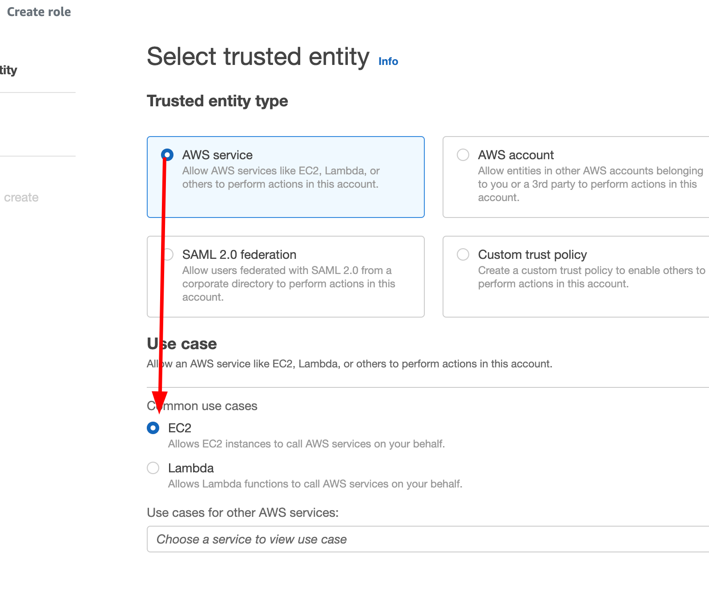

# VPC Flow Logs

# Overview

We’re going to create two EC2 instances and diagnose a connectivity issue between the two, using VPC flow logs.

I will be using ap-southeast-4 (Melbourne) for this demo, but you can use any region you like. VPC Flow Logs are available in *all* regions.

# Instructions

## Stage 1 - Creating IAM roles

Head to the IAM console: [https://us-east-1.console.aws.amazon.com/iamv2/home](https://us-east-1.console.aws.amazon.com/iamv2/home)

*EC2 SSM Session Manager role*

Go to Roles and click on <kbd>Create role</kbd>

Leave “AWS service” selected and choose “EC2”



Click <kbd>Next</kbd>

On the Add Permissions page, search for and select `AmazonSSMManagedInstanceCore`


Click <kbd>Next</kbd>

Set the “Role Name” to `Demo-SSM-Role`

Click <kbd>Create role</kbd>

*VPC Flow Logs role*

Go to Roles and click on <kbd>Create role</kbd>

Select “Custom trust policy” and enter the following policy

```json
{
  "Version": "2012-10-17",
  "Statement": [
    {
      "Effect": "Allow",
      "Principal": {
        "Service": "vpc-flow-logs.amazonaws.com"
      },
      "Action": "sts:AssumeRole"
    }
  ]
}
```


Click <kbd>Next</kbd>

Under “Add permissions”, search for and select `CloudWatchLogsFullAccess`


In the real world this should be locked down a lot more (to the specific log group, to only the required actions, etc), but for the sake of this demo, we’ll use this AWS managed role.

Click <kbd>Next</kbd>

In the “Role name” enter `Demo-VPC-Flow-Logs`

Click <kbd>Create role</kbd>

## Stage 2 - Creating EC2 instances

Head to the EC2 dashboard: [https://ap-southeast-2.console.aws.amazon.com/ec2/home](https://ap-southeast-2.console.aws.amazon.com/ec2/home)

Click on <kbd>Launch instances</kbd>


Set the instance name to anything you like and make sure Amazon Linux is selected


Leave the “Instance Type” on the default (probably `t3.micro`)

Under “Key Pair” set to “Proceed without a key pair”


Under “Network Settings”, leave the default VPC selected.

Leave “Create security group” selected

Uncheck “Allow SSH traffic from”


Expand “Advanced details”

Under “IAM instance profile” select the role you created in the previous step


Leave all other settings as they are.

Change the number of instances to launch to `2` and click <kbd>Launch instance</kbd>


## Stage 3 - Login to both instances

Head to the EC2 console: [https://ap-southeast-2.console.aws.amazon.com/ec2/home](https://ap-southeast-2.console.aws.amazon.com/ec2/home)

Go to Instances, and check both instances have passed both health checks


If they have, select the first instance and click <kbd>Connect</kbd>


On the next page, the Session Manager tab should already be selected, and the <kbd>Connect</kbd> button should be orange (not disabled). Click on <kbd>Connect</kbd>


This is going to open a new tab, and provide you with a shell to the instance, just like you would get using SSH.

In a new tab, head back to the EC2 console: : [https://ap-southeast-2.console.aws.amazon.com/ec2/home](https://ap-southeast-2.console.aws.amazon.com/ec2/home)

Go to Instances, and select the *other* instance. You can compare the instance ID from the other tab / window to confirm you’re not connecting to the same instance twice.

Click on <kbd>Connect</kbd>


Again on the next page, click on <kbd>Connect</kbd>

Now you should have two tabs, or two windows, with a shell to both of your newly created instances. 

## Stage 4 - Test connectivity between the instances

On both of the instance shells, run `ip a`. This is short for `ip address` and shows all of the IP addresses assigned to *all* interfaces. 

The IP on interface `eth0` is the same IP that is shown in the EC2 console


*Tip*: <kbd>ctrl</kbd> + <kbd>L</kbd> or entering the command `clear` will clear the screen to make things easier to read. So if you notice my terminal output disappearing, that is why.

Now let’s try pinging the other instance. Grab the IP of the opposite instance and enter into the shell `ping <ip address> -c 3 -W 1` followed by the IP. In my case this is `ping 172.31.18.205 -c 3 -W 1`

The `-c 3` tells ping to send 3 ping packets, then exit. By default ping will ping continuously forever (unless you exit, using <kbd>ctrl</kbd> + <kbd>c</kbd>). The `-W 1` tells ping to wait 1 second, and if it doesn’t hear a response, consider that packet timed out. Ping packets should rarely take over 1 second to return, even pinging a server on the other side of the world.


As you can see, the ping output is telling us there were 3 packets sent, 0 packets received, and 100% packet loss. Meaning the other instance didn’t respond at all. 

Let’s confirm it’s not an issue on our side, we’ll try pinging a known working host, Google’s DNS servers, which have the super easy to remember IP of 8.8.8.8


Much healthier. 

So now we know that outbound ping is working, but we still don’t know where along the path to the other instance the ping packet is being lost or blocked.

Both instances should have been created in the same subnet (availability zone), which will make diagnosing the issue a bit simpler. If the servers were in different networks, in different data centers, on different sides of the world, this could be fairly complicated to troubleshoot because there would a lot more hops (routers), firewalls, and networks, that we would need to take into account.

## Stage 5 - Creating a CloudWatch log group

Head to the CloudWatch console: [https://ap-southeast-4.console.aws.amazon.com/cloudwatch](https://ap-southeast-4.console.aws.amazon.com/cloudwatch/)

Go to Logs, then Log Groups, then click <kbd>Create log group</kbd>


Set the Log group name to `VPC-Flow-Logs-Demo`

Click <kbd>Create</kbd>

## Stage 6 - Creating a VPC Flow Log

There’s a few places we can create the VPC flow log; the VPC itself, the subnet, or the ENI of an instance. For this demo, because we don’t have any other instances in the VPC, we’re going to put the VPC flow log on the VPC itself.

Head to the VPC console: [https://ap-southeast-4.console.aws.amazon.com/vpc](https://ap-southeast-4.console.aws.amazon.com/vpc)

Go to “Your VPCs”, select the VPC your instances are deployed in (for me, that’s the default VPC, yours *should* be the same unless you selected a different VPC in step 2)

Go to the “Flow Logs” tab and click <kbd>Create flow log</kbd>


On the next page, set the name of the VPC Flow Log to `demo-flow-log`

Change “Maximum aggregation interval” to “1 minute”

Under “Destination log group” select the log group you created in stage 5

Under “IAM role” select the VPC flow log role you created in stage 1 (`Demo-VPC-Flow-Logs`)

Your settings should look like this:


Click <kbd>Create flow log</kbd>

Go back to your SSM Session Manager console (where you were running the ping commands earlier), and try pinging the other instance again


For this next step we will need the ENI ID of the instance we are pinging *from*. 

Head to the EC2 console: [https://ap-southeast-4.console.aws.amazon.com/ec2/home](https://ap-southeast-4.console.aws.amazon.com/ec2/home)

Go to Instances, and select the instance you were running the ping commands from. Go to the “Networking” tab, scroll down to “Network Interfaces” and click the copy icon next to the ENI ID


Keep this ID handy for the next step

*Tip:* You can also get the ENI ID from the instance itself, using the Instance Metadata Service (IMDS), by running this command:

```json
echo $(curl -s http://169.254.169.254/latest/meta-data/network/interfaces/macs/"$(curl -s http://169.254.169.254/latest/meta-data/network/interfaces/macs)"interface-id)
```

## Stage 7 - Viewing VPC Flow Logs

Head to the CloudWatch console: [https://ap-southeast-4.console.aws.amazon.com/cloudwatch/home](https://ap-southeast-4.console.aws.amazon.com/cloudwatch/home)

Go to Logs, then Log Groups, then click on the [`VPC-Flow-Logs-Demo`](https://ap-southeast-4.console.aws.amazon.com/cloudwatch/home?region=ap-southeast-4#logsV2:log-groups/log-group/VPC-Flow-Logs-Demo) log group


If you don’t see any log streams, try refreshing in 1-2 minutes. Remember we set the aggregation level to 1 minute in the VPC Flow Logs settings, meaning VPC will send flow logs to CloudWatch  every minute.

You will see there’s log streams for each ENI that has sent traffic on the VPC, in my case, that’s one per instance, so two. In a production environment, enabling VPC Flow Logs on the VPC itself might yield hundreds or thousands of ENI streams.

Paste the ENI ID you copied in the previous stage into the Log Stream search


Click on the log stream, and you will (most likely) see a huge output of confusing looking log entries. These are all of the connection flows that have gone through this ENI, so that will include the ping attempts we made, but also any other traffic such as DNS lookups, bots / IP scanners from the internet attempting to connect to our external IP, session manager traffic, etc.

The format of the log entries can also be a bit daunting, you can read what each column means here: [https://docs.aws.amazon.com/vpc/latest/userguide/flow-logs.html#flow-logs-default](https://docs.aws.amazon.com/vpc/latest/userguide/flow-logs.html#flow-logs-default)

But as a quick summary, for an example log entry like this:

```json
2 1234567890123 eni-01ed204d4ab726d6d 70.232.69.76 172.31.26.160 443 57588 6 6 614 1678845342 1678845368 ACCEPT OK
```

`2` is the VPC Flow Log version

`1234567890123` is your AWS account ID

`eni-01ed204d4ab726d6d` is the ENI ID

`70.232.69.76` is the source IP 

`172.31.26.160` is the destination IP (note it doesn’t show your public IP, because that has already been translated to your internal IP)

`443` is the source port

`57588` is the destination port

`6` is the protocol (6 is TCP, 1 is ICMP, 17 is UDP. You can view the protocols here: [https://www.iana.org/assignments/protocol-numbers/protocol-numbers.xhtml](https://www.iana.org/assignments/protocol-numbers/protocol-numbers.xhtml))

`6` is the number of packets transferred in this flow

`614` is the number of bytes transferred in this flow

`1678845342` is the start time in Unix EPOCH time

`1678845368` is the end time in Unix EPOCH time

`ACCEPT` shows that the traffic was accepted (not blocked by an ACL or security group)

`OK` is the log status, showing that the flow was logged successfully.

Let’s see if we can find our (working) ping packets to `8.8.8.8` from earlier. In the search bar up the top of the page, enter `8.8.8.8` and hit enter.


So you can see the sent packet, of protocol `1` which is ICMP, and the action was `ACCEPT`

```json
2 123456789012 eni-01ed204d4ab726d6d 172.31.26.160 8.8.8.8 0 0 1 3 252 1678845698 1678845726 ACCEPT OK
```

Then you can see the return packet which was also accepted

```json
2 123456789012 eni-01ed204d4ab726d6d 8.8.8.8 172.31.26.160 0 0 1 3 252 1678845698 1678845726 ACCEPT OK
```

Let’s look for our broken pings now, search for the IP address you were pinging (the destination instance)


We can see it was accepted, but there was no response packets, indicating the packet was blocked (or lost) elsewhere, but this tells us the security group on *this* ENI isn’t the problem.

Let’s check the ENI of the destination instance. Again, grab the ENI ID of the *destination* instance from the EC2 console


or by running the following command on the *destination* instance

```json
echo $(curl -s http://169.254.169.254/latest/meta-data/network/interfaces/macs/"$(curl -s http://169.254.169.254/latest/meta-data/network/interfaces/macs)"interface-id)
```

Head back to the CloudWatch console: [https://ap-southeast-4.console.aws.amazon.com/cloudwatch](https://ap-southeast-4.console.aws.amazon.com/cloudwatch)

Go to Logs, then Log Groups, then click on the [`VPC-Flow-Logs-Demo`](https://ap-southeast-4.console.aws.amazon.com/cloudwatch/home?region=ap-southeast-4#logsV2:log-groups/log-group/VPC-Flow-Logs-Demo) log group

Then search for the ENI ID of the destination instance


Search for the IP address of the *source* instance, and we can see the problem


It’s being rejected at the destination ENI. Because we know both of these instances are in the same subnet, that rules out the issue being a Network ACL, and is very likely going to be a security group rule.

## Stage 8 - Resolving the network issue

Head to the EC2 console: [https://ap-southeast-4.console.aws.amazon.com/ec2/home](https://ap-southeast-4.console.aws.amazon.com/ec2/home)

Go to Instances and select the *destination* instance, then go to the “Security” tab


You can see the security group attached to this instance (and therefore the primary ENI) doesn’t have *any* inbound rules, meaning *all* new connections will be blocked. I say “new connections” because, as mentioned in Adrian’s courses, security groups are stateful, meaning if you make an outbound connection, any related return connections will be *allowed*.

Let’s fix this up, click on the security group


Then click on <kbd>Edit inbound rules</kbd>


Click <kbd>Add rule</kbd>


Under “Type” select “All ICMP - IPv4”


Change “Source” to “Anywhere-IPv4”


Then click <kbd>Save rules</kbd>

We’ve just allowed all ICMP traffic, which is what ping uses (it doesn’t by default use TCP or UDP), to any ENI that has this security group attached.

If we go back to our session manager console on our *source* instance, we can see ping is now working


Thanks to VPC Flow Logs we found the location of the issue and resolved it 🙌

## Stage 9 - Bonus: Network ACLs and VPC Flow Logs

Let’s see what happens if block ICMP at the Network ACL level

Head to the EC2 console: [https://ap-southeast-4.console.aws.amazon.com/ec2/home](https://ap-southeast-4.console.aws.amazon.com/ec2/home)

Go to Instances and select the *source* instance, then go to the “Networking” tab and click on the subnet


Click on the subnet, go to the “Network ACL” tab, and click on the ACL ID


Click on the network ACL, go to the “Outbound rules” tab, and click <kbd>Edit outbound rules</kbd>


You will see that by default, network ACLs allow everything in and out. 

Click on <kbd>Add new rule</kbd>

Enter the rule number as `1`, Network ACL rules are executed in order of rule number, lowest to highest, so if you were to set the rule number to `101` it would be *behind* the allow all rule, and would be ignored.

Set the “Type” to “All ICMP - IPv4”

Change the “Allow/Deny” to “Deny”


Click <kbd>Save changes</kbd>

Head back to the session manager window of the source instance, and try pinging the destination instance. You should see it still work, because it’s in the same subnet and therefore isn’t affected by the network ACL.

If you try pinging an external IP like `8.8.8.8` however, you should see it fail


Head to the CloudWatch console: [https://ap-southeast-4.console.aws.amazon.com/cloudwatch/home](https://ap-southeast-4.console.aws.amazon.com/cloudwatch/home)

Go to Logs, then Log Groups, then click on the [`VPC-Flow-Logs-Demo`](https://ap-southeast-4.console.aws.amazon.com/cloudwatch/home?region=ap-southeast-4#logsV2:log-groups/log-group/VPC-Flow-Logs-Demo) log group

Enter the ENI ID of the instance you were just using to ping outbound


And we can see the ICMP packets were rejected


Unfortunately there’s no way to tell based on these logs whether it’s the security group, or the network ACL that is rejecting the traffic, but this at least gives you an idea on where to look.

## Stage 7 - Clean up

Head to the EC2 console: https://ap-northeast-1.console.aws.amazon.com/ec2/v2/home

Go to *Instances*, and select both “demo” instances, then click <kbd>Instance state</kbd> and then <kbd>Terminate Instance</kbd>

Be careful to only delete instances created in this demo


Go to *Security Groups* and select “launch-wizard-1” which was created back in stage 2, then click <kbd>Actions</kbd> then <kbd>Delete security groups</kbd>


Head to the VPC console: [https://ap-southeast-4.console.aws.amazon.com/vpc/home](https://ap-southeast-4.console.aws.amazon.com/vpc/home)

Go to *Your VPCs*, select the default VPC we used in stage 2, go to the *Flow Logs* tab, select the flow log we created, then click <kbd>Actions</kbd> then <kbd>Delete flow logs</kbd>


Type “delete” in the confirmation box and click <kbd>Delete</kbd>

*If* you did the stage 8 steps:

Go to *Network ACLs*, select the network ACL you modified (there is likely only one), go to *Outbound rules* and click <kbd>Edit outbound rules</kbd>


Click <kbd>Remove</kbd> next to the rule denying ICMP traffic


Be careful *not* to delete rule 100 which allows all traffic. Click <kbd>Save changes</kbd>

Head to the CloudWatch console: [https://ap-southeast-4.console.aws.amazon.com/cloudwatch/home](https://ap-southeast-4.console.aws.amazon.com/cloudwatch/home)

Go to *Logs*, then *Log Groups*, then select the `VPC-Flow-Logs-Demo` log group, click <kbd>Actions<kbd> then <kbd>Delete log group(s)</kbd>


Click <kbd>Delete</kbd> in the confirmation box

Head to the IAM console: [https://us-east-1.console.aws.amazon.com/iamv2/home](https://us-east-1.console.aws.amazon.com/iamv2/home)

Go to *Roles*, and search for “demo”. Select the two roles we created in stage 1, and click <kbd>Delete</kbd>


Enter “delete” in the confirmation box, and click <kbd>Delete</kbd>
