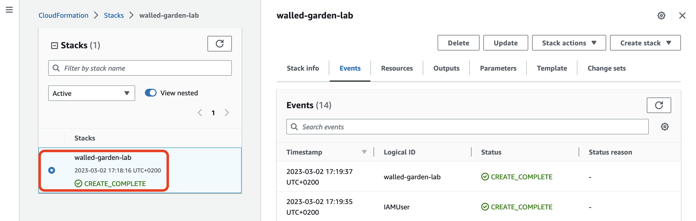

# Please follow below instructions to setup & cleanup the lab from [command line](#cmdline) or [AWS console](#console).

## <a name="cmdline"></a>Using command line

### Lab setup

Deploy a cloudformation stack from `iamboundary.yaml` -template

```
$ STACK=walled-garden-lab
$ aws cloudformation deploy --stack-name ${STACK}  --template-file iamboundary.yaml --capabilities CAPABILITY_NAMED_IAM

Waiting for changeset to be created..
Waiting for stack create/update to complete
Successfully created/updated stack - walled-garden-lab
```

Get ARN for credentials stored in Secrets Manager

```
$ aws cloudformation describe-stacks --stack-name ${STACK} --query 'Stacks[].Outputs'
[
    [
        {
            "OutputKey": "Credentials",
            "OutputValue": "arn:aws:secretsmanager:eu-west-1:111111111111:secret:walled-garden-lab/user-WU6ORb",
            "Description": "IAM credentials stored in Secrets Manager"
        }
    ]
]
```

Note ARN from `OutputValue` and supply it as `--secret-id`

```
$ aws secretsmanager get-secret-value --query 'SecretString' --output text \
 --secret-id arn:aws:secretsmanager:eu-west-1:1111111111111:secret:walled-garden-lab/user-WU6ORb
{"password":"THIS-IS-YOUR-PASSWORD","username":"walled-garden-lab-user"}
```

Note `username` and `password` from above. Username is `${STACK}-user`.

### Lab cleanup

```
$ aws cloudformation delete-stack --stack-name ${STACK}
```

Wait for a moment and then verify stack has been deleted.

```
$ aws cloudformation describe-stacks --stack-name ${STACK}
An error occurred (ValidationError) when calling the DescribeStacks operation: Stack with id walled-garden-lab does not exist]
```

## <a name="console"></a>Using AWS console

### Lab setup

Open the Cloudformation console and start creating a new stack.
If you don't yet have any stacks on your account in given region this is how the console will look.
Click "Create Stack" to move forward ...


Check "Template is ready" & "Upload a template file". Then "Choose file", select [iamboundary.yaml](./iamboundary.yaml) and click "Next" to move forward ...


Give a new for the stack you are about to createi and click "Next" to move forward ... 
**Note:** While stack names are region specific this stack will create IAM user and group,
and name them based on your stack name. Because IAM entities are global, you can not create
multiple stacks, into different regions, using the same stack name from this template.


You don't need to setup any options for the stack. Scroll down and click "Next" to move forward ...


On review step, remember to acknowledge stack might (it will) create IAM resources with custom names.
Then you are ready to click "Submit" and start stack build ...


Wait until the stack has "CREATE_COMPLETE" -status. 




After the stack has been created, check "Output" -tab and note the ARN for Credentials.


Open AWS Secrets Manager -console and find the secret created from the Cloudformation stack.
Click the link to view details ...


Scroll down to "Secret value" and click "Retrieve secret value" to reveal the IAM username and password.


Username will be derived from the stackname, e.g. `walled-garden-lab-user`, and password is a random string.
The User in below screenshot doesn't exists any longer so don't waste your time trying to find which account it is for ;-)


### Lab cleanup

After you have done the lab, clean-up the setup by selecting the stack from Cloudformation console and clicking "Delete" ...


And wait until stack deletion has been completed.


