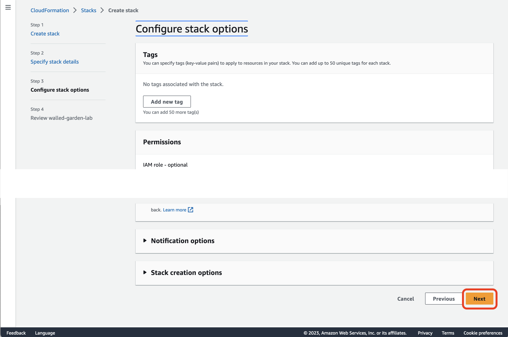

# Please follow below instruction to setup and cleanup the lab setup from [console](#console) or [command line](#cmdline).


## <a name="console"></a>Using AWS console

### Lab setup





### Lab cleanup


## <a name="cmdline"></a>Using command line

### Lab setup

Deploy a cloudformation stack from `iamboundary.yaml` -template

```
$ STACK=walled-garden-lab
$ aws cloudformation deploy --stack-name ${STACK}  --template-file iamboundary.yaml --capabilities CAPABILITY_NAMED_IAM

Waiting for changeset to be created..
Waiting for stack create/update to complete
Successfully created/updated stack - walled-garden-lab
```

Get ARN for credentials stored in Secrets Manager

```
$ aws cloudformation describe-stacks --stack-name ${STACK} --query 'Stacks[].Outputs'
[
    [
        {
            "OutputKey": "Credentials",
            "OutputValue": "arn:aws:secretsmanager:eu-west-1:111111111111:secret:walled-garden-lab/user-WU6ORb",
            "Description": "IAM credentials stored in Secrets Manager"
        }
    ]
]
```

Note ARN from `OutputValue` and supply it as `--secret-id`

```
$ aws secretsmanager get-secret-value --query 'SecretString' --output text \
 --secret-id arn:aws:secretsmanager:eu-west-1:1111111111111:secret:walled-garden-lab/user-WU6ORb
{"password":"THIS-IS-YOUR-PASSWORD","username":"walled-garden-lab-user"}
```

Note `username` and `password` from above. Username is `${STACK}-user`.

### Lab cleanup

```
$ aws cloudformation delete-stack --stack-name ${STACK}
``` 

Wait for a moment and then verify stack has been deleted.

``` 
$ aws cloudformation describe-stacks --stack-name ${STACK}
An error occurred (ValidationError) when calling the DescribeStacks operation: Stack with id walled-garden-lab does not exist]
```
