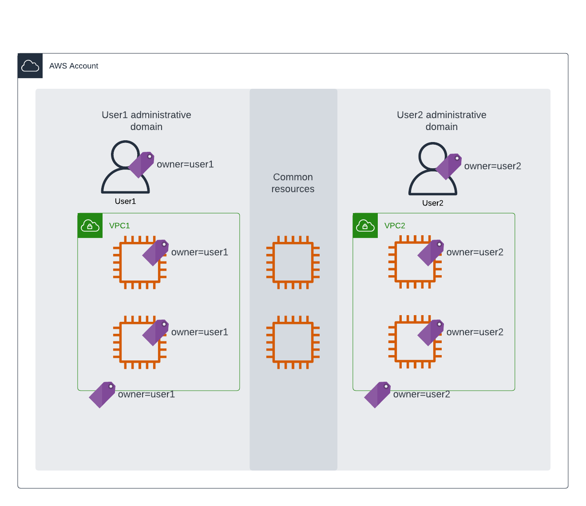
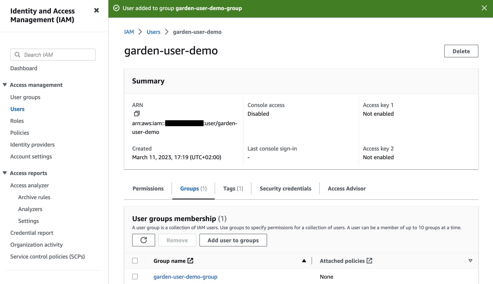

# IAM walled garden demo

## Brief history of shared AWS accounts

Back in the days, when creating an AWS account was a lot of overhead, common pattern was to have multiple teams sharing a single account. This created a demand to isolate teams from each other by assigning them an IAM policy that would grant access only to their part of the account. While it might have been possible (in theory) to create complex IAM policies to containerize resources by application or team, one fundamental problem did remain. Once you granted a right to create an IAM policy or role, you effectively granted admin level access to everything on the account. While IAM has very granular controls for actions, it can not limit what policies you attach to a role, or content of policy documents.

## IAM permission boundary


There are 3 types of IAM polices that control your access to AWS APIs. First and most common is normal identity-based policies that are attached to roles and users. Second type is organization service control policies (SCP) that are attached to AWS accounts or OUs. These can limit what the local admins can do on the account and as they are not part the account, those can not be modified by local admins. Typical use-case for SCPs would be limiting regions or services you are allowed to use within given account.

The Third type is [permission boundary](https://docs.aws.amazon.com/IAM/latest/UserGuide/access_policies_boundaries.html) policy. It is similar to regular IAM policies inside of an account, but the use-case is similar to SCPs, limiting what can be granted in normal policies.

Policy evaluation logic works so, that you are only allowed for an actions if all three policy types allow it. You may remember that single deny will always overwrite any number of allow statements, but all 3 policies must also allow your actions, ie. the effective permissions are the intersection of 3 different types of polices applied. This is why you typically want to have “allow-all” -statement in permission boundary or SCP policies, and then deny the parts you don’t want to be granted via normal IAM policies.

## Definition of walled garden



Our goal is to setup permission boundary so it would allow users to manage IAM policies, roles, users, groups and instance-profiles and work independently. At the same time the boundary should protect one's resources from others sharing the same AWS account. Ie. User would be restricted into their own walled gardens, within they can have admin like permissions.

We will define the ownership of resource by tagging it with ```owner``` -tag that has the same value as the tag attached to IAM principal. Unfortunately resource creation and applying a tag, are 2 separate operations. Because resources are created without tags, it is necessary to allow operations in permission boundary when ```owner``` -tag is not present. Otherwise you wouldn't be to create any new resources. This means that untagged resources are common property for all users as long as applicable IAM policy (and SCPs) allow.

Definition of walled garden can now be broken down into 5 requirements and implemented in IAM statements

### Limit access to resources owned by given user, group or role (1)
### Deny hijacking resources owned by others (2)

The First ```Allow``` statement will scope boundary policy to include only resources that  have no ```owner``` -tag assigned (see above) or it has the same value as your effective IAM principal has. In this lab it will be ```owner=user1```. This implements both ownership and denies resource hijacking, not allowing re-tagging.

NOTE: ```${aws::PrincipalTag/owner}``` is reference to active IAM pricipal ```owner``` -tag value.

```
          - Sid: 'AllowUnlessOwnedBySomeoneElse'
            Effect: Allow 
            Action: '*'
            Resource: '*'
            Condition:
              StringEqualsIfExists:
                'aws:RequestTag/owner': ${aws:PrincipalTag/owner}
                'aws:ResourceTag/owner': ${aws:PrincipalTag/owner}
```

### Allow creating and modifying IAM resources only within your "namespace" (3)

Denying IAM modifications of resources that are not prefixed with your ```owner``` -tag value ensures separation between multiple users. This is also a minor limitation to ability to create IAM resources that you should remember. However it doesn't affect content of policies, only naming.

```
          - Sid: 'DenyIAMChangesWithoutPrefix'
            Effect: Deny
            Action:
              - iam:Add*
              - iam:Attach*
              - iam:Create*
              - iam:Delete*
              - iam:Detach*
              - iam:Pass*
            NotResource:
              - !Sub "arn:*:iam::${AWS::AccountId}:group/${!aws:PrincipalTag/owner}-*"
              - !Sub "arn:*:iam::${AWS::AccountId}:policy/${!aws:PrincipalTag/owner}-*"
              - !Sub "arn:*:iam::${AWS::AccountId}:role/${!aws:PrincipalTag/owner}-*"
              - !Sub "arn:*:iam::${AWS::AccountId}:user/${!aws:PrincipalTag/owner}-*"
              - !Sub "arn:*:iam::${AWS::AccountId}:instance-profile/${!aws:PrincipalTag/owner}-*"
```

### Deny modification or removal of permission boundary policy (4)

All above would be useless unless there is a way to protect the permission boundary itself. Boundary policy created in the lab setup has a name derived from the stack name you created. Once the permission boundary is attached to IAM principal, it can not be modified by the principal.

```
          - Sid: 'DenyBoundaryModification'
            Effect: Deny
            Action:
              - iam:CreatePolicyVersion
              - iam:DeletePolicy
              - iam:DeletePolicyVersion
              - iam:SetDefaultPolicyVersion
            Resource: !Sub "arn:aws:iam::${AWS::AccountId}:policy/${AWS::StackName}-boundary"
```

Second statement denies boundary subject from deleting the boundary.

```
          - Sid: 'DenyBoundaryRemoval'
            Effect: Deny
            Action:
              - iam:DeleteUserPermissionsBoundary
              - iam:DeleteRolePermissionsBoundary
            Resource: '*'
            Condition:
              StringEquals:
                'iam:PermissionsBoundary': !Sub "arn:aws:iam::${AWS::AccountId}:policy/${AWS::StackName}-boundary"
```

### Force above rules to be inherited to every policy created or modified (5)

Finally we must deny actions to create new users or roles if the same permission boundary isn't attached. This will ensure the permission boundary is inherited to IAM entities created, and it isn't possible to escape your walled garden by assuming unrestricted role you created. 

```
          - Sid: 'ForceBoundaryInheritance'
            Effect: Deny 
            Action:
              - iam:CreateUser
              - iam:CreateRole
              - iam:PutUserPermissionsBoundary
              - iam:PutRolePermissionsBoundary
            Resource: '*'
            Condition:
              StringNotEquals:
                'iam:PermissionsBoundary': !Sub "arn:aws:iam::${AWS::AccountId}:policy/${AWS::StackName}-boundary"
```

With this theoretical background we are ready to get started with lab exercise ...

## Lab exercise

Login to your AWS console with username and password you got from [lab setup](../01_LABSETUP/README.md). The Cloudformation template created you 2 VPCs. VPC1 has ```owner=YOUR_IAM_USERNAME``` (or more preciesly value of your IAM users owner-tag) tag on it. VPC2 is tagged to another owner.


Now we are ready to start testing if 5 requirements above were implemented. Lets start with 

> Limit access to resources owned by given user, group or role (1)

Select VPC1 and verify you can view it's attributes and add a secondary CIDR


Try adding 100.64.0.0/24 CIDR, verify it got added to the list and then click "Remove".


All did work because you were the owner of VPC1. If you try to view attributes of VPC2 you will get an error message because you are not the owner of it and therefore your access is denied.


You will get similar error message if you try to modify VPC2 CIDR ranges.


You are also denied of hijack VPC2 by changing the value of ```owner``` -tag that was the 2nd requirement of walled garden definition.

> Deny hijacking resources owned by others (2)

If you try changing existing ```owner``` -tag value, you will get an error. In addition to hijacking resources from others, this will also prevent you from giving away your resources to others.


Above 2 requirements create borders of walled garden. Remaining of this lab will demonstrate it isn't possible to remove or alter those borders even though you are able to create your own IAM policies and pricipals.

Saying your IAM user has the same ```owner```-tag as your IAM user is circular definition that is always true. So you should be able to edit it ...


... except we defined earlier you shouldn't be able break out of your garden by altering permission boundary attached to IAM principal.

> Deny modification or removal of permission boundary policy (4)

Removal of permission boundary is not allowed because of explicit deny in boundary policy.


You can edit boundary policy in console, but saving the changes is denied.


So, once you have permission boundary attached your IAM user or role, you can not get out of it. Then we should verify all new IAM pricipals you create have the same permission boundary.

> Force above rules to be inherited to every policy created or modified (5)

If you try to create an IAM user without attaching the permission boundary to it, you will get an error because of explicit deny in your permission boundary.


Now we still need to verify it is possible to create IAM pricinpals when correct permission boundary is attached.


And remmeber to add your owner -tag to new user as well.


But it is still failing ?!? What did we forget ?


Last remaining requirement was to limit IAM resource to namespace, ie. having certain prefix to their names. In our case the prefix is "garder-user".

**NOTE:** AWS IAM has a concept of [path](https://docs.aws.amazon.com/IAM/latest/UserGuide/reference_identifiers.html#identifiers-friendly-names) that would be more elegant way of defining namespaces. While it would be possible to write permission boundary policy using paths, it wouldn't work with AWS console as paths are only supported in APIs and CLI :-(

> Allow creating and modifying IAM resources only within your "namespace" (3)

Lets try once more, creating IAM user "garder-user-demo" ...


... adding the user into "Admin" -group, attaching the correct permission boundary, and not forgetting the owner -tag (not shown in screenshots).


Now the user was created but adding it to Admin -group failed, because that group isn't in your control; it doesn't have the correct owner -tag and it is not within your IAM namespace either.


But if you create garden-user-demo-group, you can attach the user to it as now both user and group are within your IAM namespace. 




Now you have tested all 5 requirement defining the walled garden are implemented in IAM policy statements show in the beginning. You can also create new IAM principals and policies freely, as long as, you attach the same permission boundary as you have, and have them within your namespace. This allows multiple users/teams, with admin like permissions, sharing an AWS account and protect their own resources using tags.

When you are done with this lab, please remember to clean-up the resources you created. First delete any IAM users and groups you created manually and then follow [the instructions to delete lab setup](../01_LABSETUP/README.md).

## Extra credit

While this lab was about showing how multiple IAM users could operate on shared account with admin like permissions, you could apply the same pattern to automated CI/CD pipelines when you have multiple pipelines deploying to the same account and want to be sure each pipeline is managing only it's own part of infrastructure.
