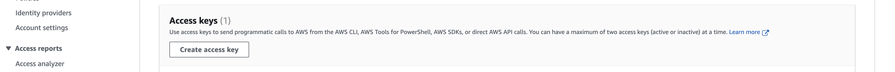

# AWS Access Keys
In this demo you will learn how to obtain you AWS Access keys and learn how to set up the access keys in the AWS CLI. You will also learn how to switch accounts in the AWS CLI, when you have multiple accounts for different purposes.

# About the Lab
In this lab you will learn about AWS Access Keys and how to set them up.

# AWS Access Keys Lab
In this part of the lab we will start by teaching about the AWS Access keys and how to set up them up

NOTE: For almost all step below, an image is attached where necessary, which will you help you select the right service/option.

## Stage 1: Introduction to AWS Access Keys

1. To access any of the AWS services, you can use the AWS Management Console, the Command Line Interface (CLI), or Software Development Kit (SDK).

2. I hope that for this Intermediate lab, you already have an AWS account. If not feel free to search the web on how to create a FREE AWS account and get to know which are the free services in the free tier.

3. Once you have created an account. Please log in with an IAM user. DO NOT USE THE ROOT USER for security reasons.

4. You should see a page like the one shown below. It can vary and change a bit, but overall should be similar.

5. This method of using the AWS services is via the AWS Console, another method used by developers is via the AWS CLI.

6. For this you need to authenticate your computers terminal to have access to the AWS account. This is done with the help of access keys.

7. These keys consist of an access key ID and secret access key, which are used to make programmatic requests to AWS.

## Stage 2: Generating your Access Keys

1. Please log in to AWS with your IAM user. DO NOT USE THE ROOT USER for security reasons.

2. On the SEARCH bar on the top left side, please search for `IAM`.

3. IAM is a global service and is not dependent on the region which you are situated in.

4. Select `USERS` on the left side panel.

5. Please select your user name or IAM name from list of all users.

6. Please select the third tab labelled as `Security Credentials` .

7. Scroll down and select `Create access key`.

8. Follow along the and then you will be able to download your access key ID and access secret key as a `CSV` file.

9. Please keep this safely and DO NOT SHARE THIS WITH ANYONE.

## Stage 3: Setting up your Access Keys in the CLI

1. Download the latest version of AWS CLI from [here](https://docs.aws.amazon.com/cli/latest/userguide/getting-started-install.html) based on your operating system.

2. Once it is installed, open your terminal and type the command

        aws configure

3. It will prompt you to enter the AWS Access Key ID, followed by the AWS Secret Access Key, which you can get from the downloaded csv file from stage 2.

4. Enter the Default region name, based on the region you are present in. You can find a list of all region names [here](https://docs.aws.amazon.com/AmazonRDS/latest/UserGuide/Concepts.RegionsAndAvailabilityZones.html).

5. Finally enter the Default output format as json.

Thats all !! Now you can access any of the AWS services with proper commands from the CLI.

## Stage 4: Switching between multiple AWS Accounts

1. Well we learnt how to on how to setup the AWS CLI with the access keys. How about the case when you want to use another account? It will be tedious to everytime perform an `AWS CONFIGURE` and set it up.

2. There is an easy way to switch accounts in the AWS CLI.

3. Firstly, you can get a list of AWS profiles by the command

        aws configure list-profiles

4. By default, there will be one default profile.

5. To insert a new profile, enter the command

        aws configure --profile account1

6. Enter the required credentials for this account

7. You can then switch between the accounts by passing the profile on the command.

8. The profile is default profile, when no --profile parameter is provided in the command.

