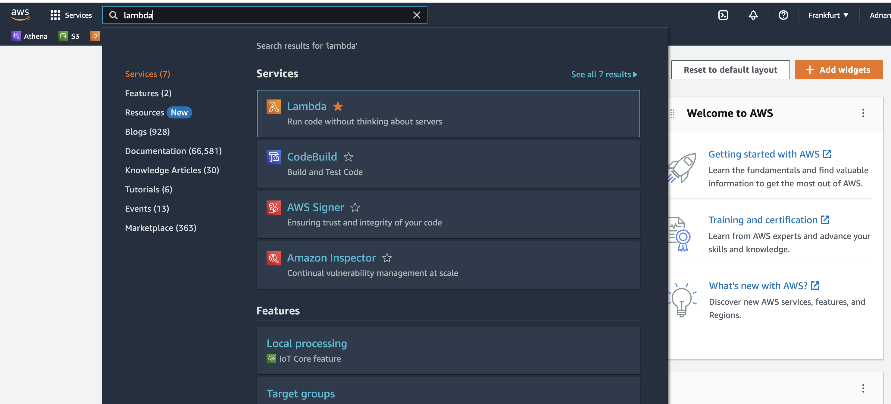
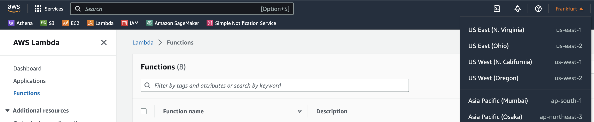

# AWS CDK
In this demo you will learn about AWS CDK, and also learn how to create a lambda function via the AWS CDK.

# About the Lab
In this lab we will firstly introduce you to AWS CDK and then teach you on how to create a Lambda function with the AWS CDK.

# AWS CDK
In this part of the lab we will start by teaching about the AWS CDK and how to create a lambda function with the help of AWS CDK

NOTE: For almost all step below, an image is attached where necessary, which will you help you select the right service/option.

## Stage 1: Introduction to AWS CDK

1. Need of AWS CDK: When you are working on a small project, you can simply use the service via the AWS Console or even use the AWS CLI.

2. In this case, the chances of error are quite low, the architectures are less complicated, and managing the infrastructure is a rather smaller task.

3. However, when the project is complicated and bigger, the overall architecture can be quite complex and difficult to handle many things via the AWS Console.

4. This is when the AWS CDK comes of help. AWS CDK is an open-source framework that can help us to manage and create AWS resources and services with a programmatic approach.

5. It supports Python, JavaScript, TypeScript, Java, C#, and Go.

## Stage 2: Setting up an AWS CDK Project

1. In order to install AWS CDK with python, run the command as shown below. More information can be found on the official documentation [here](https://docs.aws.amazon.com/cdk/v2/guide/getting_started.html).

        npm install -g aws-cdk

2. To check if cdk was installed properly, run the command as shown below. This should show you the current version of installed cdk. 

        cdk --version

3. My system has npm version 8.15.0, python version 3.8.8, and node version 16.17.0.

4. Once you have installed cdk, we can start by creating the the cdk project folder by running the command

        mkdir cdk_project && cd cdk_project

5. In order to create a cdk project, with python as our default language, run the command

        cdk init --sample_app --language python

6. If you read the logs, it will ask you to activate the virtual environment by running the command

        source .venv/bin/activate

7. Followed by this you can install the required dependencies by running the command

        pip install -r requirements.txt

## Stage 3: Create AWS Lambda with AWS CDK 

We have installed and set up an AWS CDK Project. Lets now directly dive into how we can create a Lambda function with the AWS CDK. We will use python as our programming language.

1. In order to create a lambda function, create a lambda folder with a file for the lambda function.

        mkdir lambda_cdk && cd lambda_cdk
        touch lambda_function.py

2. Insert the following python code in order to print the current date. Understanding of the python code is beyond the scope of this demo. Simply stating, this code will print todays date. You can find the script [here](lambda_function.py).

        from datetime import date

        def lambda_handler(event, context):
        
            today = date.today()
            today = str(today)
            print("Today`s date:", today)
            return {
                `statusCode`: 200
            }

3. Once you have created the lambda function, you need to create/add the stack for AWS CDK. For this you need to add the ready made construct (read more [here](https://docs.aws.amazon.com/cdk/v2/guide/constructs.html)) to your AWS CDK stack.

    1. Open the file aws-lambda-creation-automation/cdk_project/cdk_project/cdk_project_stack.py

    2. Replace the text in the file with the open provided in this repository.

4. Thats it. We are now ready to deploy our lambda to AWS.

    1. Lets check our difference between AWS and locally to deploy by using the command as shown below.

            cdk diff

    2. Finally you can deploy using the command shown below

            cdk deploy

6. In case of any error, please read through the logs, which will provide great feedback

## Stage 4: Checking your AWS Lambda

1. Once the deployment is complete, you can sign into the AWS Console.

2. On the SEARCH bar on the top left side, please search for `LAMBDA`.

3. Make sure you are in the right region. To learn more about AWS Regions please read the documentaion [here](https://docs.aws.amazon.com/awsconsolehelpdocs/latest/gsg/select-region.html).

4. Now if you sort the list by `Last Modified`, you should be able to see your newly created Lambda function.