# Intermediate Demo - AWS Lambda Creation and Automation
In this lab you will learn how to create an AWS Lambda and how to automate the process of updating the lambda function.

# What is AWS Lambda 
AWS LAMBDA: “AWS Lambda is an event-driven, serverless computing system provided. It is a computing service that runs code in response and you dont need to manage the underlying resources.”

## More about AWS Lambda
1. AWS Lambda is one the first known serverless computing services offered by AWS and is extremely popular amongst developers around the world.
2. By serverless, it does not mean that there are no servers, rather its a development model for developers to not worry about creating or managing the servers, and can create simply create and run their application.
3. Advantages of AWS Lambda:
    1. Automatic provisioning of resources
    2. Available on demand
    3. Security of resources is handled by AWS
    4. Pay per usage
    5. No need to maintain the servers
    6. AWS Lambda supports Python, Ruby, Java, Go, PowerShell, Node.js and C#
4. Disadvantages of AWS Lamda:
    1. Lambda function has a max time to run of 15 minutes
    2. Can be difficult to configure at times (we will learn this in this lab)
    3. Cold Start: As AWS Lambda is an on demand service, whenever the lambda function is invoked (called), it can take some time to download the code and set up the environment. This is referred to as cold start and it is not desirable.
5. Summarizing: Just code and forget about the infrastructure.
6. AWS Lambda is denoted by the logo shown below.

    

# About the Lab
This lab will be divided into two parts:
1. The first part is to learn how to create an AWS Lambda Functon from the console.
2. The second part is how to automate the update of the lambda function, when you push your code to any code repository (eg: Github, AWS Code Commit, etc.)

# Part 1: Creating your First AWS Lambda Function
In this part of the lab we will start by creating a simple lambda function that should simply return you todays date, when it is invoked. We will use python as our programming language. Feel free to use any another supported language of your choice. 

NOTE: For almost all step below, an image is attached where necessary, which will you help you select the right service/option.

## Stage 1: Create an AWS Account and Login
1. I hope that for this Intermediate lab, you already have an AWS account. If not feel free to search the web on how to create a FREE AWS account and get to know which are the free services in the free tier. 

2. In the AWS free tier you get around 1 Million free lambda invocations per month. Feel free to read more [here](https://aws.amazon.com/free/?all-free-tier.sort-by=item.additionalFields.SortRank&all-free-tier.sort-order=asc&awsf.Free%20Tier%20Types=*all&awsf.Free%20Tier%20Categories=*all) on AWS.

3. Once you have created an account. Please log in with an IAM user. DO NOT USE THE ROOT USER for security reasons.

4. You should see a page like the one shown below. It can vary and change a bit, but overall should be similar.

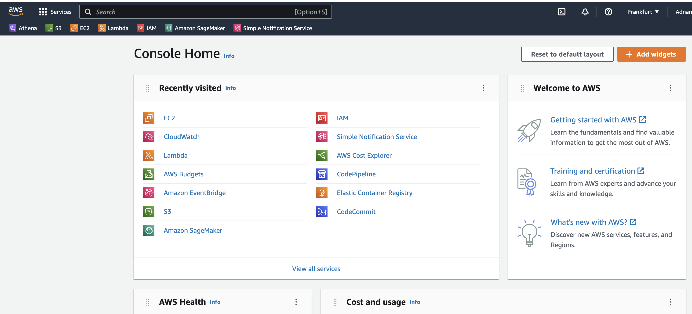

## Stage 2: Navigate to the Lambda Service

1. On the SEARCH bar on the top left side, please search for `LAMBDA`.

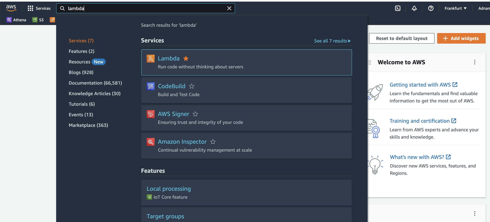

2. One you have selected the service, firstly please select the Region in which you are located or is closest to you, in order to have the minimun latency. To learn more about AWS Regions please read the documentaion [here](https://docs.aws.amazon.com/awsconsolehelpdocs/latest/gsg/select-region.html).

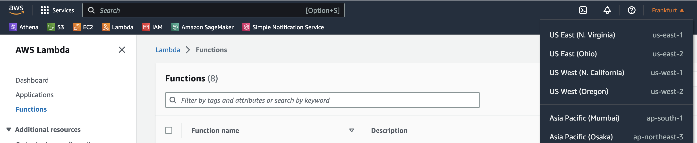

## Stage 3: Create your Lambda Function.

1. Once you are on the AWS Lambda service page and have selected the appropriate region. Click on the orange box, labelled as `CREATE FUNCTION`.

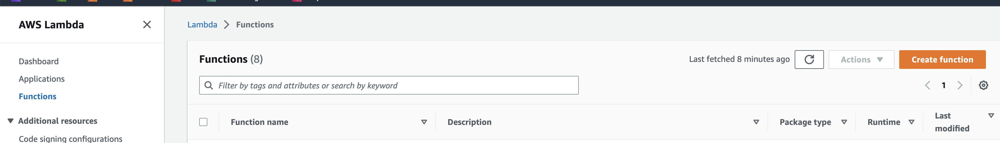

2. On clicking the orange box, you will land up on a page with many configurations. Do not be overwhelmed, its quite straight forward. Please select on type in the following options.
    1. Author from sratch
    2. Enter your desired name to the function
    3. Select the runtime as Python. In case you want to use another programming language, you can select the appropriate runtime.
    4. Select the architecture as x86_64

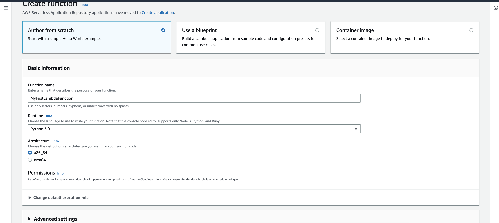

3. For now we will skip the part of the permissions. If your AWS Lambda needs to access any other service such as an S3 bucket, SNS topic, etc, you can create a new IAM role for this lambda function. To know more about this, you can read the documentation [here](https://docs.aws.amazon.com/lambda/latest/dg/lambda-intro-execution-role.html).

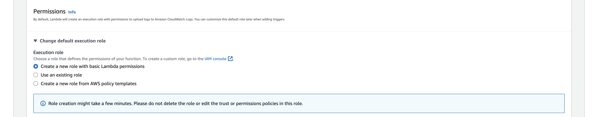

4. Finally scroll down and click on the orange box on right hand corner, which is labelled as `CREATE FUNCTION`. Please now wait for few seconds for the lambda function to be created.

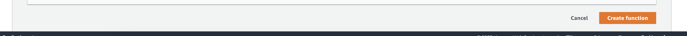

5. Once this is complete, you will land to a page like the one shown below. This indicates that you have succesfully created your lambda function.

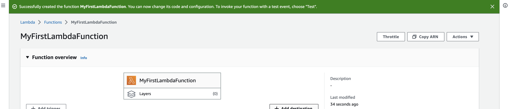

## Stage 4: Code Your Lambda

1. Now as you have created and configured your Lambda function, you need to provide it with the code to run with, when it is invoked.

2. For this, scroll down and select the tab labelled as `CODE.

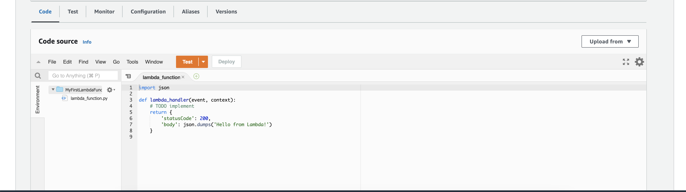

3. Here you will see lambda_function.py python script, which has the lambda_handler function. This is the DEFAULT function that runs, whenever the lambda function is invoked. This can be seen in the Runtime Settings below. This can be changed by clicking the `EDIT` button in the Runtime Settings.

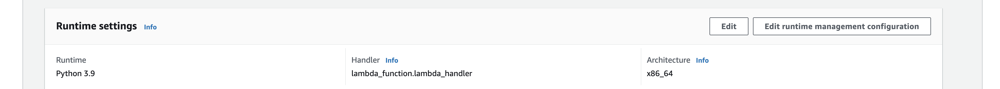

4. Insert the following python code in order to print the current date. Understanding of the python code is beyond the scope of this demo. Simply stating, this code will print todays date. You can find the script [here](lambda_function.py).

        from datetime import date

        def lambda_handler(event, context):
        
            today = date.today()
            today = str(today)
            print("Today`s date:", today)
            return {
                `statusCode`: 200
            }

        lambda_handler(1, 1)

5. Once you have inserted the code, click on `DEPLOY` to save the changes and deploy the code to your Lambda function.

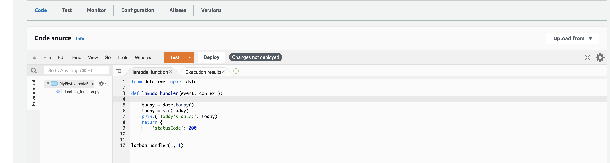

NOTE: For every change made to the lambda function, the code has to be deployed.

## Stage 5: Test Your Lambda

1. Now that you have created, configured, coded and deployed your lambda, its time to test if the lambda function when called by another service works or not.

2. For this we can test this within the console itself. The lambda function (async) takes two arguements.
    1. Event: It contains the input data.
    2. Context: It contains the runtime information such as the function name, function version and log group.

3. Here since this is a dummy test event, we simple provide 1, 1 as event and context.

4. Next, click on the drop down of the orange button labelled as `Test` and select configure test event. Then enter the following inputs.
    1. Select Create New Event
    2. Provide a name to the test Event
    3. Provide the Event JSON (here it does not matter since the event will not be used)
    4. Scroll down and click `SAVE`.

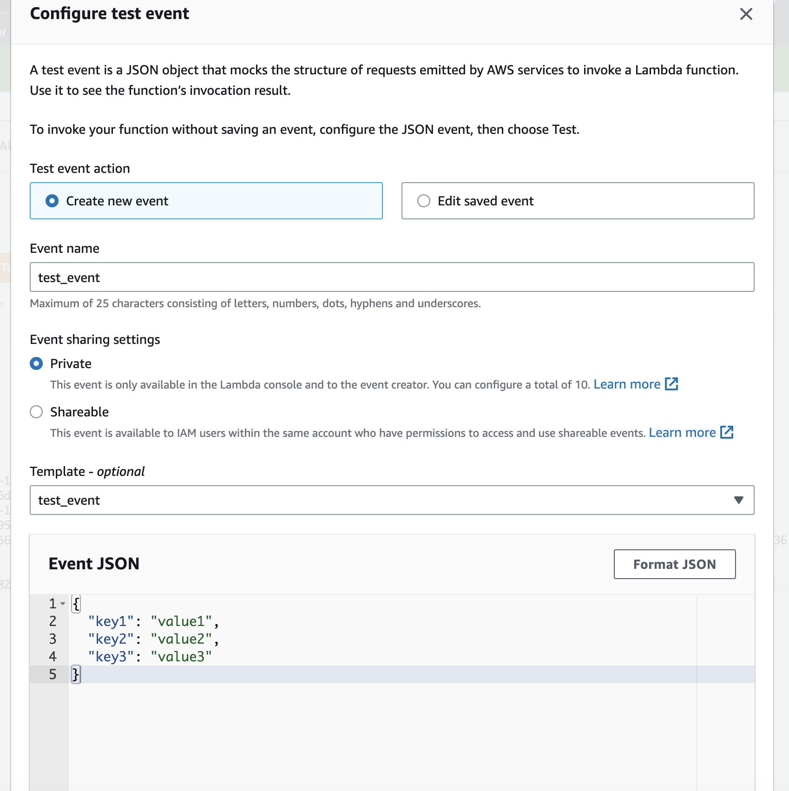

5. Then click on the orange `TEST` button to test and run the lambda function. 

6. Once the execution is finished, you will see the output in the `Execution Results` tab, as shown below.

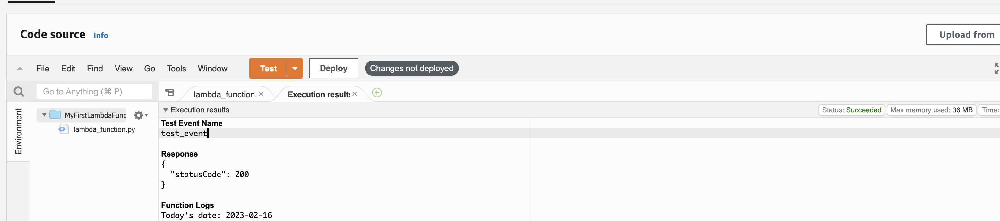

## Stage 6: Experiment

1. That was it. `Congratulations` on creating your first lambda function.
2. Now its your time to experiment and learn.
3. You will definitely encounter errors, but by falling you learn.

# Add On
In the above Part 1 we created our first lambda function via the AWS console. We can also create a lambda function via AWS CDK. To learn how to do this, you can read the article [here](AWS_Access_CDK.md).

# Part 2: Automation of your AWS Lambda Function
In this part of the lab we will firstly understand what we need to automate and why and how it can be easily done.

NOTE: For almost all step below, an image is attached where necessary, which will you help you select the right service/option.

## Stage 1: Understanding the Process

1. Suppose as a Data Scientist you create a model for performing a task. The codes are well documented on Github.

2. You have also created a lambda function that is capable of using this model when it is triggered with an event.

3. Now suppose after 1 months of time you notice that there is a small bug and you change the codes, and push them to GitHub. Is is not frustrating that you also need to change the corresponding lambda function ? 

4. You would need to login into AWS, navigate to AWS Lambda, find your function, update your code, test the code, etc.

5. Well there exists a simple solution to automate this process using Github Actions.

6. GITHUB ACTIONS: “GitHub Actions is a CI/CD tool for the GitHub flow. You can use it to integrate and deploy code changes to a third-party cloud application platform as well as test, track, and manage code changes.”

7. So now we will learn how to automatically deploy from GITHUB to AWS Lambda, whenever you push from your local repository to the remote repository in the cloud.

## Stage 2: Github Side Steps

1. In your local repository, create a folder .github and within that .workflows, and within that a file main.yaml.

2. Insert the following yaml code in the main.yaml file.

        name: deploy to lambda
        on:
        push:
            branches:
            - main
        jobs:

        deploy_source:
            name: deploy lambda from source
            runs-on: ubuntu-latest
            steps:
            - name: checkout source code
                uses: actions/checkout@v1
            - name: default deploy
                uses: appleboy/lambda-action@master
                with:
                aws_access_key_id: ${{ secrets.AWS_ACCESS_KEY_ID }}
                aws_secret_access_key: ${{ secrets.AWS_SECRET_ACCESS_KEY }}
                aws_region: eu-central-1
                function_name: test-data
                source: lambda_function.py

3. Here you have asked github to do the following:
    1. On every push to the `main` branch on github, it has to run a job.
    2. It will use the `AWS access key` and `AWS secret key` from github secrets to authenticate. To know more about AWS access keys, please read the documentation [here](https://docs.aws.amazon.com/IAM/latest/UserGuide/id_credentials_access-keys.html). Please refer the article [here](AWS_Access_CDK.md) to know how to obtain your access keys.
    3. This will then deploy all codes to function named `test-data` in the region `eu-central-1`.
    4. Provide the name of lambda at function_name, and the code which should be triggered at source. By default the Lambda function will search and execute the lambda_handler function. However this can be changed at the Lambda function console.

4. You should configue the aws credentials within your github account for that repository. Settings -> Secrets -> Actions -> New repository secret.

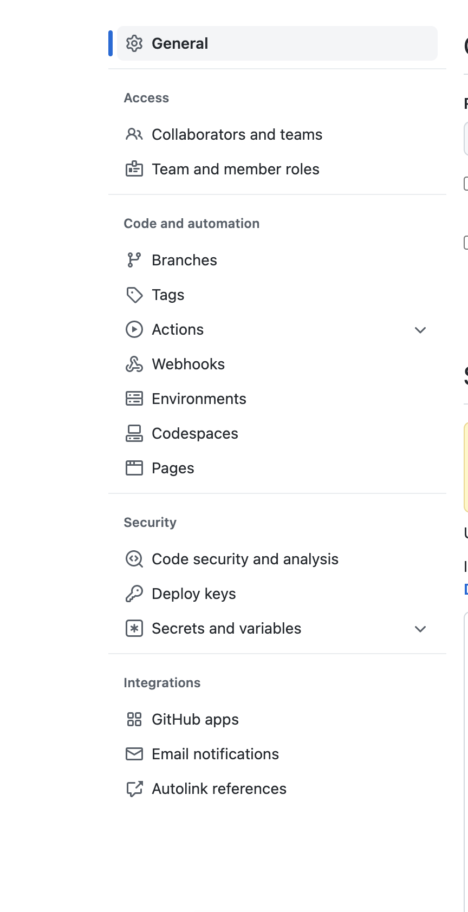

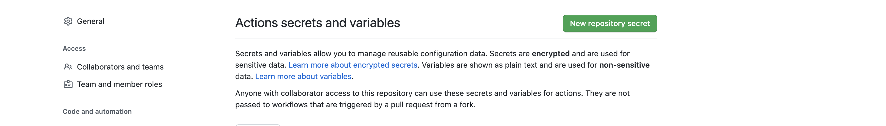

5. TIP: Do not use your IAM access keys and secret keys. You can create a new IAM user and get the access key ID and access ID, with limited permissions.

6. Finally you can push to github.

7. Thats all, once this is set-up, you can push changes to GitHub and it should automatically reflect in your Lambda Function.

8. You can view the status of your github action on the `Actions` tab on github.

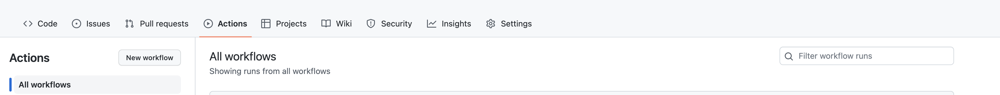

# Summary

In this entire demo lab, you have learnt how to create and configure your lambda function. You have learnt how to test and excecute it. You have also learnt how to automate the flow using Gitub Actions.

