# Common Issues - Cause & Fixes

## STAGE1

There are no common problems at this stage. Just ensure that you verify two emails, the email the app will use to send, and the email you will be recieving email at for the demo.  

For production usage you would remove SES sandbox mode.  

## STAGE2

There are two main mistakes which can be made in stage 2.  

### Sending Email for the Pet Cuddle-O-Tron Application

In the lambda function code there is a placeholder which starts as:-
```
FROM_EMAIL_ADDRESS = 'REPLACE_ME'
```
The `REPLACE_ME` part **must** be replaced by the `PetCuddleOTron Sending Address` you noted down in Stage 1.  
If you don't do this, emails will never arrive when sent by the application.  

### Deploying the `email_reminder_lambda` function

After pasting the lambda function code, and updating the above placeholder you **need** to click `Deploy` to ensure the Lambda Function is deployed ready for use. If you don't deploy, the generic `Hello World` lambda function will run and emails wont be sent.  

## STAGE3

In Stage3 there are two placeholders you need to replace in the ASL for the `PetCuddleOTron` State Machine.  

inside here :-

```
    "EmailOnly": {
      "Type" : "Task",
      "Resource": "arn:aws:states:::lambda:invoke",
      "Parameters": {
        "FunctionName": "EMAIL_LAMBDA_ARN",
        "Payload": {
          "Input.$": "$"
        }
      },
      "Next": "NextState"
    },
```

You need to replace `EMAIL_LAMBDA_ARN` with the ARN of the `email_reminder_lambda` Lambda function.  
**AND**
inside here :-
```
    "EmailandSMS": {
      "Type": "Parallel",
      "Branches": [
        {
          "StartAt": "ParallelEmail",
          "States": {
            "ParallelEmail": {
              "Type" : "Task",
              "Resource": "arn:aws:states:::lambda:invoke",
              "Parameters": {
                "FunctionName": "EMAIL_LAMBDA_ARN",
                "Payload": {
                  "Input.$": "$"
                }
              },
              "End": true
            }
          }
        },
```
You need to replace `EMAIL_LAMBDA_ARN` with the ARN of the `email_reminder_lambda` Lambda function. 
Failure to do either of these will result in the step function failing, no emails will be sent.  

## STAGE4

There are four main mistakes which you can make in stage 4

### api_lamdda placeholder

Within the api_lambda code is a placeholder. The original code has a line as below :-
```
SM_ARN = 'YOUR_STATEMACHINE_ARN'
```
 

The `YOUR_STATEMACHINE_ARN` needs to be replaced with the ARN of the `PetCuddleOTron` Statemachine created in Stage 3.  
If you don't replace this placeholder you will see an `Oops! Error Error: TypeError: Failed to fetch` error when clicking the `LEVEL1`, `LEVEL2` or `LEVEL3` buttons. 
 

You can get further information via the `/aws/lambda/api_lambda` log group inside cloudwatch logs.  
It will show an error similar to the one below  
 

Fix this by going to the Lambda console, selecting `api_lambda` finding the lambda code, update the SM_ARN line with the PetCuddleOTron state machine ARN and then `Deploy` or `Deploy as latest`.  
 

### Enable API Gateway CORS

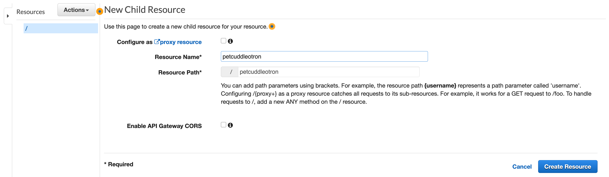 

When configuring the RESOURCE if you don't tick the `Enable API Gateway CORS` box the serverless application will fail with an `Oops! Error Error: TypeError: Failed to fetch` error (the same error as the api_lambda placeholder error above).  
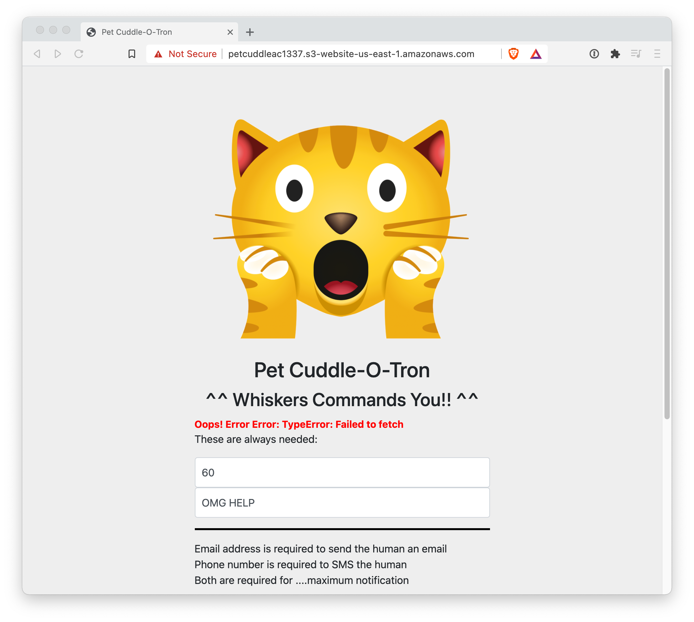
To fix this one, either delete the entire API and start again (the easy way).  
**or**  
Click `Resources` in API Gateway console.  
Select the `/petcuddleotron` resource in API Gateway, click `Actions` and select `Enable CORS`  
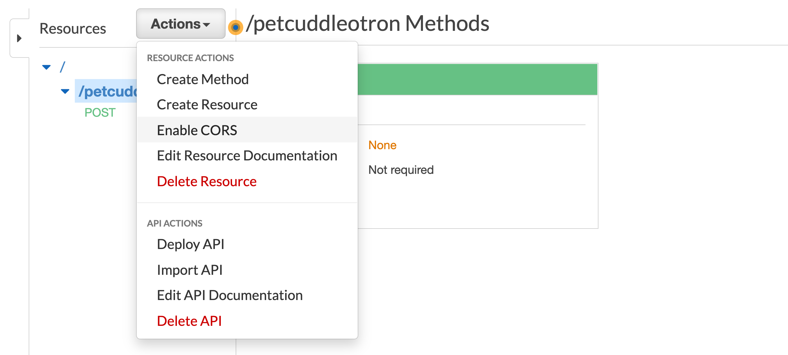
Click `Enable CORS and replace existing CORS headers`  
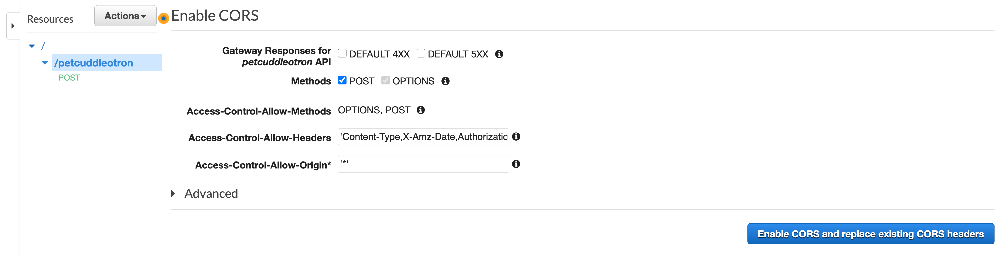
Click `Yes, replace existing values`  
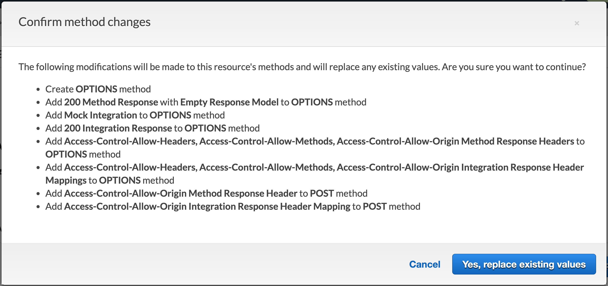
Click `Actions` then `Deploy API`    
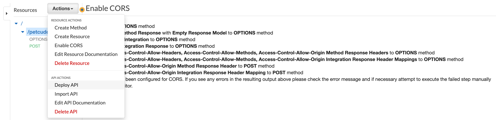
Select `prod` and click `Deploy`  
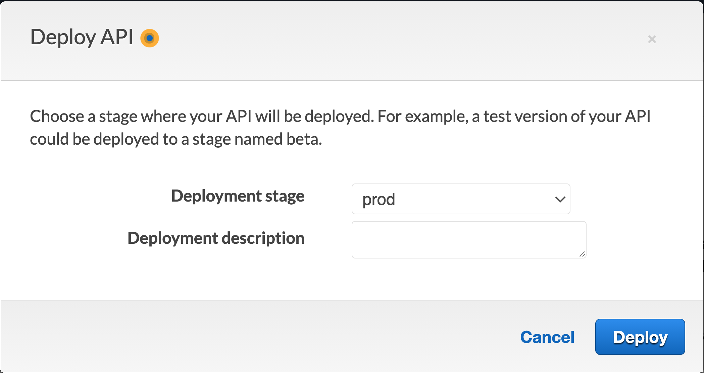
Go back to the PetCuddleOTron application, refresh the browser and retry to the app - it should work.  


### Use Lambda Proxy integration

When creating the API Gateway Method, you need to check the `Use Lambda Proxy Integration Box`.   
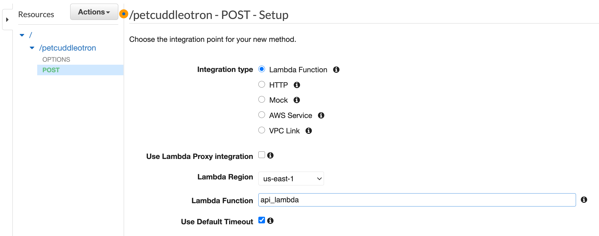 
If you don't, when running the application you will recieve the error below.  
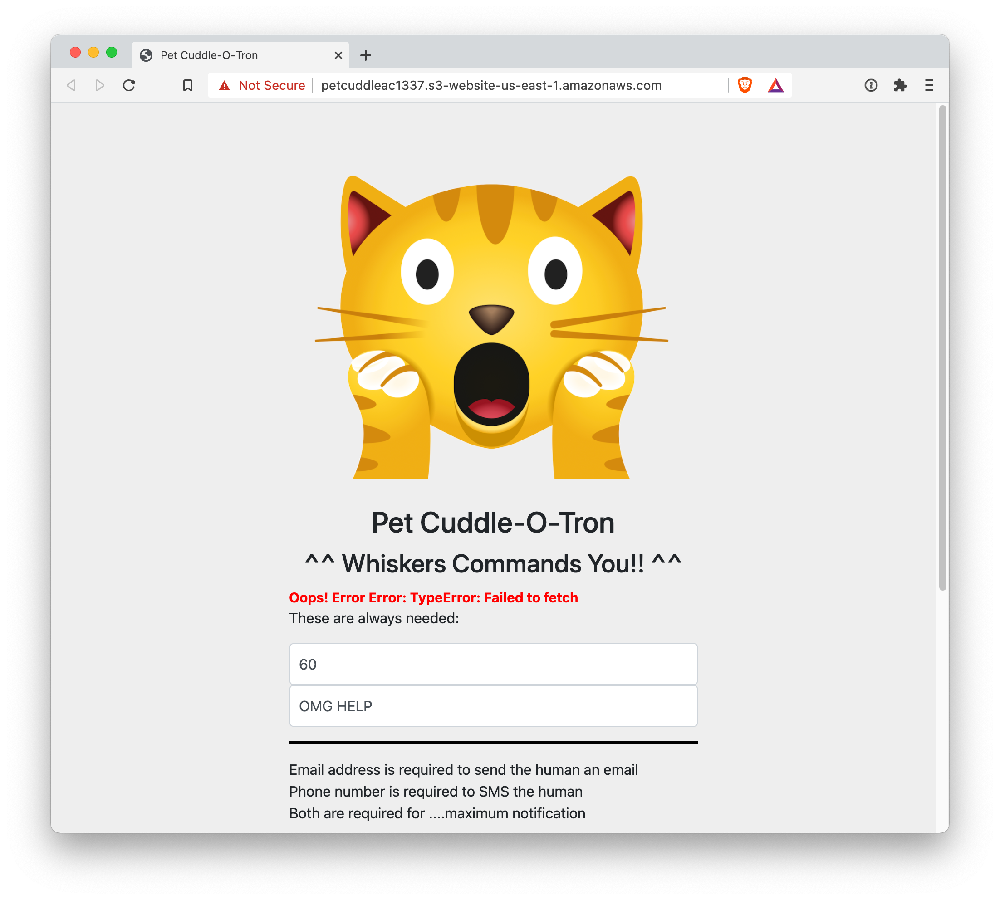  
You can get further information via the `/aws/lambda/api_lambda` log group inside cloudwatch logs.  
It will show an error similar to the one below (note the KeyError).   
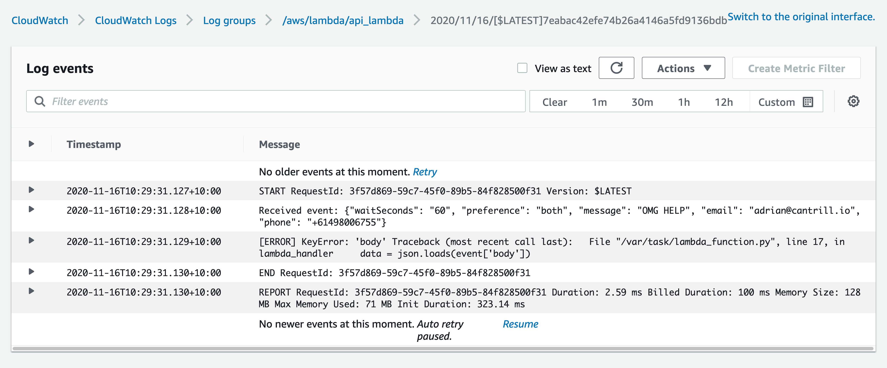 
To fix it, either delete and recreate the API (the easy way).  
**or**  
Click `resources` in API gateway, then selevct the `POST` method in the `/petcuddleotron` resource  
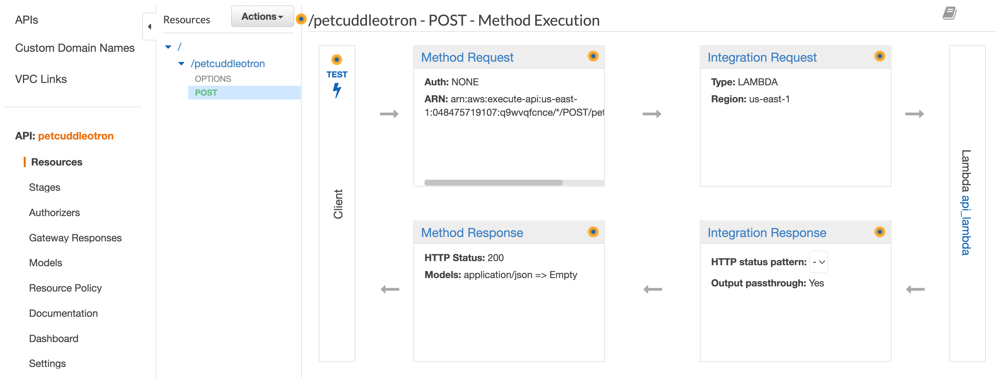  
Click `Integration Request`.  
Check check the `Use Lambda Proxy Integration Box`  
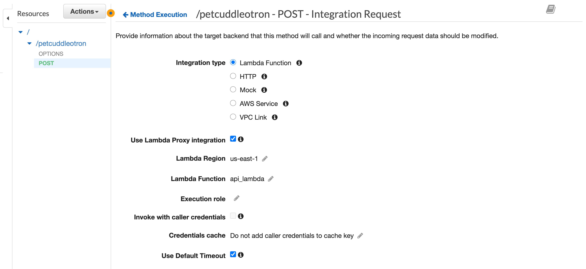  
Click `OK`.  
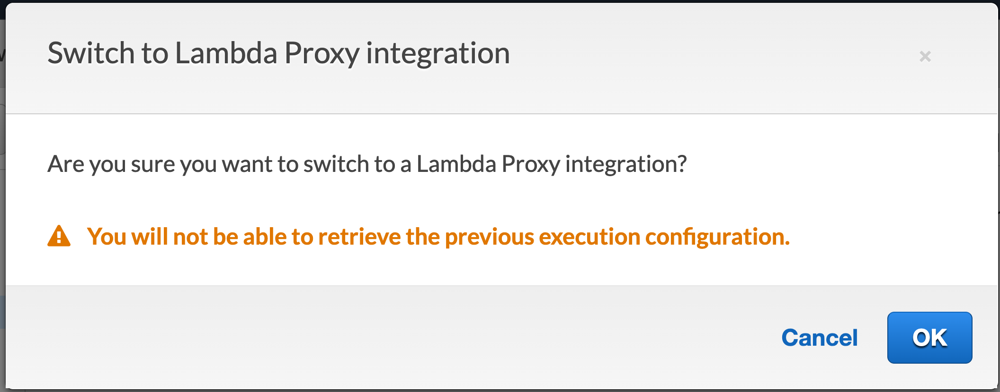 
Click `OK`.  
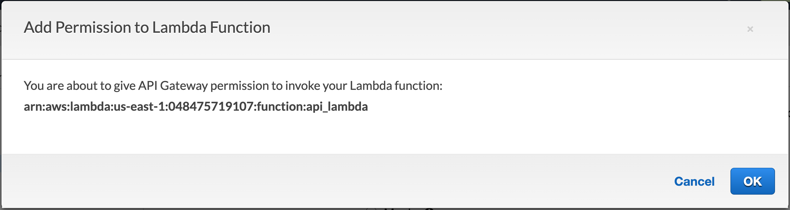  
Click `Actions` then `Deploy API`.  
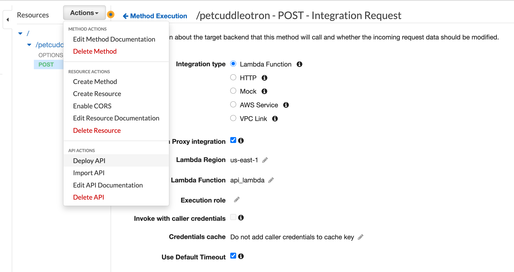 
Choose `prod` in `Deployment stage`   
Click `Deploy`.  
 
Refresh the Pet Cuddle O Tron application and try again.   


## STAGE5

In Stage5 you need to edit the `serverless.js` file before uploading it to S3.  
At the top of this file is a placeholder  
```
var API_ENDPOINT = 'REPLACEME_API_GATEWAY_INVOKE_URL';
```
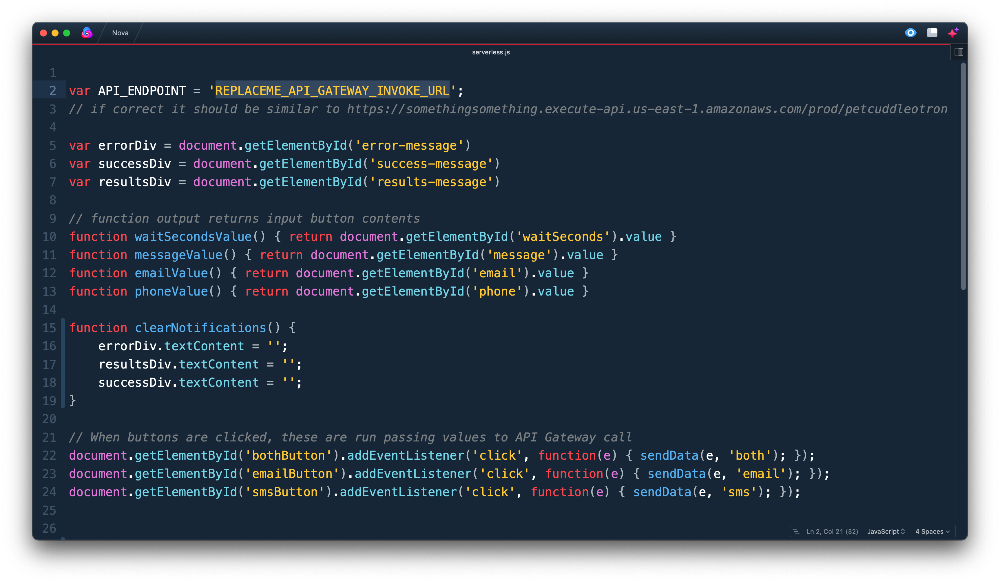 

Which needs to be updated with the full Invoke URL for your API Gateway, which should look something like this :-
```
https://somethingsomething.execute-api.us-east-1.amazonaws.com/prod/petcuddleotron
```
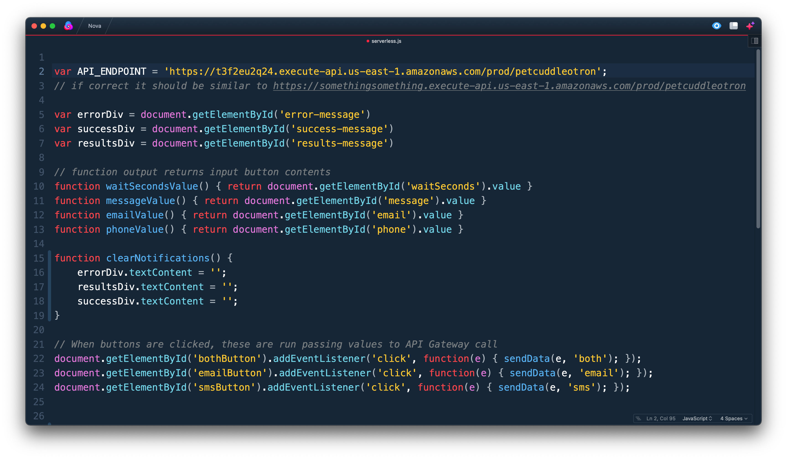 
Failure to do this, will result in an error message like this when clicking on the `LEVEL1`, `LEVEL2` or `LEVEL3` buttons.  
```
Oops! Error Error: SyntaxError: Unexpected token < in JSON at position 0
```
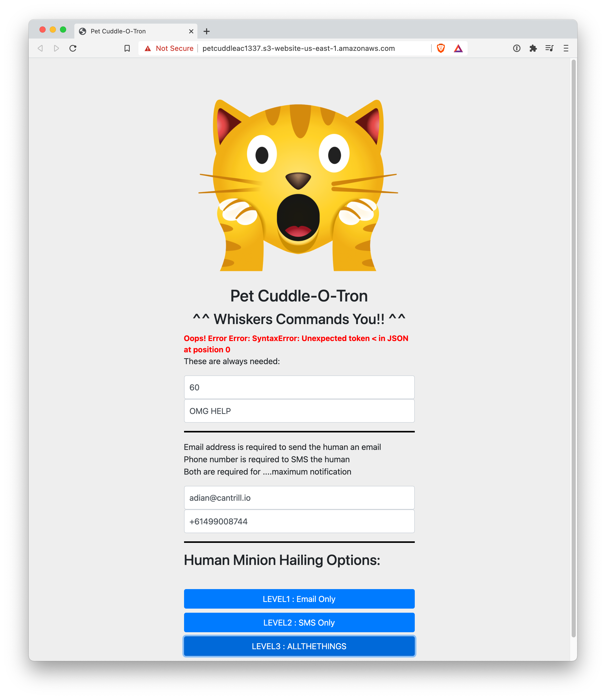 

Be sure to use the full invoke URL with the petcuddleotron on the end, **NOT** like the image below which is missing it. This will also cause an error.  

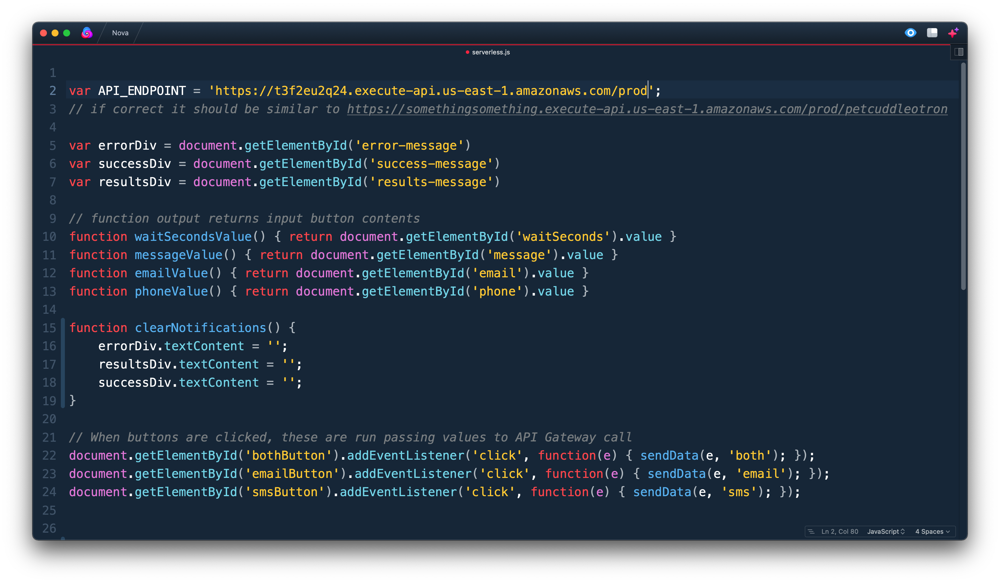 
