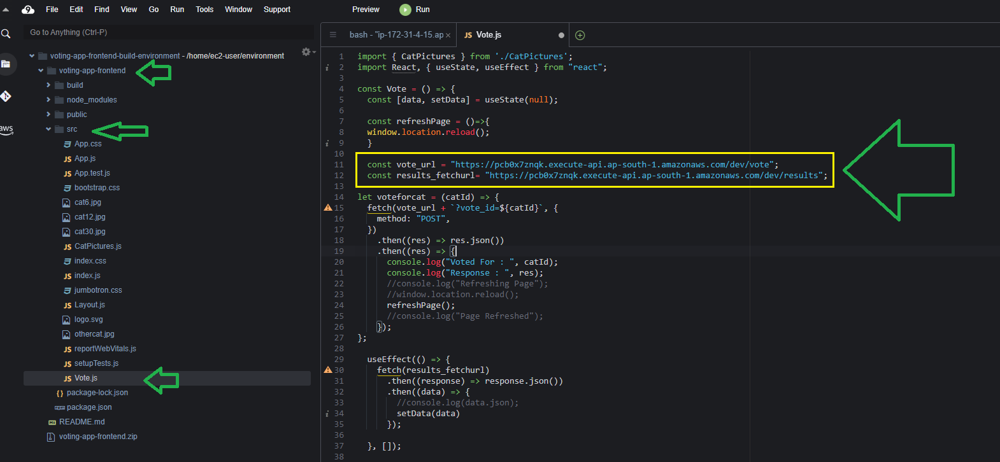

# 1-Click Install For Serverless Voting Application 

## Step 1 - Cloudformation Template

Login into AWS and select the `us-east-1` region. Apply the template below and wait for `CREATE_COMPLETE` before continuing with step-2.
### [Serverless Voting Application](https://console.aws.amazon.com/cloudformation/home?region=us-east-1#/stacks/create/review?templateURL=https://learn-cantrill-labs.s3.amazonaws.com/aws-serverless-voting-app/aws-serverless-voting-app.yaml&stackName=Serverless-Voting-App-Demo)

This template will create the below resources.
- Lambda Functions
- IAM Policies, Lambda Execution roles
- DynamoDB
- API Gateway
- S3 Bucket
- Cloud9 IDE

## Step 2 - Update the API Gateway endpoints in the React application and deploy to S3 bucket for website hosting

### Check S3 bucket name and website URL

In the **Outputs** section of the cloudformation stack, note that the S3 bucket name and the S3 website URL is displayed. Make a note of these two as they are required in the following steps.


### Get API Gateway Endpoints

- Open the API Gateway console and click on the `Voting-App-Api-Gateway` 
- Under `results` click on `GET` and then `Integration Request`


- Click on the edit icon for `voting-app-fetch-results` and then click on the tick icon.


- Click **Ok** to proceed.


- Click on **Actions** and then on **Deploy API**


- Create a new deployment stage and enter a stage name `dev` and click on **Deploy**


- The stages section will be opened.


- Click on the stage name `dev` under which you can see both `vote` and `results` resources.
- Click on each resource to view the api gateway endpoint for that resource.
- Note that these two URL's will be used in the React frontend to call the api gateway and the backend lambda functions.


### Editing the React application using Cloud9 IDE and copy static content to S3 Bucket

- Open the Cloud9 IDE and **Open** the `VotingAppCloud9IDE` environment.


- Wait for few minutes for the IDE to open and you will see a terminal where you can run linux commands.


- Run the below commands in the terminal

```
sudo yum install -y nodejs
node -v
wget https://learn-cantrill-labs.s3.amazonaws.com/aws-serverless-voting-app/voting-app-frontend.zip
unzip voting-app-frontend.zip
cd voting-app-frontend
```

- As shown in the below screenshot, expand the folder `voting-app-frontend` from the left side file explorer of the IDE.
- Inside src, there is a `Vote.js` file. Open the file.
- You will see that, there are two urls configured in the code `vote_url` for `vote` and `results_fetchurl` for `fetch results`
- Replace these two URL's with the two urls that you received after creating the API Gateway deployment.



- Save the file with CTRL+S
- In the terminal, run the below commands

```
npm update
npm run build
```


- Now you can run the below commands to copy the contents of the build folder to the s3 bucket. Replace the bucket name with the bucketname that was present in the cloudformation stack output.

```
cd build
aws s3 cp . 's3://<REPLACE_BUCKET_NAME_FROM_STACK_OUTPUT>' --recursive
```


- In the S3 bucket refresh to see the newly copied files.


- Try to access the webpage with the **Bucket website endpoint** that was present in the cloudformation stack output.


### Creating a Cloudfront distribution for this application (Optional)

- Deploy this [Template](https://console.aws.amazon.com/cloudformation/home?region=us-east-1#/stacks/create/review?templateURL=https://learn-cantrill-labs.s3.amazonaws.com/aws-serverless-voting-app/cloudfront.yaml&stackName=CDN-Serverless-Voting-App-Demo) to create a Cloudfront distribution.

- In the **Parameters** section, for S3BucketURL enter the **Bucket website endpoint** without the `http://` and proceed and deploy the Stack.


- In the **Outputs** section of cloudformation stack, you will get the Cloudfront endpoint. Open it in a new tab to see the webpage.


