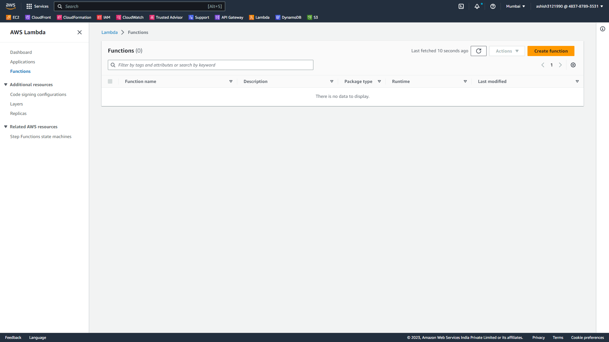
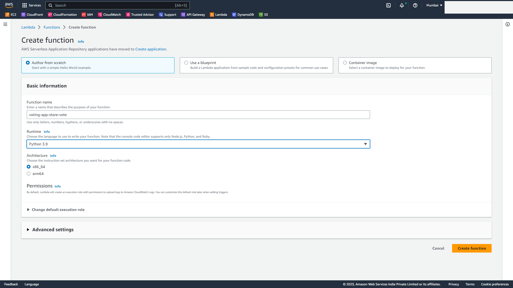
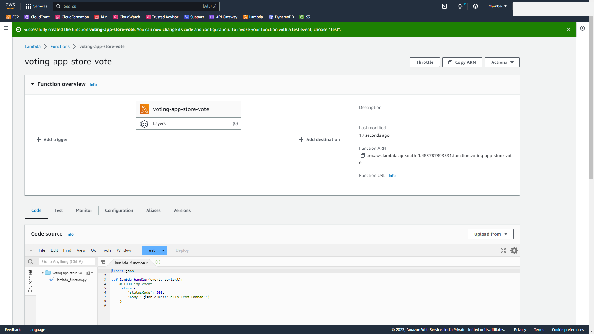

# Stage-1 Backend

## Step 2 - Create Lambda Functions

### **Part-1: Create a Lambda function to fetch the vote from frontend and store it in DynamoDB table.** [View Screenshots](./02_LABINSTRUCTIONS/Stage1_Step2_Part1.md)

- Move to the Lambda console and click on **Create Function** 

- For **Function Name** enter `voting-app-store-vote`
- For **Runtime** select `Python 3.9`
- Leave all the other options as default and click on **Create Function**

