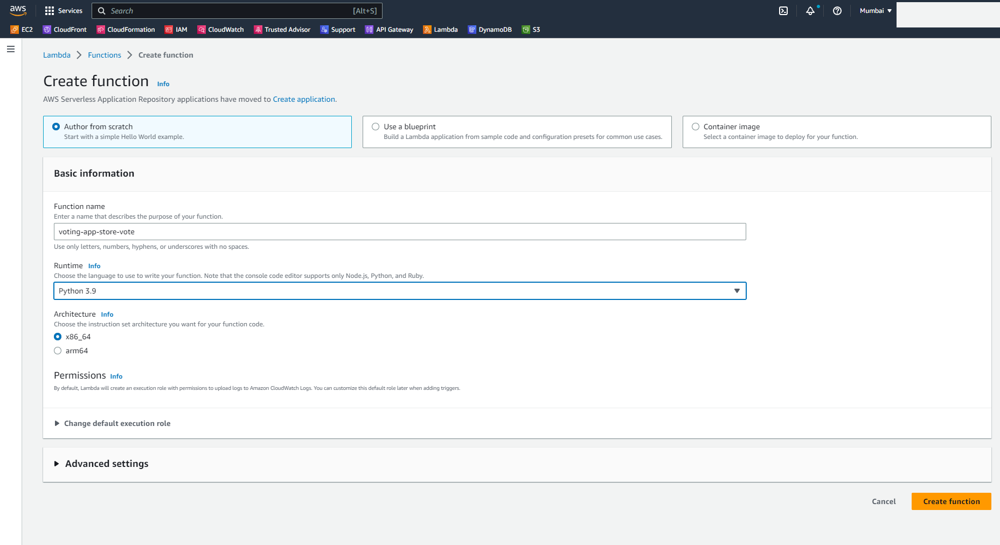

# Stage-1 Backend

## Step 2 - Create Lambda Functions

### **Part-1: Create a Lambda function to fetch the vote from frontend and store it in DynamoDB table.**

- Move to the Lambda console and click on **Create Function** 

- For **Function Name** enter `voting-app-store-vote`
- For **Runtime** select `Python 3.9`
- Leave all the other options as default and click on **Create Function**

- After the function is created, replace the function code with the code from [voting-app-store-vote.py](./01_LABSETUP/voting-app-store-vote.py)

- Click on Deploy. You will get a success message.
- **Note:** If you have used a different name for the DynamoDB table, change the **Table Name** in the code as well.

