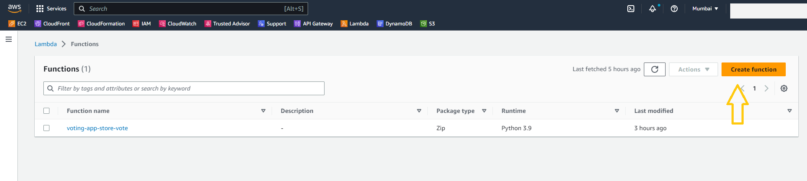
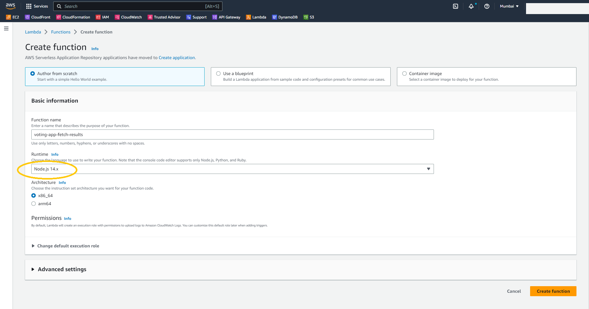
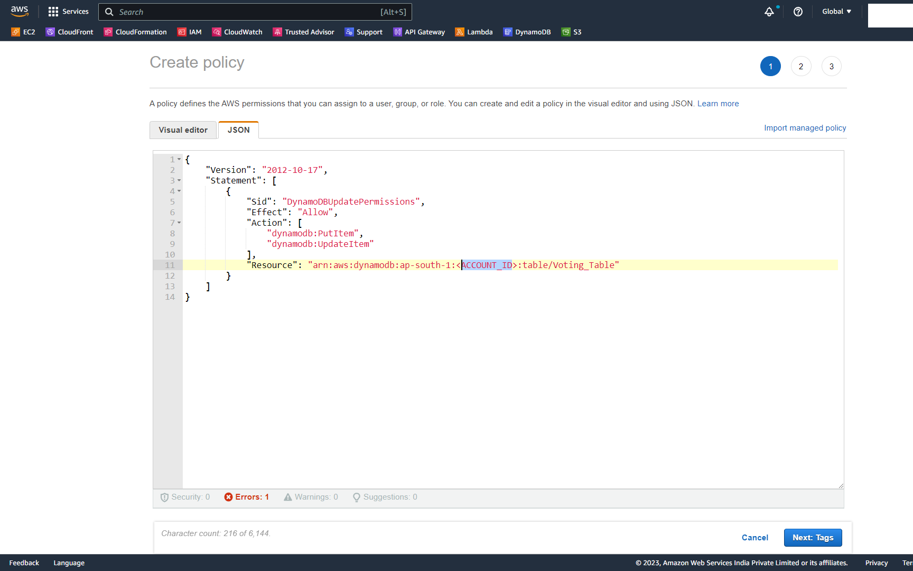
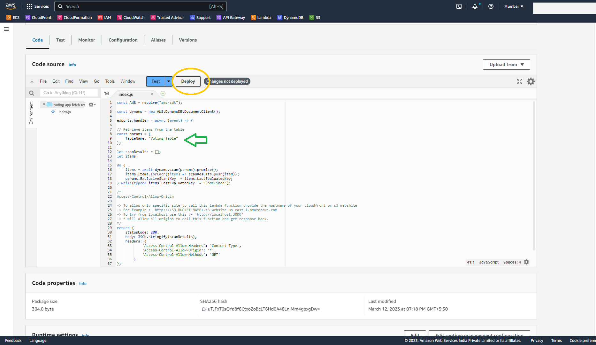
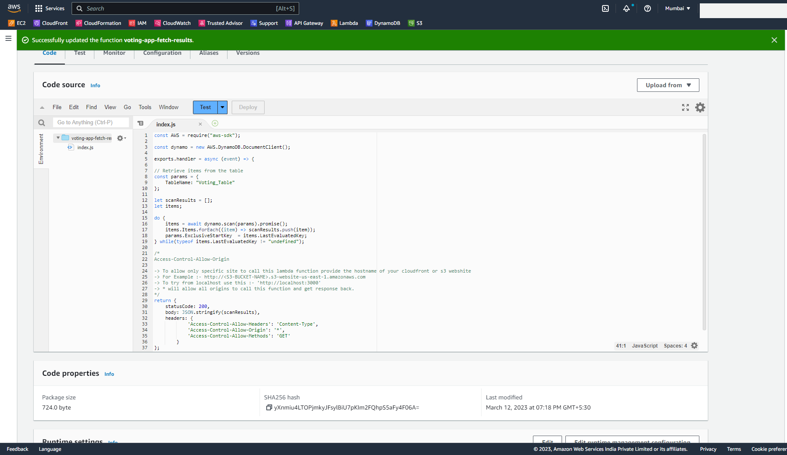

# Stage-1 Backend

## Step 2 - Create Lambda Functions

### **Part-2: Create a Lambda function to fetch the results from DynamoDB table and send it back to Frontend.**

- Create another lambda function. 

- For **Function Name** enter `voting-app-fetch-results`
- For **Runtime** select `Node.js 14.x`
- Leave all the other options as default and click on **Create Function**

- After the function is created, replace the function code with the code from [voting-app-fetch-results.js](/aws-serverless-voting-app/01_LABSETUP/voting-app-fetch-results.js)

- Click on Deploy. You will get a success message.
- **Note:** If you have used a different name for the DynamoDB table, change the **Table Name** in the code as well.

