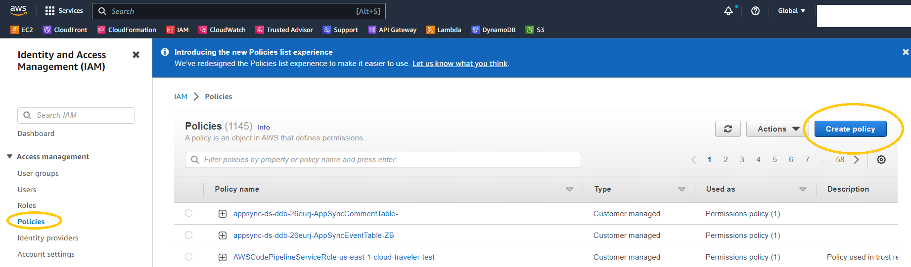
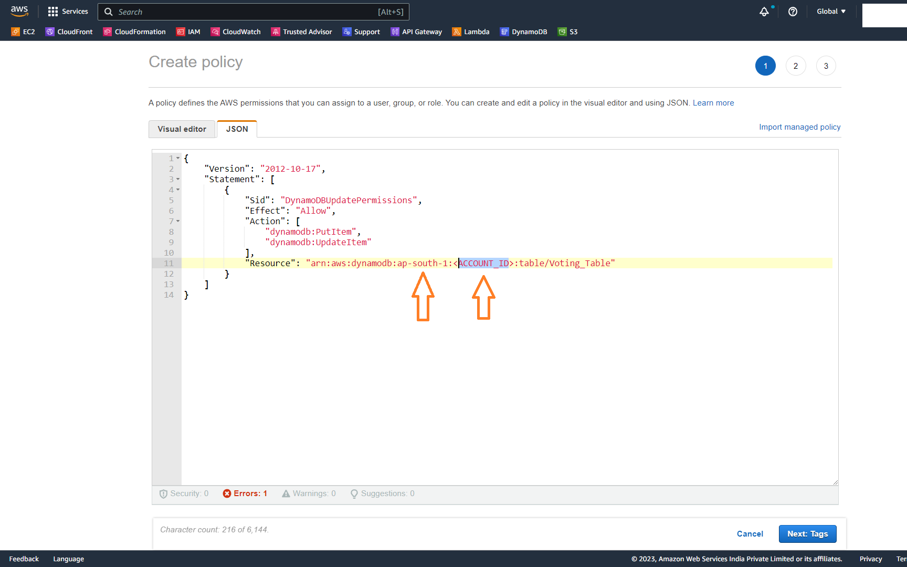

# Stage-1 Backend

## Step 2 - Create Lambda Functions

### **Part-3:** Create IAM permissions policy for both lambda functions [View Screenshots](./02_LABINSTRUCTIONS/Stage1_Step2_Part3.md)

By default the lambda functions will get a basic execution role to only send logs to cloudwatch. In order to update or fetch data from the DynamoDB table `Voting_Table`, the lambda functions need the required privileges. You need to create IAM permissions policy and attach it to the execution role of both lambda functions. **Note:** If you have used a different name for the DynamoDB table, change the table name in the below policy accordingly. Also add the region and your account ID in the JSON policy.

#### Permissions policy for lambda function `voting-app-store-vote`

- Move to the IAM console.



- Click on **Policies** and then **Create Policy**


- In the Create Policy page click on JSON and paste the following policy definition to the JSON editor.

```
{
    "Version": "2012-10-17",
    "Statement": [
        {
            "Sid": "DynamoDBUpdatePermissions",
            "Effect": "Allow",
            "Action": [
                "dynamodb:PutItem",
                "dynamodb:UpdateItem"
            ],
            "Resource": "arn:aws:dynamodb:<REGION>:<YOUR_AWS_ACCOUNTID>:table/Voting_Table"
        }
    ]
}
```



- Click on **Next: Tags** and then click on **Next: Review**


- For **Policy Name** enter `voting-app-dynamodb-update-policy`
- Click on **Create Policy**. After the Policy is created you will get a success message


#### Permissions policy for lambda function `voting-app-fetch-results`

- Move to the IAM console. Click on **Policies** and then **Create Policy** to create another IAM policy.
- In the Create Policy page click on JSON and paste the following policy definition to the JSON editor. 

```
{
    "Version": "2012-10-17",
    "Statement": [
        {
            "Sid": "DynamoDBScanPermissions",
            "Effect": "Allow",
            "Action": "dynamodb:Scan",
            "Resource": "arn:aws:dynamodb:<REGION>:<YOUR_AWS_ACCOUNTID>:table/Voting_Table"
        }
    ]
}
```


- Click on **Next: Tags** and then click on **Next: Review**


- For **Policy Name** enter `voting-app-scan-dynamodb-policy`
- Click on **Create Policy**. After the Policy is created you will get a success message


