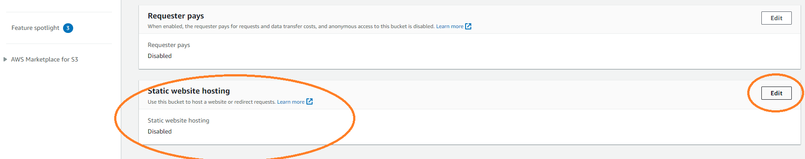

# Stage 2 - Frontend

### **Part-1:** Create S3 bucket for website hosting

- Move to the S3 bucket console and create a new S3 bucket with name `serverless-voting-app-demo`
- Choose a region where you have created the backend resources in stage-1


- Under **Block public access settings** uncheck all ticks and select the acknowledge option.


- Leave the other options as default and click on **Create Bucket**


- Under **Properties** scroll down to the **Static Website Hosting**




- Click edit and select the options as shown below.


- After the changes are saved, you will be able to see the **Bucket website endpoint**


- Under **Permissions** Edit the bucket policy. Copy the below policy and click on **Save Changes**

```
{
    "Version": "2012-10-17",
    "Statement": [
        {
            "Sid": "PublicReadGetObject",
            "Effect": "Allow",
            "Principal": "*",
            "Action": "s3:GetObject",
            "Resource": "arn:aws:s3:::serverless-voting-app-demo/*"
        }
    ]
}
```


### **Part-2:** Create a Cloud9 IDE to edit the Frontend Javascript code, build the React application and deploy to S3 bucket.

- Open the Cloud9 IDE and create a new environment.


- Enter any name for the IDE and leave all the other default options and click on create


- The IDE will be available in few minutes.


- Once it is ready, open the IDE and you will see a terminal where you can run linux commands.


- Run the below commands

```
sudo yum install -y nodejs
node -v
wget https://github.com/ashish3121990/learn-cantrill-io-labs/raw/67c637eb01f752a260a9e246b1a62df5d76b3a14/aws-serverless-voting-app/01_LABSETUP/voting-app-frontend.zip
unzip voting-app-frontend.zip
cd voting-app-frontend
```


- As shown in the [screenshots](/aws-serverless-voting-app/02_LABINSTRUCTIONS/readme_stage2_screenshots.md), expand the folder `voting-app-frontend` from the left side file explorer of the IDE.
- Inside src, there is a `Vote.js` file. Open the file.
- You will see that, there are two urls configured in the code `vote_url` for `vote` and `results_fetchurl` for `fetch results`
- Replace these two URL's with the two urls that you received at the end of stage-1 after creating the API Gateway deployment.


- Save the file with CTRL+S
- In the terminal, run the below commands

```
npm update
npm run build
```


- Now you can run the below commands to copy the contents of the build folder to the s3 bucket

```
cd build
aws s3 cp . 's3://serverless-voting-app-demo' --recursive
```


- In the S3 bucket refresh to see the newly copied files.


- Try to access the webpage with the **Bucket website endpoint**


