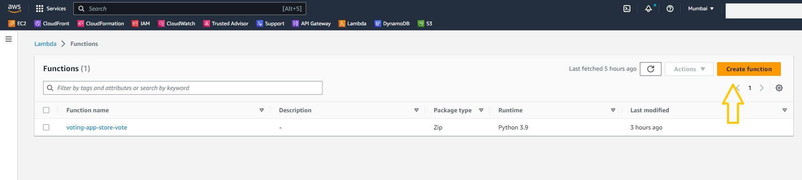
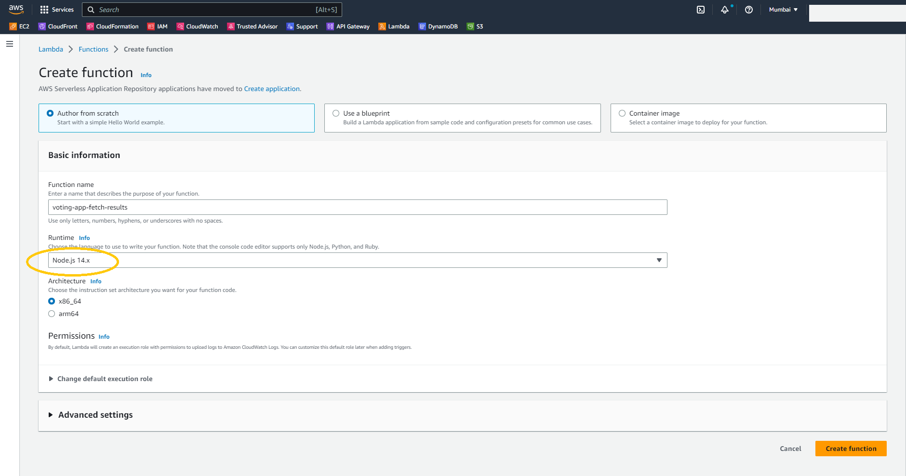
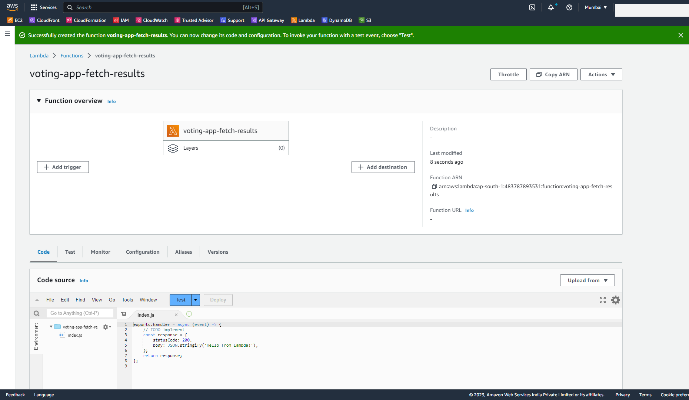
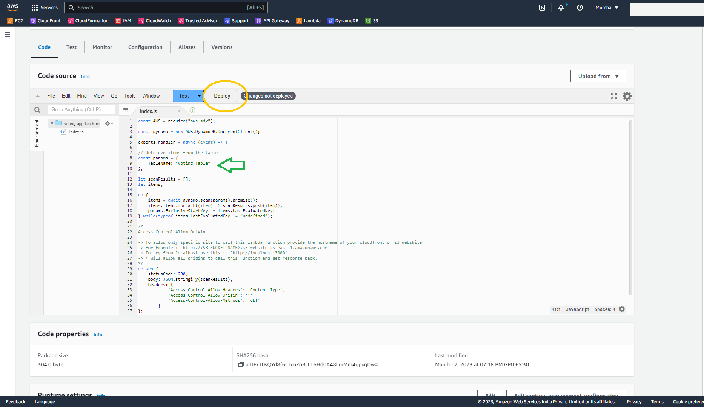
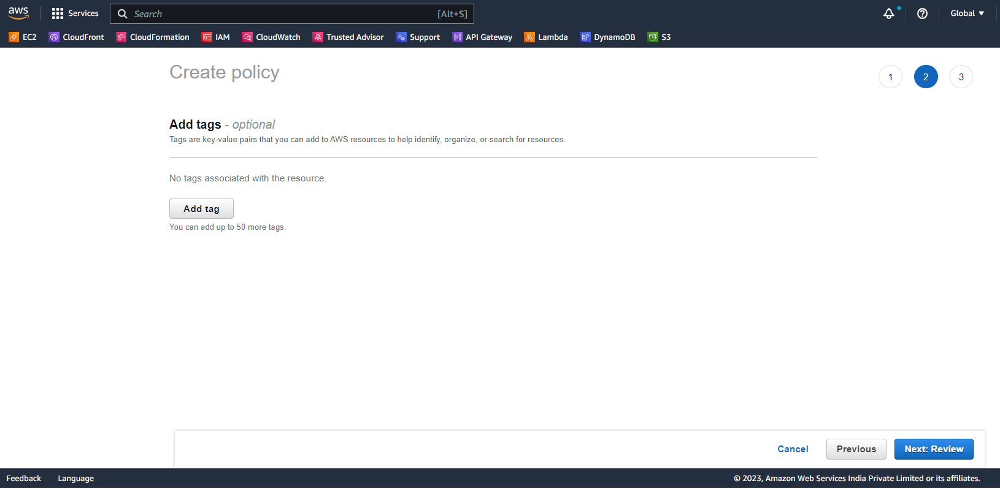
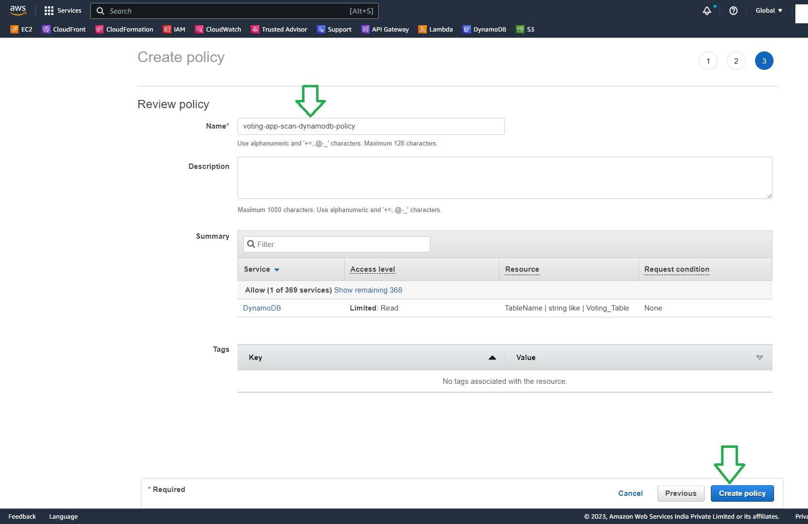
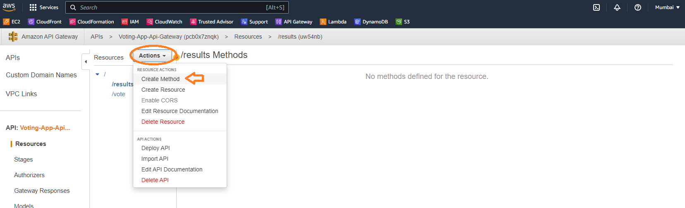

# Serverless Voting Application

In this mini project you will create a completely serverless voting application in two stages. First you will create the backend using API Gateway, Lambda functions and DynamoDB table. Then you will create the frontend application using ReactJS and deploy it to an S3 bucket for static website hosting which will be delivered using CloudFront CDN. Below is the architecture for this project.


# Stage 1 - Backend

- Choose a region where you want to deploy the application and use the same region for creating all the resources in below stages.
- [Click here to go back to Readme](/aws-serverless-voting-app/README.md)

## Step 1 - Create a DynamoDB table

- Move to the DynamoDB console to create a new table.
- For **Table Name** enter `Voting_Table`
- For **Partition key** enter `vote_id` of type string
- Leave all the other options as default and click on **Create Table**


- After the DynamoDB table is created you will get a success message.


## Step 2 - Create Lambda Functions and attach required permissions.

### **Part-1: Create a Lambda function to get the users vote from frontend and store it in DynamoDB table.**

- Move to the Lambda console and click on **Create Function** 


- For **Function Name** enter `voting-app-store-vote`
- For **Runtime** select `Python 3.9`
- Leave all the other options as default and click on **Create Function**


- You will get a success message.


- After the function is created, replace the function code with the code from [voting-app-store-vote.py](/aws-serverless-voting-app/01_LABSETUP/voting-app-store-vote.py)


- Click on Deploy. You will get a success message.
- **Note:** If you have used a different name for the DynamoDB table, change the **Table Name** in the code as well.


### **Part-2: Create a Lambda function to fetch the results from DynamoDB table and send it back to Frontend.**

- Create another lambda function. 



- For **Function Name** enter `voting-app-fetch-results`
- For **Runtime** select `Node.js 14.x`
- Leave all the other options as default and click on **Create Function**





- After the function is created, replace the function code with the code from [voting-app-fetch-results.js](/aws-serverless-voting-app/01_LABSETUP/voting-app-fetch-results.js)
- **Note:** If you have used a different name for the DynamoDB table, change the **Table Name** in the code as well.



- Click on Deploy. You will get a success message.


### **Part-3:** Create IAM permissions policy for both lambda functions

By default the lambda functions will get a basic execution role to only send logs to cloudwatch. In order to update or fetch data from the DynamoDB table `Voting_Table`, the lambda functions need the required privileges. You need to create IAM permissions policy and attach it to the execution role of both lambda functions. **Note:** If you have used a different name for the DynamoDB table, change the table name in the below policy accordingly. Also add the region and your account ID in the JSON policy.

#### Permissions policy for lambda function `voting-app-store-vote`

- Move to the IAM console.


- Click on **Policies** and then **Create Policy**


- In the Create Policy page click on JSON and paste the following policy definition to the JSON editor. Update REGION and YOUR_AWS_ACCOUNTID

```
{
    "Version": "2012-10-17",
    "Statement": [
        {
            "Sid": "DynamoDBUpdatePermissions",
            "Effect": "Allow",
            "Action": [
                "dynamodb:PutItem",
                "dynamodb:UpdateItem"
            ],
            "Resource": "arn:aws:dynamodb:<REGION>:<YOUR_AWS_ACCOUNTID>:table/Voting_Table"
        }
    ]
}
```


- Click on **Next: Tags** and then click on **Next: Review**



- For **Policy Name** enter `voting-app-dynamodb-update-policy`
- Click on **Create Policy**. After the Policy is created you will get a success message


#### Permissions policy for lambda function `voting-app-fetch-results`

- Move to the IAM console. Click on **Policies** and then **Create Policy** to create another IAM policy.
- In the Create Policy page click on JSON and paste the following policy definition to the JSON editor. Update REGION and YOUR_AWS_ACCOUNTID

```
{
    "Version": "2012-10-17",
    "Statement": [
        {
            "Sid": "DynamoDBScanPermissions",
            "Effect": "Allow",
            "Action": "dynamodb:Scan",
            "Resource": "arn:aws:dynamodb:<REGION>:<YOUR_AWS_ACCOUNTID>:table/Voting_Table"
        }
    ]
}
```


- Click on **Next: Tags** and then click on **Next: Review**


- For **Policy Name** enter `voting-app-scan-dynamodb-policy`
- Click on **Create Policy**. After the Policy is created you will get a success message




### **Part-4:** Attach the IAM policies to the Lambda execution role.

#### For lambda function `voting-app-store-vote`

- Move to the Lambda console and click on the function `voting-app-store-vote`


- Under Configuration, click on the Execution role name to open the IAM role in a new tab


- Under `Add permissions` click on `Attach Policies`


- Search for the policy `voting-app-dynamodb-update-policy` and press enter


- Select the policy and click on `Add permissions`


- You will get a success message that the policy was attached to the role


#### For lambda function `voting-app-fetch-results`

- Repeat the same steps for the lambda function `voting-app-fetch-results`
- Move to the Lambda console and click on the function `voting-app-fetch-results`
- Under Configuration, click on the Execution role name to open the IAM role in a new tab
- Under `Add permissions` click on `Attach Policies`
- Search for the policy `voting-app-scan-dynamodb-policy` and press enter
- Select the policy and click on `Add permissions`
- You will get a success message that the policy was attached to the role

## Step 3 - Create API Gateway

- Move to the API Gateway console.
- Select REST API and click on build.


- Select the radio button for `REST` and `New API`
- For **API Name** enter `Voting-App-Api-Gateway` and click on **Create API**


- Under **Actions** click on **Create Resource**


- For **Resource Name** enter `vote` and click on **Create Resource**.


- Similarily create another resource with **Resource Name** as `results`


- Now there are two resources in the api gateway `vote` and `results`


#### Create resource and methods

- Under the `results` resource create a GET method. Select the `results` resource and click on **Actions** and create a GET method.




- For **Integration Type** select `Lambda Function`
- Select `Use lambda proxy integration` and select the region where the lambda is created.
- For **Lambda Function** name, use `voting-app-fetch-results` which was created in earlier steps.


- Click on Save and select OK when a prompt asks for giving api gateway the permissions to invoke lambda function.


- Repeat the above 5 steps for creating a POST method under the `vote` resource.
- Under the `vote` resource create a POST method. Select the `vote` resource and click on **Actions** and create a POST method.
- For **Integration Type** select `Lambda Function`
- Select `Use lambda proxy integration` and select the region where the lambda is created.
- For **Lambda Function** name, use `voting-app-store-vote` which was created in earlier steps.
- Click on Save and select OK when a prompt asks for giving api gateway the permissions to invoke lambda function.


#### Create deployment

- Click on **Actions** and then on **Deploy API**


- Create a new deployment stage and enter a stage name `dev` and click on **Deploy**


- The stages section will be opened.


- Click on the stage name `dev` under which you can see both `vote` and `results` resources.
- Click on each resource to view the api gateway endpoint or the invoke URL for that resource.
- These two URL's will be used in the React frontend to call the api gateway and the backend lambda functions.


# Stage 2 - Frontend [Go to Stage-2](/aws-serverless-voting-app/02_LABINSTRUCTIONS/readme_stage2_screenshots.md)

