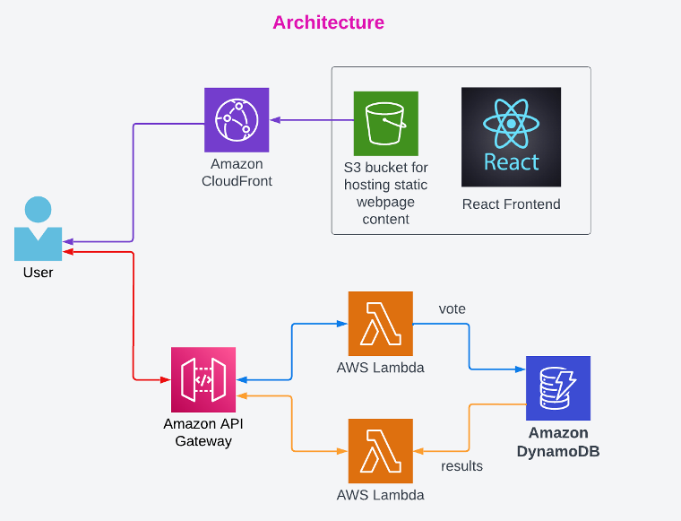

# Serverless Voting Application

In this mini project you will create a completely serverless voting application in two stages. First you will create the backend using API Gateway, Lambda functions and DynamoDB table. Then you will create the frontend application using ReactJS and deploy it to an S3 bucket for static website hosting which will be delivered using CloudFront CDN. Below is the architecture for this project.

# Stage 1 - Backend

- Choose a region where you want to deploy the application and use the same region for creating all the resources in below stages.

## Step 1 - Create a DynamoDB table [View Screenshots](./02_LABINSTRUCTIONS/Stage1_Step1.md)

- Move to the DynamoDB console to create a new table.
- For **Table Name** enter `Voting_Table`
- For **Partition key** enter `vote_id` of type string
- Leave all the other options as default and click on **Create Table**
- After the DynamoDB table is created you will get a success message.

## Stage 2 - Create the Lambda Role

- Step 1 - Create a DynamoDB table

Create the S3 Buckets
